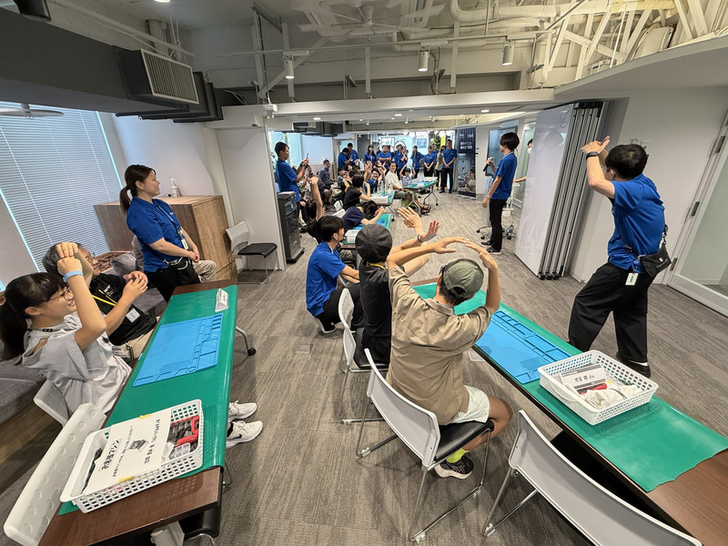

En una clase de montaje no se aprende a reparar un ordenador: se aprende de dónde sale. Eso es lo que Dell Technologies se propuso demostrar en su decimocuarta edición de la clase de montaje de PC para padres e hijos, celebrada el pasado sábado en su centro de atención al cliente de Miyazaki (Japón).

Siete menores, repartidos con sus acompañantes en seis grupos de un total de catorce participantes, se enfrentaron a una bandeja con nueve componentes distintos y 23 tornillos. El objetivo: montar de principio a fin un portátil Dell 14 (DC14250) con procesador Intel Core 5 120U, 16 GB de memoria RAM y 512 GB de SSD, con Windows 11 como sistema operativo.

## Cómo funciona la clase

El ejercicio no es una simulación: los participantes trabajan sobre el equipo real. Entre las tareas de montaje figuraban colocar la memoria, conectar la pantalla y ensamblar el altavoz, el teclado, la unidad SSD, la batería y los módulos Wi-Fi. Al terminar, cada grupo encendió su portátil y comprobó que la conexión Wi-Fi funcionaba. El equipo montado se lo llevaron a casa.

El precio de la entrada era de 113.275 yenes (unos 730 dólares) e incluía tanto la máquina final como un año de servicio técnico in situ. La actividad se desarrolló en la quinta planta de un edificio del centro de Miyazaki que en su día albergó unos grandes almacenes.

## Un escaparate de la reparabilidad

Dell presentó la jornada como una versión comprimida del trabajo que realiza un técnico de servicio de la compañía. La misma empresa que obtiene beneficios récord fabricando racks de centros de datos para inteligencia artificial dedicó un sábado a mostrar a los más pequeños cómo se ensambla un portátil, un gesto que encaja con su discurso sobre reparabilidad y fiabilidad.

Masashi Hayashida, responsable del centro de Dell en Miyazaki, resumió la intención de la actividad durante el evento: «Los ordenadores pueden hacer muchísimas cosas. Quiero que la gente use sus equipos hasta que se averíen y los conozca a fondo. Si se averían, se pueden reparar. La tecnología evoluciona constantemente. Espero que estén atentos a los avances futuros».

La vertiente técnica también incluyó una demostración de Yoko Oishi, del equipo de soporte técnico avanzado de Dell, que mostró a los medios invitados cómo sustituir el módulo USB-C de un portátil Dell XPS.

## Mascotas, historia de la empresa y una charla sobre IA

La jornada no fue solo tuerca y destornillador. Hii-kun, una de las tres mascotas caninas de la prefectura de Miyazaki, acudió al centro e interpretó una coreografía. Los asistentes también recibieron un recorrido por las oficinas y un breve repaso a la historia de Dell, fundada por Michael Dell en 1984 con una inversión inicial de 1.000 dólares y hoy presente en más de 170 países.

Además, los menores asistieron a una introducción a la inteligencia artificial en la que se explicó su relevancia, la posibilidad de que cometa errores y la conveniencia de no facilitarle datos personales más allá de lo imprescindible. Como cierre, becarios universitarios del centro organizaron un concurso de diez preguntas de verdadero o falso sobre Dell, Intel y el mundo del PC.

## Qué lectura saca el usuario

La propuesta de Dell no es un producto que el lector pueda comprar ni un manual reproducible en casa: es una iniciativa de marca y de servicio comunitario. Su interés está en el mensaje que transmite en un momento en el que la industria empuja hacia equipos más reparables y en el que muy pocos usuarios abren siquiera la tapa de su portátil. Enseñar a un niño qué hay dentro de un ordenador —y que puede arreglarlo— es, a la vez, formación técnica y una declaración de intenciones sobre la vida útil del hardware.
