ServeTheHome ha publicado su análisis del **Dell Pro 5 16 (AMD)**, la variante con silicio de AMD de la gama empresarial intermedia de Dell. El equipo, identificado como P516265, monta el Ryzen AI 9 HX PRO 470, el procesador móvil más potente que Dell ofrece en este modelo, y llega ocho años después del debut de los primeros Ryzen móviles como prueba de que AMD ya recibe un trato de igualdad frente a Intel en los portátiles corporativos de los grandes fabricantes.

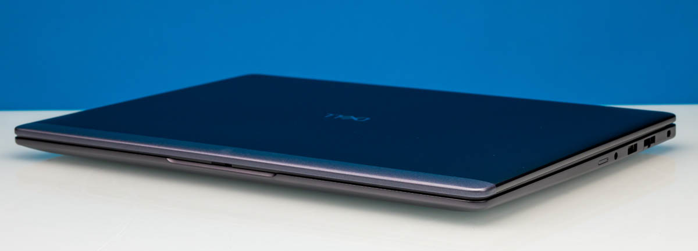

## Un Ryzen AI 9 de gama completa en un chasis de 16 pulgadas

El Dell Pro 5 16 se sitúa en el punto medio entre los portátiles económicos y los premium: incorpora chips de gama alta y memoria modular, pero no es de los más delgados ni ofrece tarjeta gráfica dedicada. El equipo analizado pesa 1,82 kg y mide 358,6 x 253,4 x 18,95 mm, con un diseño que se estrecha hacia el frontal y un acabado en aluminio gris magnetita.

El procesador es un Ryzen AI 9 HX PRO 470 de la familia Gorgon Point, con cuatro núcleos Zen 5 a hasta 5,2 GHz y ocho núcleos Zen 5c a hasta 3,3 GHz, además de una GPU integrada Radeon 890M (RDNA 3.5, 16 unidades de cómputo) y una NPU de 55 TOPS. La unidad probada llegó con 64 GB de memoria DDR5-5600 en dos módulos SO-DIMM y un SSD de 1 TB.

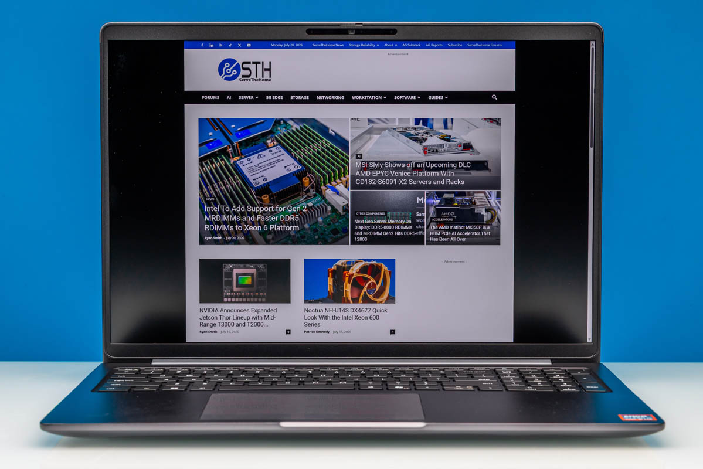

La pantalla de la muestra de análisis era la mejor que Dell ofrece para este equipo: un panel IPS de 16 pulgadas con resolución 2560×1600, 500 nits de brillo máximo, cobertura del 100 % del espacio sRGB y refresco variable de 48 a 120 Hz. No hay opción OLED en esta familia; el resto de paneles se queda en 1920×1200.

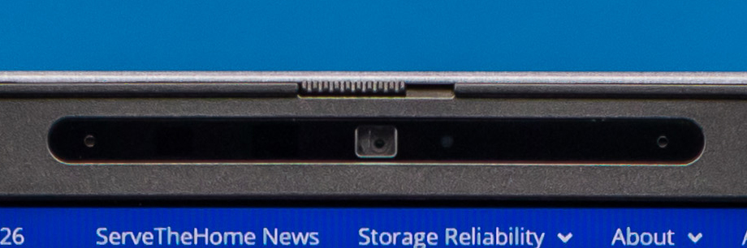

Para videollamadas, el portátil puede llevar una cámara de 8 MP con sensor infrarrojo para Windows Hello y obturador físico de privacidad. El teclado es retroiluminado e incorpora teclado numérico completo, una ventaja de las 16 pulgadas frente al modelo de 14, junto con un lector de huellas integrado en el botón de encendido. El audio corre a cargo de dos altavoces de 2 W.

## Interior modular y conectividad orientada a empresa

El punto fuerte del equipo es su modularidad: batería, almacenamiento, memoria y radio inalámbrica son reemplazables por el usuario y se fijan únicamente con tornillos Phillips. La memoria va en módulos SO-DIMM, ya que Gorgon Point no admite LPCAMM2 extraíble; la configuración de 64 GB analizada supone un sobrecoste cercano a 1.500 dólares sobre los 16 GB base, aunque sigue siendo más barata que los módulos LPCAMM2 del Dell Pro 5 14 con Intel.

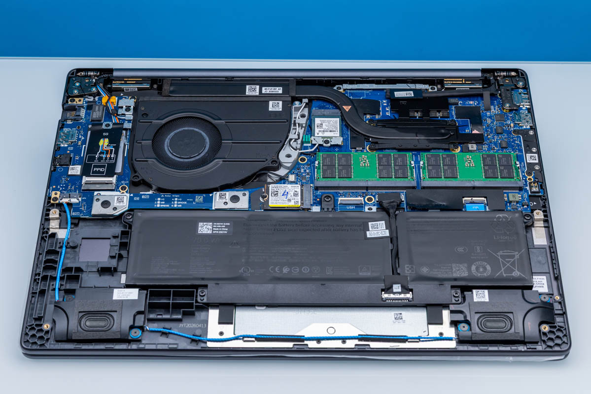

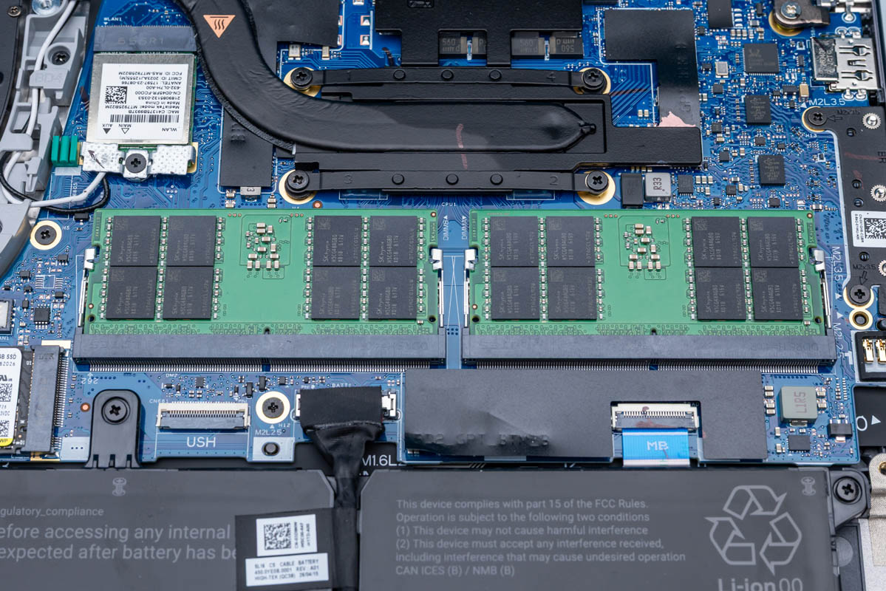

El almacenamiento se limita a una única ranura M.2 2230, lo que condiciona las futuras ampliaciones. La unidad probada era un SSD QLC PCIe Gen4 de SanDisk; la plataforma Ryzen AI 400 no ofrece PCIe Gen5, así que no hay motivo para montar unidades más rápidas.

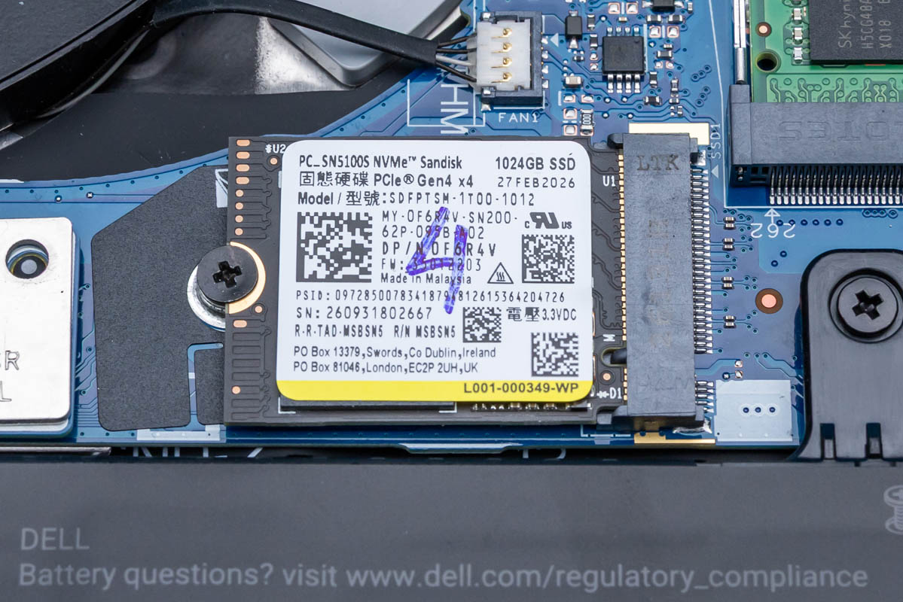

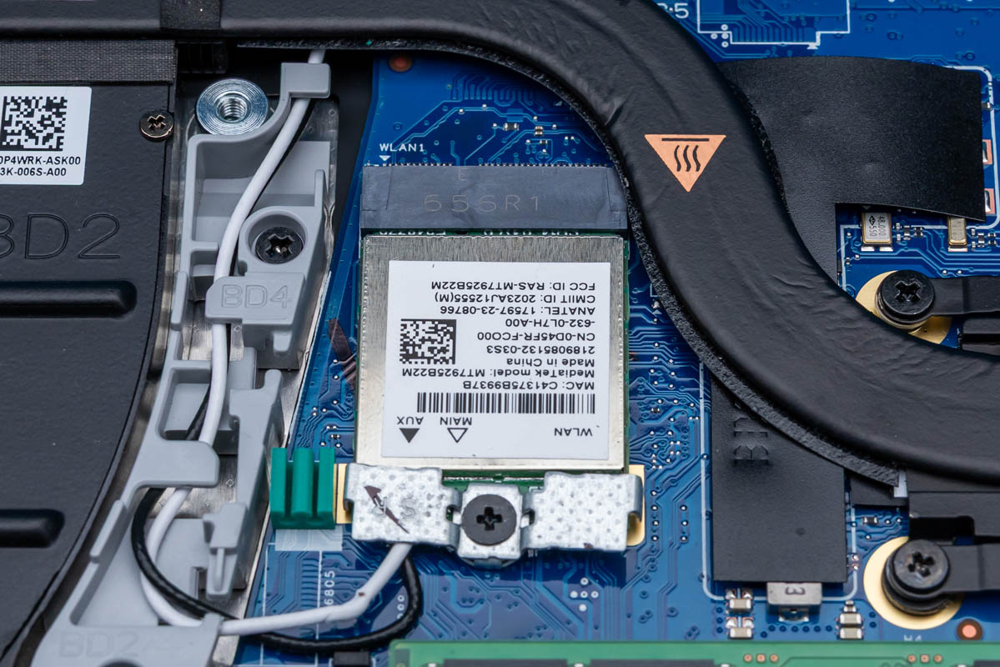

La conectividad es la gran carta de presentación empresarial. En el lado izquierdo hay dos puertos USB-C con Thunderbolt 4 a 40 Gbps, un USB-A de 5 Gbps y HDMI 2.1; en el derecho, un USB-A de 5 Gbps, jack de 3,5 mm, ranura SIM (sin uso) y un conector Ethernet RJ45. El Thunderbolt 4 es un añadido notable: la plataforma de AMD no lo soporta de forma nativa, así que Dell lo implementa con un controlador externo, algo que pocos fabricantes hacen. El puerto HDMI 2.1, en cambio, solo soporta señal TMDS, por lo que se queda en 4K a 60 Hz.

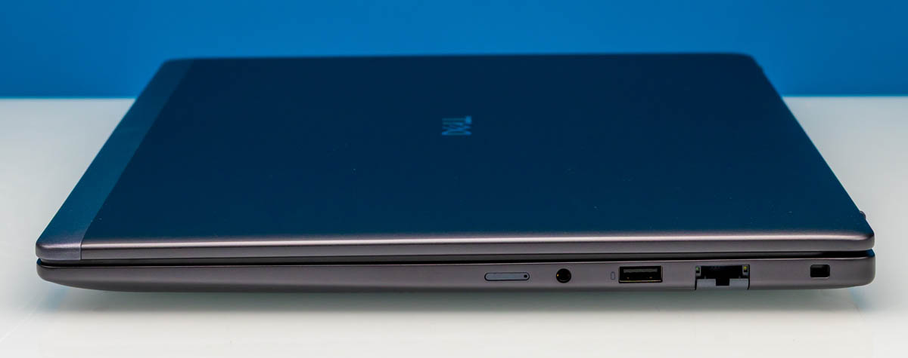

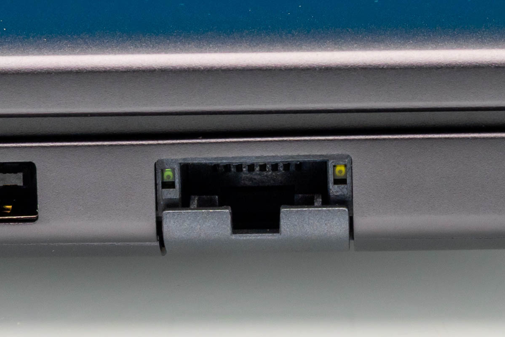

El Ethernet cableado usa el veterano controlador Realtek RTL8111EP-CG de 1 GbE, en lugar de una solución de 2,5 GbE; resulta útil para gestión, pero en un buen entorno inalámbrico el Wi-Fi 7 integrado puede ser más rápido. La radio es una MediaTek MT7925 de gama de entrada, que ofrece tribanda pero prescinde del canal de 320 MHz presente en radios superiores.

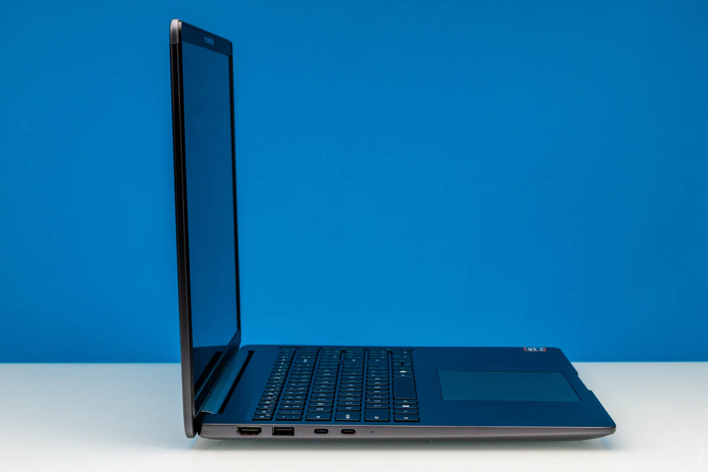

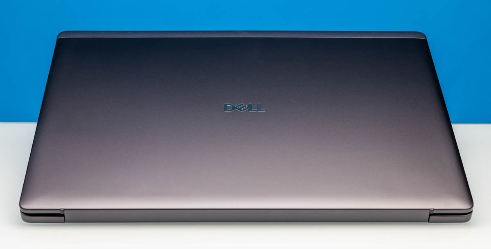

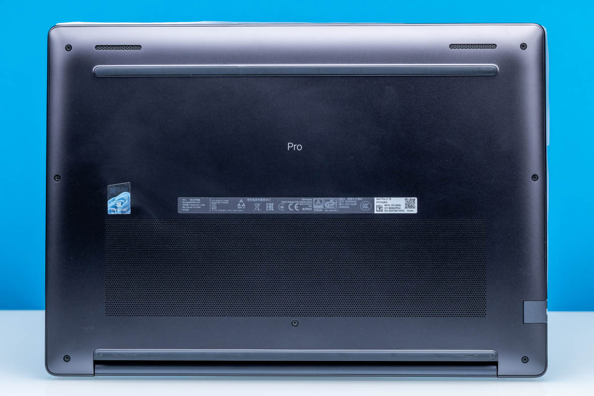

En el interior, un único ventilador refrigera el SoC, que puede alcanzar hasta 54 W en su cTDP más alto. La batería de la muestra es la opción más grande disponible, de 70 Wh (también se ofrecen 45 y 57 Wh).

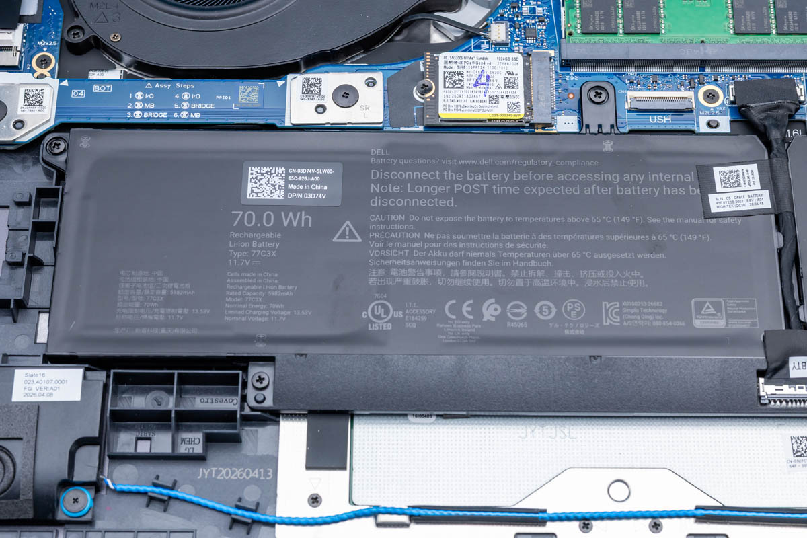

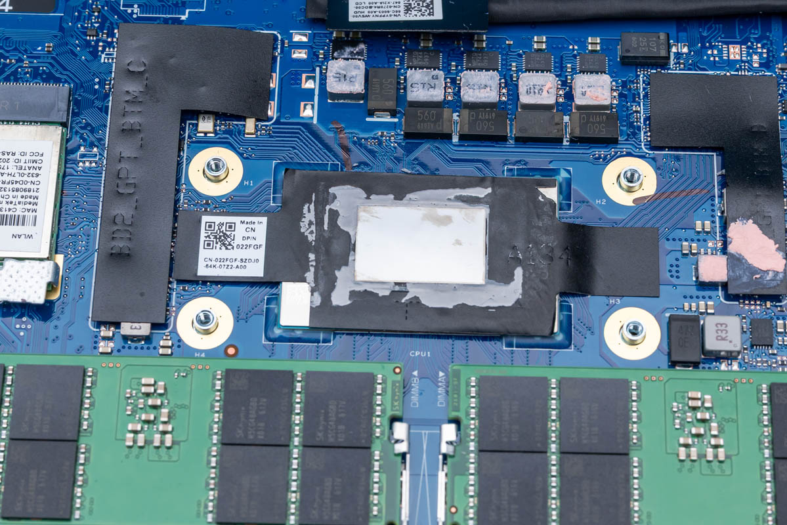

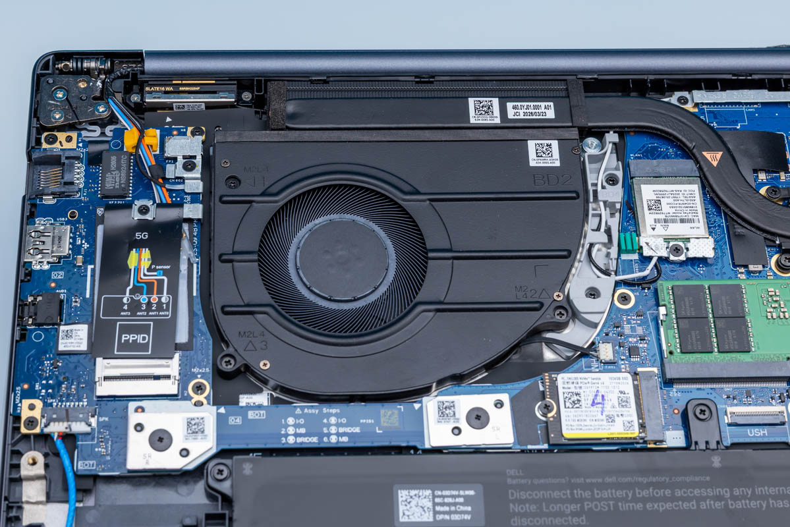

## Rendimiento: cerca de Intel en un núcleo, por detrás en multinúcleo

ServeTheHome comparó el Dell Pro 5 16 con el Dell Pro 5 14 basado en Intel Core Ultra 3 que analizó semanas atrás, un enfrentamiento casi simétrico entre ambas plataformas.

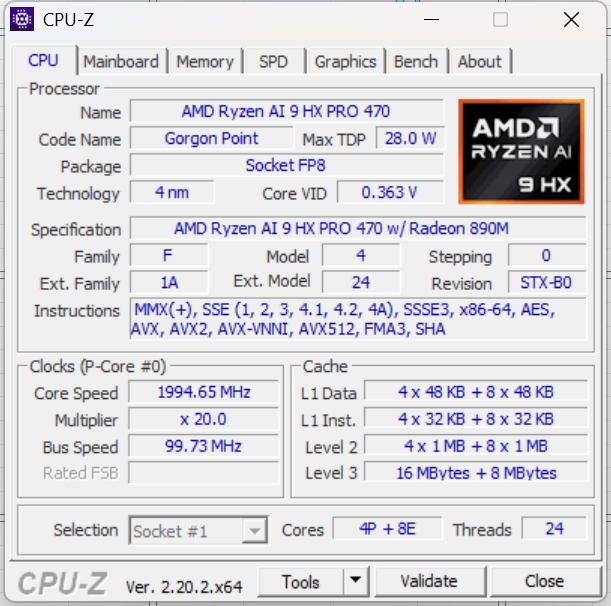

En Geekbench 6, el equipo con AMD obtiene 2.950 puntos en mononúcleo, apenas por encima del Intel. En multinúcleo, sin embargo, queda por detrás: los doce núcleos del Ryzen son capaces, pero ocho de ellos están limitados a 3,3 GHz, y ahí se nota que la plataforma de AMD es esencialmente una versión reciclada del Strix Point de 2025.

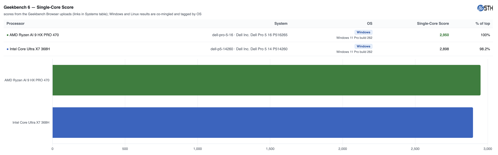

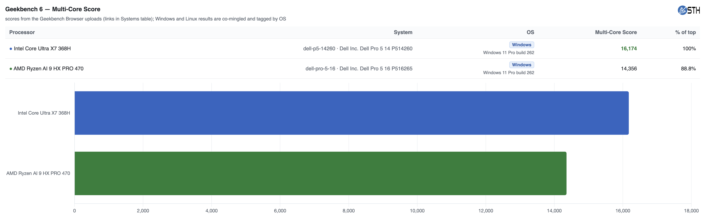

En Geekbench 7 los resultados se acercan aún más en mononúcleo, con una diferencia del 0,5 % que entra dentro del margen de variación de la prueba. En multinúcleo, en cambio, la ventaja de Intel se amplía ligeramente.

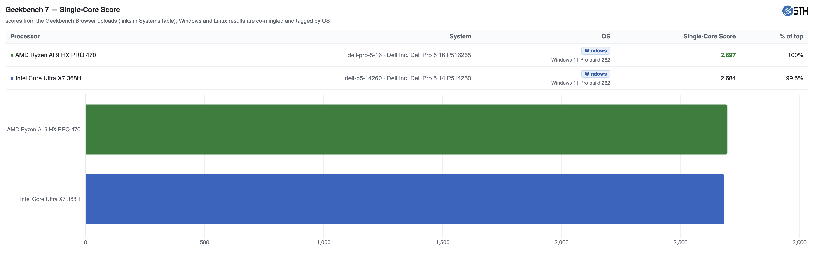

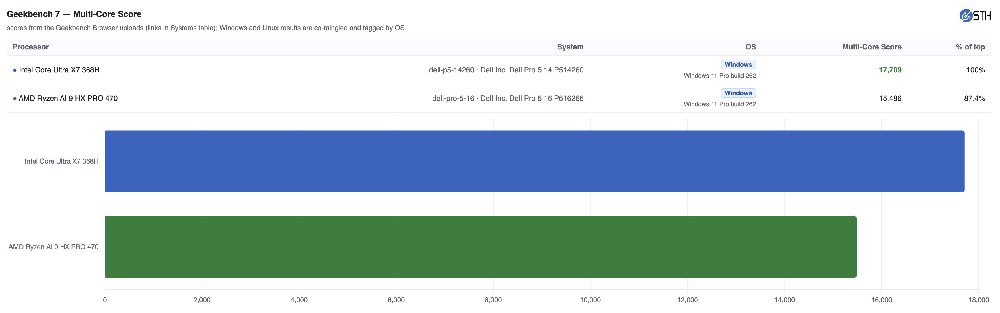

En MLPerf Client v1.6.1, la Radeon 890M supera los 25 tokens por segundo con Phi 3.5, aunque baja de 10 tokens por segundo con el modelo de razonamiento Phi 4. La NPU rinde en torno al 65 % de la GPU en Llama 3.1 y Phi 3.5, lo que la convierte en una alternativa viable y más eficiente para cargas de inferencia ligeras.

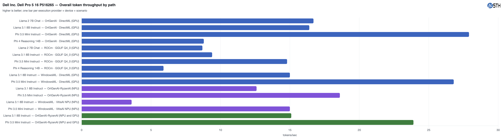

## Veredicto: un todoterreno empresarial a mejor precio

El Dell Pro 5 16 no busca destacar en un único apartado, sino ofrecer un equilibrio entre rendimiento, autonomía, tamaño, peso, prestaciones y precio. Y en esa misión cumple: es un portátil empresarial de libro, con una garantía base de tres años y una modularidad poco habitual en equipos tan delgados.

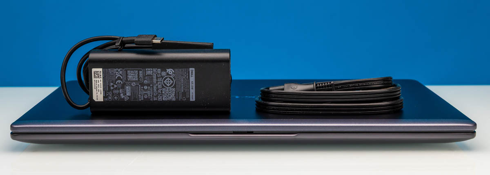

El equipo incluye un adaptador de 65 W, suficiente para cargarlo, aunque la función de carga rápida Express Charge exige el adaptador opcional de 100 W. El panel llega a consumir 5,7 W a máximo brillo, mientras que el grueso del consumo lo aporta el SoC.

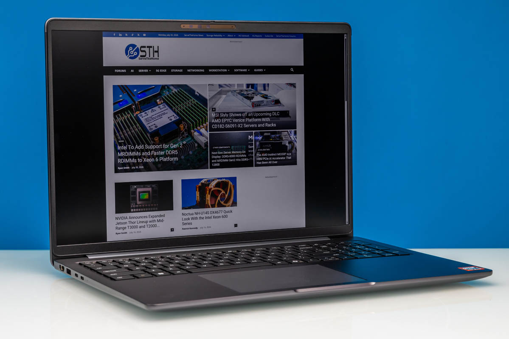

La conclusión del análisis es clara: el modelo con AMD es la opción más económica de la gama Pro 5, cerca de 1.000 dólares más barata que el equivalente con Intel. A cambio cede algo de rendimiento en cargas multinúcleo y de GPU, pero para el usuario de oficina que busca un equipo equilibrado, esa diferencia de precio pesa más que los puntos perdidos en un benchmark.
