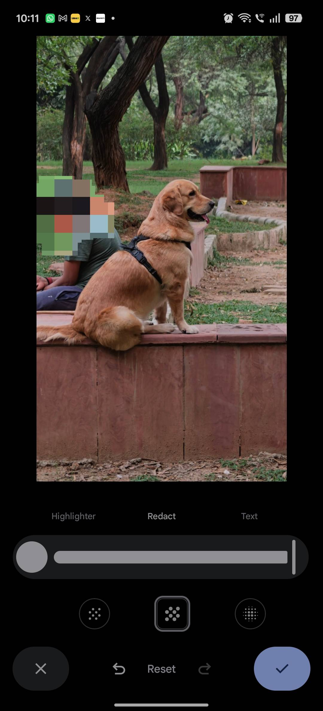
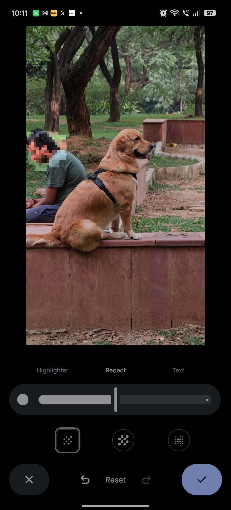

Google Photos ha incorporado a su herramienta de marcado un pincel de censura con el que ya se puede difuminar o pixelar cualquier zona de una imagen. Hasta ahora, ocultar datos sensibles de una captura obligaba a recurrir a aplicaciones de terceros o a garabatear encima con el lápiz. Esta guía explica cómo usar la nueva función paso a paso, pensada para cualquiera que comparta capturas de banca, billetes de avión, matrículas o fotos de menores.

## Requisitos previos

- Un teléfono Android con la aplicación de Google Photos actualizada desde Play Store.
- El despliegue es por fases: si el icono todavía no aparece, es posible que la función aún no haya llegado a tu cuenta.

Google Photos también se ha movido en la gestión de la biblioteca: la galería de Samsung ya se puede [sincronizar con el servicio](/noticias/samsung-google-photos-sync/).

## Pasos para censurar una imagen en Google Photos

### 1. Abre la imagen en Google Photos

Abre Google Photos y selecciona la foto o la captura de pantalla que quieres editar. La herramienta funciona sobre cualquier imagen de la biblioteca.

### 2. Entra en el modo de edición

Toca el botón Editar situado en la parte inferior de la pantalla.

### 3. Abre la herramienta de marcado

Selecciona la opción Marcado. El pincel de censura es nuevo: aparece junto al lápiz que ya se usaba para garabatear.

### 4. Toca el pincel de censura

Toca el icono del pincel de censura para activarlo.

### 5. Elige el estilo y el grosor

Puedes escoger entre tres estilos de censura: Blur, Mosaic Light y Mosaic.

- **Blur** aplica un desenfoque gaussiano a la zona elegida.
- **Mosaic Light** añade bloques de píxeles pequeños.

- **Mosaic** genera bloques de píxeles más gruesos.

Después, ajusta el grosor del pincel con el control deslizante. Conviene hacerlo en cada edición: para una cara basta un pincel grueso, mientras que para tapar texto y dejar legible el resto de la imagen conviene afinarlo. El autor del reportaje original prefiere el estilo Mosaic por considerarlo algo más seguro.

### 6. Pasa el dedo por las zonas sensibles

Desliza el dedo sobre las partes que quieres ocultar. Si el resultado no convence o te equivocas, puedes deshacer o rehacer la censura sin salir de la pantalla.

### 7. Aplica el cambio

Toca la marca de verificación para confirmar la censura.

### 8. Guarda una copia

Elige Guardar como copia. Así la imagen censurada se añade a la biblioteca y el original se conserva intacto.

### 9. Comparte la versión censurada

Comparte la copia editada con quien necesites.

## Cómo verificar que funcionó

Antes de compartir, amplía la zona censurada y comprueba que ningún dato se distingue. Si la censura quedó pobre o mal colocada, usa las opciones de deshacer y rehacer para repetirla. Guardar como copia permite volver al original y volver a intentarlo si hace falta.

## Advertencias y limitaciones

- Por ahora la función se está desplegando **solo en Android**. No hay una fecha confirmada para iOS.
- Si el pincel de censura no aparece, es probable que el despliegue aún no haya llegado a tu equipo. Comprueba que Google Photos está actualizado desde Play Store.
- Guardar como copia no es un detalle menor: evita sobrescribir la imagen original, algo útil si más adelante necesitas el archivo sin censurar.
