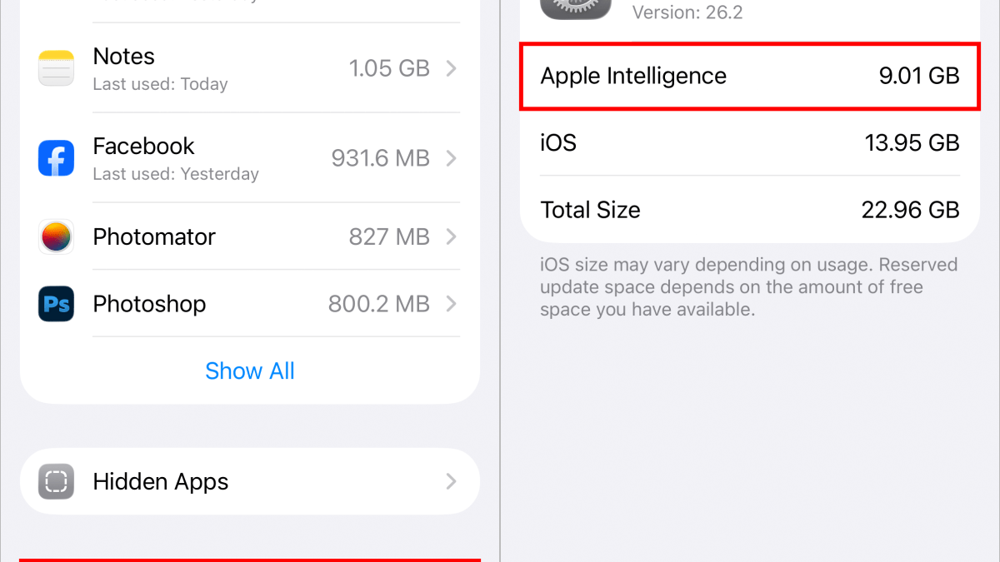
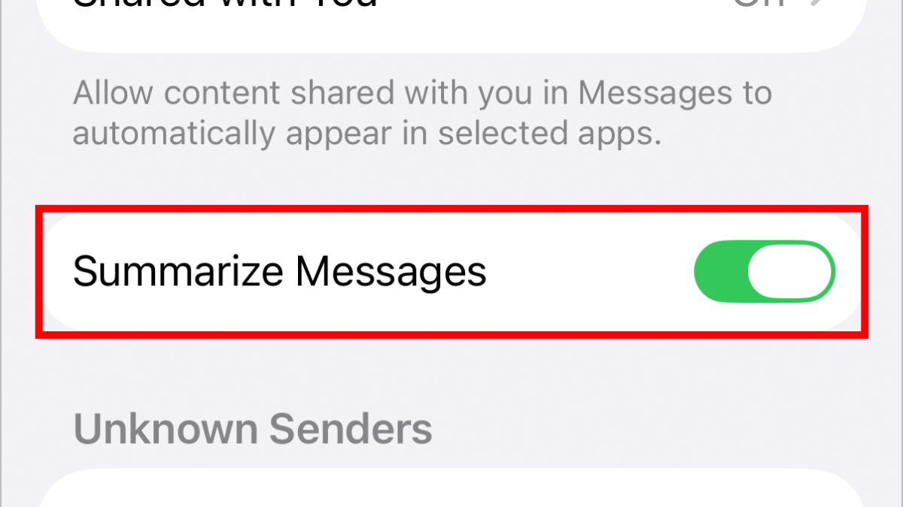
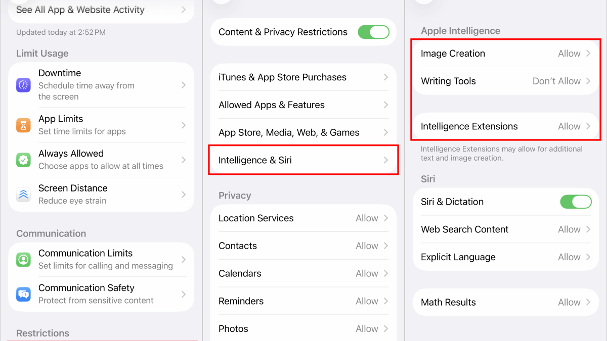
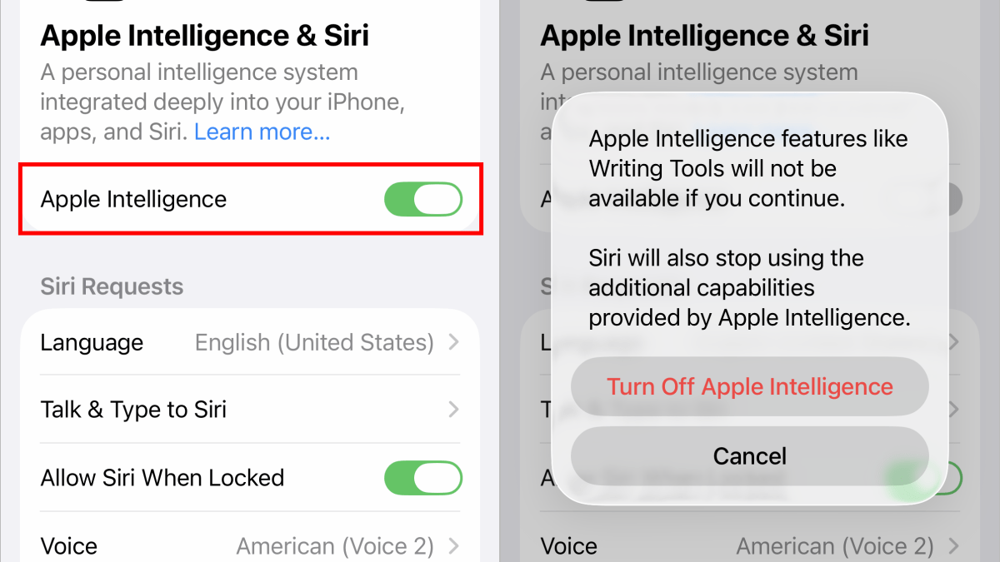

iOS 27 comienza a desplegarse esta semana y, con la nueva versión, Apple ha reorganizado los ajustes de su inteligencia artificial. El apartado que hasta ahora se llamaba **Apple Intelligence y Siri** pasa a llamarse simplemente **Siri**, de modo que desaparece el interruptor único que permitía desactivar toda la IA de Apple de una sola vez. Según CNET, quien actualice a iOS 27 pero quiera prescindir de esas funciones tendrá que hacerlo ajuste a ajuste.

Esta guía recoge las alternativas que siguen disponibles en iOS 27 y el método completo que continúa funcionando en iOS 26 o anterior.

> **Nota sobre los nombres de los ajustes:** las rutas se indican en español tal como aparecen en un iPhone configurado en ese idioma. La denominación exacta puede variar ligeramente según la versión del sistema y el idioma elegido.

## Por qué desactivar Apple Intelligence

Desde que las primeras funciones de Apple Intelligence llegaron con iOS 18.1, parte del público decidió prescindir de ellas. Hay dos motivos principales.

El primero es el espacio. Herramientas como Image Playground, Genmoji y los resúmenes de mensajes pueden ocupar **hasta 7 GB** del almacenamiento interno del dispositivo, una cantidad considerable en equipos que suelen ir al límite de su capacidad libre.

El segundo es el interés real. Una encuesta reciente de CNET señala que solo el **19 %** de los propietarios de teléfonos inteligentes en Estados Unidos cambia de dispositivo para aprovechar las novedades de IA. Un estudio de ZDNET y Aberdeen apunta en la misma dirección: la mayoría de los adultos estadounidenses afirma que no usará la mayoría de estas funciones y solo un **8 %** pagaría un extra por ellas. El matiz es que algunas prestaciones sí generan consenso: un **58 %** de los encuestados considera valioso el uso de IA para editar fotos.

A ello se suman los resúmenes inexactos, que han sido un problema recurrente, y la sensación de estar probando funciones que Apple todavía está desarrollando. El propio autor de la guía original reconoce que aprecia herramientas como los resúmenes de notificaciones o la función Limpiar de la app Fotos, pero sostiene que Apple Intelligence sigue siendo un trabajo en curso. También recuerda que no todos los iPhone pueden ejecutarla: requiere modelos recientes, como la gama iPhone 18, iPhone 17, iPhone Air, iPhone 16 y iPhone 15 Pro, además de Mac y iPad con chip de la serie M y el iPad mini más reciente.

**Un detalle importante:** en actualizaciones tempranas de iOS 18, el sistema volvía a activar Apple Intelligence por su cuenta aunque se hubiera desactivado. Desde iOS 18.4 ese ajuste se respeta.

## Cómo apagar Siri AI en iOS 27

En iOS 27 ya no existe un interruptor general de Apple Intelligence, pero sí se puede desactivar Siri AI. El camino es **Ajustes > Siri** y desactivar el control correspondiente.

Conviene saber qué implica, porque el alcance es amplio:

- Se desactiva por completo el asistente de voz.
- Se bloquean las conversaciones en la nueva app dedicada de Siri.
- Se pierde el acceso a Visual Intelligence, la función que analiza lo que aparece en pantalla.
- Si hay altavoces HomePod vinculados a la misma cuenta de iCloud que el iPhone, dejarán de reconocer la voz del usuario y de ayudar con contenido personal.

## Cómo saber cuánto espacio ocupa Apple Intelligence

Si la preocupación es el almacenamiento, se puede consultar el consumo real desde **Ajustes > General > Almacenamiento del iPhone (o iPad) > iOS (o iPadOS)**.

Un matiz que conviene tener presente: aunque se desactive Apple Intelligence, ese espacio sigue apareciendo en la lista de almacenamiento de iOS. Lo que sí se ha podido comprobar es que, cuando el teléfono se llena y el sistema necesita ese espacio ya inactivo, iOS lo recupera.

## Cómo desactivar funciones concretas

No hace falta renunciar a todo. Si algunas funciones resultan útiles y otras molestas, se pueden apagar por separado en los ajustes de las aplicaciones correspondientes.

Un ejemplo habitual son los resúmenes de texto en las notificaciones de Mensajes: se desactivan en **Ajustes > Apps > Mensajes**, apagando la opción **Resumir mensajes**.

Hay otras funciones que no dependen de una app concreta. Las **Herramientas de escritura**, que usan Apple Intelligence para corregir o reescribir texto, aparecen al seleccionar texto en cualquier aplicación; para desactivarlas hay que apagar Apple Intelligence en todo el sistema.

También conviene no confundir otro ajuste: casi todas las apps incluyen una opción **Apple Intelligence y Siri** con un interruptor llamado **Aprender de esta app**, activado por defecto. Ese control solo decide si Apple Intelligence y Siri pueden observar cómo se usa la aplicación para hacer sugerencias; no afecta a ninguna función de IA en concreto.

## La vía de Tiempo de uso

Otra forma de limitar lo que puede hacer Apple Intelligence está escondida en los ajustes de Tiempo de uso. Está pensada para controlar qué apps y funciones pueden ejecutarse en el dispositivo de otra persona, como el iPhone de un menor, pero también sirve para restringir componentes de la IA.

1. Abre **Ajustes** y entra en **Tiempo de uso > Restricciones de contenido y privacidad**.
2. Activa **Restricciones de contenido y privacidad** si no lo está. Si es la primera vez que se toca este interruptor, no hay que preocuparse: por defecto todo está permitido.
3. Toca **Inteligencia y Siri**.
4. Decide si permites o bloqueas estas tres funciones: **Creación de imágenes** (Image Playground y Genmoji), **Herramientas de escritura** y la **Extensión de ChatGPT**, que procesa con ChatGPT las peticiones que superan las capacidades de Apple Intelligence.

CNET advierte de que las capturas de este apartado corresponden a iOS 26 y que su aspecto puede cambiar en iOS 27, aunque el recorrido por los ajustes es el mismo.

## Cómo desactivar Apple Intelligence por completo si sigues en iOS 26 o anterior

Si el dispositivo todavía no ha actualizado a iOS 27, el proceso sigue siendo muy sencillo. Primero conviene comprobar la versión instalada en **Ajustes > General > Información**, donde aparece el número de iOS en uso.

En iOS 26 o versiones anteriores, abre **Ajustes** (iPhone o iPad) o **Ajustes del Sistema** (Mac), elige **Apple Intelligence y Siri** y desactiva la opción **Apple Intelligence**. En el cuadro de diálogo que aparece, confirma con **Desactivar Apple Intelligence**.

Al hacerlo se pierden estas funciones:

- Herramientas de escritura.
- Resúmenes de notificaciones.
- Visual Intelligence.
- Genmoji.
- Image Playground: la app permanece, pero no permite crear imágenes.
- Compatibilidad de Siri con ChatGPT.
- Image Wand en la app Notas.

Hay una excepción curiosa: la herramienta **Limpiar** de la app Fotos sigue disponible aunque Apple Intelligence esté desactivada, probablemente porque la primera vez que se usa descarga sus propios recursos y los conserva.

## Antes de actualizar, una precaución

Si todavía no has instalado iOS 27, CNET recomienda hacer una copia de seguridad completa antes de dar el salto. Y si el objetivo es conservar el interruptor general para desactivar Apple Intelligence de un solo toque, conviene saber que actualizar a iOS 27 lo elimina: en ese caso, las alternativas de esta guía son las que quedan.
