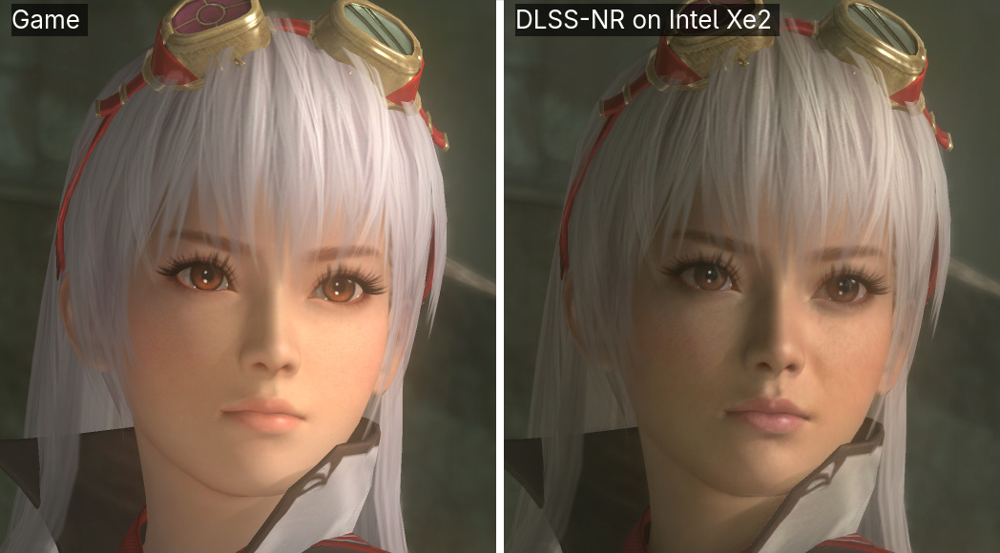
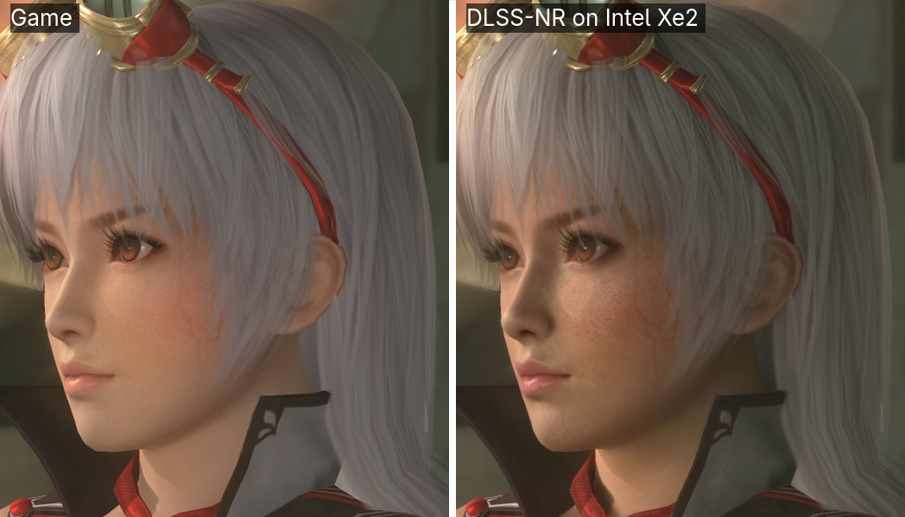
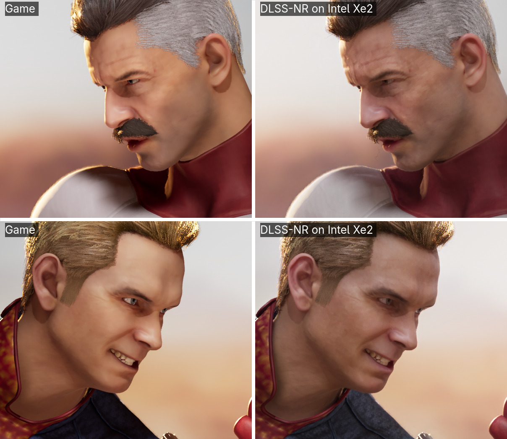
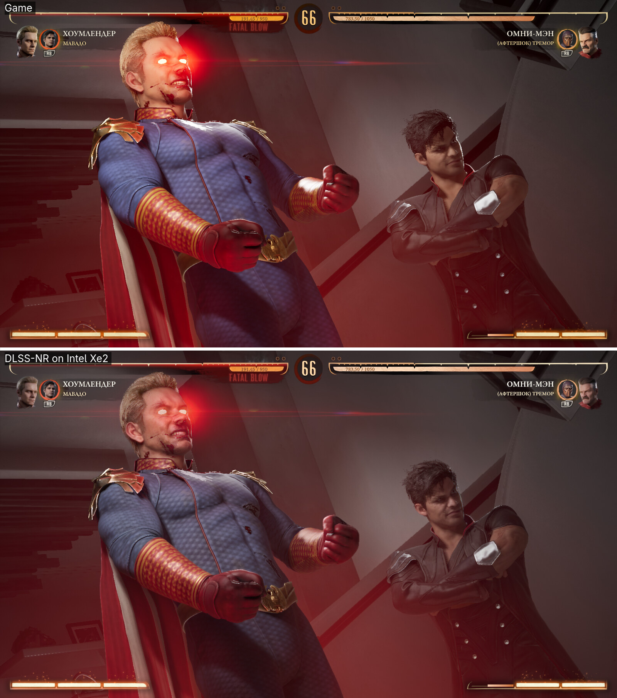

DLSS 5 Neural Rendering era, sobre el papel, territorio exclusivo del hardware NVIDIA. Un desarrollador conocido en GitHub como **Uzbekunknown** ha publicado un proyecto llamado [`dlss-nr-on-intel`](https://github.com/uzbekunknown/dlss-nr-on-intel) que consigue ejecutar esa técnica en la **gráfica integrada Intel Arc 140V** de un procesador Lunar Lake (arquitectura Xe2), sin CUDA, sin NGX y sin ninguna tarjeta NVIDIA en el sistema. El proyecto ya se ha probado en *Tekken 7*, *Dead or Alive 5 Last Round* y *Mortal Kombat 1*.

Conviene fijar las expectativas desde el principio: **no es un producto, es una prueba de concepto**. El propio autor lo califica de port de investigación y la única aplicación realista hoy es el modo foto, no jugar.

## Una reimplementación completa, no un envoltorio

La mayoría de los trucos que llevan DLSS 5 a hardware no soportado se limitan a envolver la DLL de NVIDIA. Este caso es distinto: el proyecto **reimplementa la red neuronal completa**, una U-Net de 71 bloques, y la ejecuta sobre las unidades matriciales XMX de Intel a través de la extensión Vulkan `VK_KHR_cooperative_matrix`. Como la arquitectura Xe2 no soporta FP8, todo el grafo corre en **FP16 con acumulación en FP32**.

El proceso se inyecta en la llamada `vkQueuePresentKHR`, de modo que se engancha a cualquier aplicación que presente fotogramas por Vulkan, incluidos juegos de Windows ejecutados bajo Proton. El repositorio no incluye ni binarios ni pesos de NVIDIA: **el usuario debe aportar su propia copia de `nvngx_dlssnr.dll`** y extraer de ella los pesos (649 tensores, unos 145,7 millones de parámetros, almacenados en el DLL como FP8 E4M3 y decodificados a FP16). Además, a 720p el modelo necesita alrededor de **2,3 GiB de memoria**, que en una iGPU se toma de la RAM del sistema.

## El precio en rendimiento: 10,5 fps en Tekken 7

Aquí está la letra pequeña. El propio autor mide *Tekken 7* a **10,5 fps en vivo a 640x360**, una resolución que es una novena parte del Full HD. Otras pruebas publicadas sitúan el resultado en el entorno de los **3 a 5 fps a 720p**. El motivo es que el coste del pase neuronal depende casi por completo de la resolución de salida: procesar un fotograma de 1920x1080 puede llevar unos **412 ms**, lo que fija un techo de 2,4 fps incluso si el juego renderizara al instante.

Estos son los tiempos que el autor mide para el demonio que sostiene el modelo, sin contar el trabajo del propio juego:

| Resolución | Escala de render | Tiempo | fps |
| --- | --- | --- | --- |
| 512x288 | 0,35 | 72 ms | 13,9 |
| 640x360 | 0,50 | 80 ms | 12,5 |
| 854x480 | 0,50 | 105 ms | 9,5 |
| 1920x1080 | 0,55 | 412 ms | 2,4 |

No es un problema exclusivo de Intel: DLSS 5 Neural Rendering ya supone un golpe enorme de rendimiento incluso en las RTX 50, y el reto de ejecutarlo en una iGPU multiplica el efecto. Quien quiera probarlo, además, necesita Linux: otro usuario de Reddit ha anunciado su intención de adaptarlo a Windows, pero ese trabajo todavía no existe.

## Un port escrito casi por completo por agentes de IA

El detalle más llamativo no es el rendimiento, sino cómo se construyó. El autor reconoce que **el código lo escribieron agentes de inteligencia artificial**: Claude Opus 5 de Anthropic y Astra de OpenAI. Su aportación se limitó a poner la máquina, el binario y la dirección, y a tomar las decisiones. Admite que **no podría defender el código línea por línea** y que un fallo de controlador inexistente, alucinado por uno de los agentes, condicionó tres fases enteras del desarrollo.

El repositorio documenta también los caminos equivocados a propósito, e incluye alrededor de 190 comprobaciones automáticas para respaldar las cifras que publica. Ese ejercicio de transparencia es interesante, pero no resuelve la pregunta de fondo: que una adaptación de una tecnología cerrada se publique sin que su responsable comprenda cada línea abre dudas razonables sobre su revisión y su seguridad.

*Imágenes comparativas: Uzbekunknown / GitHub.*

## Qué significa (y qué no) para el usuario

El interés de este trabajo es demostrar que DLSS 5 Neural Rendering **puede adaptarse a hardware que NVIDIA no contempla**, igual que antes se ha visto con las RTX 30, con las Radeon RDNA 4 o incluso con una versión que corre en el navegador mediante WebGPU. Como experimento, marca un límite técnico y abre la puerta a que la técnica llegue a GPUs Arc discretas o a generaciones antiguas que sí podrían moverla con más soltura.

Para el lector que tenga un portátil con Arc 140V —los Core Ultra 200V de Lunar Lake— la conclusión práctica es clara: **hoy no hay nada que instalar y disfrutar**. El rendimiento medido está a años luz de ser jugable y, por ahora, tampoco existe una vía sencilla en Windows. Es una curiosidad técnica para seguir de cerca, no una función que vaya a aparecer en tu equipo.
