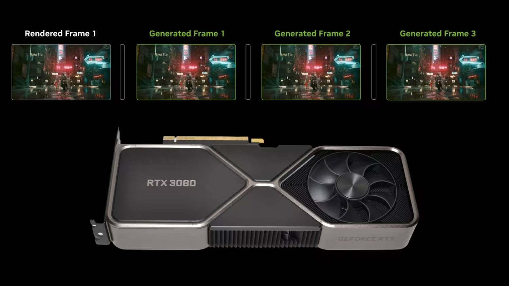

La comunidad de modders vuelve a la carga. Después de conseguir ejecutar builds filtradas de DLSS 5 en generaciones antiguas de NVIDIA, un nuevo proyecto llamado **DLSSG SM86** permite a los propietarios de tarjetas GeForce RTX 30 (arquitectura Ampere) activar la generación múltiple de fotogramas (Multi Frame Generation) en modos **2X y 4X**. Es una función que NVIDIA mantiene de forma oficial en exclusiva para sus GPU RTX 50 "Blackwell".

La diferencia con los apaños anteriores es que este mod no sustituye la tecnología de NVIDIA por la generación de fotogramas de AMD FSR: conserva los propios modelos DLSS. El mecanismo crea un backend proxy para la arquitectura SM86 que se ejecuta junto al juego y redirige las llamadas de generación de fotogramas a un runtime DLSSG 310.1 empaquetado, sin tocar los archivos del juego.

## Qué rendimiento promete

La documentación del desarrollador toma como referencia una **RTX 3080 Ti** con el controlador 591.86, bajo Windows y con D3D12. Las cifras que se citan son notables:

- **Black Myth: Wukong**: de 50 FPS a 150 FPS con generación a 4X.
- **Cyberpunk 2077** con trazado de rayos completo (*path tracing*): de 35 FPS a 100 FPS.

A esas cifras se suma una prueba en vídeo del canal fogoticus sobre una RTX 3080, en la que Cyberpunk 2077 pasa de unos 42 FPS a 74 FPS en modo 2X y a 120 FPS en modo 4X.

Conviene poner esos números en contexto: el propio desarrollador admite que **todavía no ha hecho pruebas formales de tiempos de fotograma, latencia ni estabilidad prolongada**. Es decir, los FPS brutos pueden ser muy altos sin que la experiencia sea necesariamente fluida, porque el ritmo de fotogramas (frame pacing) y la latencia son los factores que de verdad determinan si el juego se siente bien.

## Por qué NVIDIA lo mantiene en las RTX 50

La compañía ha justificado la exclusividad del Multi Frame Generation en el **Flip Metering** de Blackwell, un bloque de hardware que ayuda a mantener un ritmo de fotogramas estable. La pregunta que sobrevuela es cuánto de esa limitación es hardware y cuánto es estrategia comercial. El trabajo de los modders —que ya lograron llevar DLSS 5 a Ampere con resultados irregulares— sugiere que la frontera generacional no está tan marcada como el marketing quiere hacer creer.

## Nuestra lectura

Este tipo de mods son una buena noticia para quien sigue usando una RTX 30, una generación con mucha base instalada que aún rinde bien. Que sea posible activar la generación múltiple de fotogramas no significa que sea recomendable hacerlo sin más: si no hay latencia controlada ni un ritmo estable, se cambia fluidez aparente por una respuesta peor en el control, algo que se nota especialmente en juegos competitivos.

Para el usuario hispanohablante con una RTX 3080, 3080 Ti o 3090, el mod abre la puerta a experimentar, pero conviene tratarlo como lo que es: una prueba de comunidad, sin soporte oficial y pendiente de verificación independiente. La pelota, como casi siempre, queda en el tejado de NVIDIA.

**Fuentes originales del proyecto:** [DLSSG for SM86 (GitHub)](https://github.com/sdli1995/dlssg_for_sm86/blob/main/README.en.md) · [fogoticus en YouTube](https://www.youtube.com/watch?v=KNVr5pHAygI) · [hilo de Reddit](https://www.reddit.com/r/nvidia/comments/1waqh36/you_can_run_dlss_framegen_on_rtx_3000_cards_now/)
