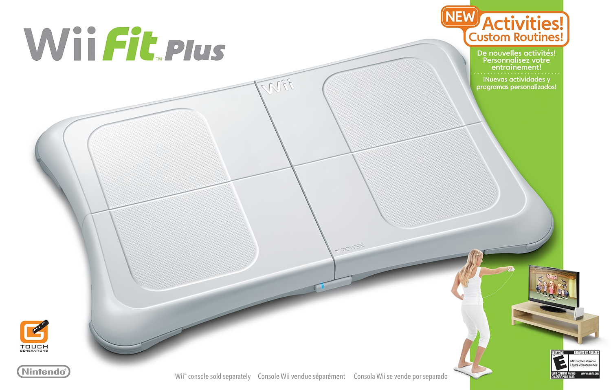

La versión 2609 de Dolphin, el emulador de GameCube y Wii, ya está disponible con 388 commits acumulados desde la entrega 2606. El informe de progreso que acompaña al lanzamiento repasa mejoras repartidas entre Android y escritorio, y dedica un apartado destacado a la seguridad: dos frentes distintos que han obligado al equipo de voluntarios a cambiar parte de sus rutinas. La emulación de consolas Nintendo sigue ampliando horizontes —como muestra el [port de Cemu a Nintendo Switch](/noticias/cemu-wii-u-switch-port/)— y Dolphin quiere que la experiencia sea cada vez más parecida entre plataformas.

## Dolphin 2609: NetPlay llega a Android

La gran novedad de esta entrega es NetPlay en Android. Se trata del sistema de juego en red de Dolphin, pensado para títulos que solo ofrecían multijugador local, y su llegada al móvil era una de las funciones más reclamadas. Hasta ahora no existía por una mezcla de dos motivos: era complicado construir una interfaz decente en Android y exigía un modo de ejecución determinista que castigaba el rendimiento en hardware limitado. Se encargó de desarrollarlo tom-pratt, que se apoyó en Jetpack Compose para levantar la interfaz por partes.

NetPlay funciona en modo lockstep: cada instancia debe permanecer perfectamente sincronizada, así que Dolphin fuerza un solo núcleo, fija la misma semilla y el mismo tiempo de arranque, y se asegura de que las mismas entradas lleguen a todos los equipos. La opción aparece en el menú "…" de la aplicación y, por ahora, requiere una red estándar (Wi-Fi o Ethernet). Usar datos móviles no está recomendado: la pérdida de paquetes y la latencia encajan mal con el multijugador determinista. Ya se trabaja en el soporte de Wi-Fi Direct para jugar entre dispositivos cercanos sin red.

Móvil y escritorio pueden jugar juntos, pero hay límites que conviene conocer. La mayoría de los sobremesa usan procesadores x86-64 y los teléfonos ARM, y Dolphin emplea compiladores JIT distintos para cada arquitectura; sus diferencias pueden provocar desincronizaciones. A esto se suma el framebuffer: los juegos que usan acceso EFB o copian EFB/XFB a la RAM pueden dar resultados distintos según el controlador gráfico, algo especialmente delicado con los controladores Adreno y Mali. En muchos juegos nada de esto dará problemas, pero son factores a tener en cuenta si aparecen desincronizaciones con la configuración correcta.

## Ver la resolución real del juego en pantalla

Otra función nueva es el indicador de resolución XFB en pantalla. Los juegos de GameCube y Wii se diseñaron para pantallas analógicas, donde recortar los bordes era habitual y los píxeles ni siquiera tenían que ser cuadrados. Por eso la resolución de renderizado no es fija: ronda los 640x480, pero cambia de un juego a otro e incluso entre escenas. Hasta ahora, la única forma de averiguarla era capturar una imagen a resolución interna y comprobar sus dimensiones, lo que no reflejaba lo que ocurría en tiempo real.

Con la nueva opción, basta con ir a Config > On Screen Display y activar "Show XFB Resolution". El dato que aparece corresponde a la resolución que el juego pide a la consola emulada (la salida XFB), no a lo que Dolphin presenta finalmente: los multiplicadores de resolución interna y la compensación de relación de aspecto quedan fuera de esta medición.

Los ejemplos del informe dejan ver esa variedad: 640x480 es lo más común en el catálogo, 640x456 aparece en muchos títulos de Wii desarrollados por Nintendo y 640x448 recuerda al legado de las 224 líneas de NES y SNES. Hay casos llamativos, como Rogue Leader, que usa 640x450 durante el juego y 640x304 en sus cinemáticas, con una relación de 2,1:1 que convierte un detalle técnico en un efecto cinematográfico.

## Android: búsqueda de ajustes, Balance Board y vibración

La lista de mejoras para Android no termina en NetPlay. La aplicación incorpora ahora un campo de búsqueda en los ajustes: basta con escribir parte del nombre de una opción para saltar directamente al submenú correspondiente, algo especialmente útil en una interfaz con menús anidados. También se ha habilitado la Wii Balance Board a través del Mayflash DolphinBar: el periférico ya se dirige a la ranura que le corresponde, lo que desbloquea los 135 juegos compatibles con la tabla de equilibrio de Wii Fit.

La vibración también recibe tres correcciones que, juntas, cambian bastante la experiencia. La primera arregla el paso del identificador del vibrador a VibratorManager, que se hacía mal y dejaba sin vibración a dispositivos como los Retroid. La segunda adopta el atributo USAGE_MEDIA, de modo que desactivar el feedback táctil del sistema ya no silencia también la vibración del juego. La tercera sustituye el antiguo pulso fijo de 100 milisegundos por una vibración de 10 segundos que se cancela cuando el juego envía la orden de parar, acercando el resultado al de la consola original.

## Compilación más simple en Windows y un aviso de seguridad

En el terreno interno, Dolphin ha terminado con una duplicidad histórica: Windows era la única plataforma que seguía usando su propio proyecto de Visual Studio en lugar de CMake. Ahora todos los sistemas pasan por CMake, que genera el proyecto de Visual Studio, y eso ha permitido eliminar más de 12.000 líneas de archivos de compilación específicos. El cambio actualiza además el proyecto a Visual Studio 2026 y a un runtime de Visual C++ más reciente: quien use el actualizador oficial lo recibirá automáticamente, pero quien actualice Dolphin a mano puede necesitar instalar el redistributable más reciente. DSPTool deja de distribuirse con las compilaciones de Windows.

El informe dedica también espacio a la seguridad. Dolphin pasó de recibir un aviso en 2024 y ninguno en 2025 a más de diez en lo que va de 2026, la mayoría escritos por IA y con un nivel de detalle excesivo. Todos describían algún fallo real, pero gestionarlos consume mucho tiempo de un equipo voluntario. Para ordenar el flujo, el proyecto ha abierto el sistema de reporte de vulnerabilidades de GitHub y recomienda a los usuarios mantener la instalación actualizada, ya que 2606, 2606a y 2609 incluyen correcciones de seguridad.

A esto se suma un incidente separado en macOS. Una vulnerabilidad crítica en la función Compartir pantalla (CVE-2026-65400) permitía conectarse a un Mac sin credenciales válidas; Apple la corrigió el 6 de agosto, pero el equipo de Dolphin no aplicó el parche a tiempo. El 8 de agosto un atacante comprometió la máquina de compilación de macOS e instaló un minero de Monero. El incidente se detectó el 15 de agosto y, tras analizar cada compilación manualmente y pasarla por VirusTotal, el equipo concluye que ninguna quedó contaminada. Los usuarios de Windows, Android y Linux no se vieron afectados, y las versiones para macOS producidas esos días (2606-294 a 2606-302 y el hotfix 2606a) se recomienda actualizarlas igualmente. La máquina se reinstaló desde cero y el acceso remoto dejó de exponerse directamente a internet; la recuperación completa llevó cuatro días.
