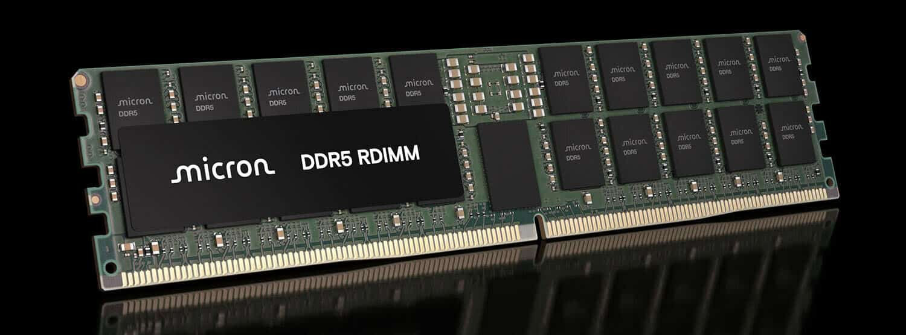

La fiebre por la inteligencia artificial ha llevado a la memoria DRAM a un terreno que hasta hace poco parecía reservado a otros componentes. Un análisis difundido por Kurnal Insights y recogido por El Chapuzas Informático compara el valor que genera cada milímetro cuadrado de silicio y llega a una conclusión llamativa: determinadas generaciones de memoria ya superan en valor por superficie a los chips más avanzados que TSMC fabrica en sus nodos de 2 y 3 nanómetros.

La comparación no mide el coste de fabricación, sino cuánto dinero puede generar cada milímetro cuadrado a los precios actuales de venta. Y con esa vara, la balanza se ha inclinado del lado de la memoria.

## Un milímetro cuadrado de DRAM vale hasta un 54 % más que uno de TSMC a 2 nm

El cálculo parte de precios estimados de unos 20.000 dólares por una oblea de 300 mm fabricada por TSMC en su nodo de 3 nm y de alrededor de 30.000 dólares para una oblea a 2 nm. Repartidos entre la superficie de la oblea, el coste nominal ronda los 0,283 dólares por milímetro cuadrado en el nodo de 3 nm y los 0,424 en el de 2 nm.

La DRAM ofrece números muy distintos gracias a su enorme densidad de almacenamiento. Asumiendo un precio de 1,50 dólares por Gb, el valor por milímetro cuadrado de cada generación queda así:

| Generación | Densidad | Valor por mm² |
| --- | --- | --- |
| DRAM 1y | 0,219 Gb/mm² | 0,329 $/mm² |
| DRAM 1z | 0,273 Gb/mm² | 0,410 $/mm² |
| DRAM 1b | ~0,436 Gb/mm² | 0,654 $/mm² |

El caso extremo es la generación 1b, capaz de almacenar alrededor de 0,436 Gb por milímetro cuadrado. A los precios actuales, cada milímetro cuadrado podría generar unos 0,654 dólares, un 54 % más que el nodo de 2 nm de TSMC. Y si se toma el precio real registrado el 21 de septiembre para chips DDR5 de 16 Gb —24,80 dólares, equivalentes a unos 1,55 dólares por Gb—, la cifra asciende hasta los 0,676 dólares por milímetro cuadrado.

## La IA, detrás del vuelco

Conviene no perder de vista un matiz importante: que la DRAM valga más no significa que fabricarla sea más caro que producir un chip lógico de vanguardia. De hecho, ocurre justo lo contrario. La memoria sigue siendo técnicamente más barata de fabricar que una CPU o una GPU en un nodo de 2 nm; lo excepcional es el precio al que se vende.

El motivo es la escasez. La inteligencia artificial absorbe cada vez más capacidad de las fábricas de memoria —sobre todo HBM, la memoria de alto ancho de banda que consumen los aceleradores— y ese giro tensa la oferta de la DRAM convencional, la que llevan servidores, equipos de sobremesa, portátiles y móviles. Esa combinación de demanda disparada y oferta reasignada permite a los fabricantes obtener mucho más dinero por cada unidad de superficie de silicio, como reflejan también [los márgenes récord del sector](/noticias/cxmt-dram-margins/).

El análisis no es, sin embargo, una comparación perfecta. El precio de TSMC representa aproximadamente lo que cobra la fundición por procesar una oblea, mientras que las cifras de DRAM reflejan el valor potencial de venta de los chips contenidos en esa misma superficie. No se descuentan el rendimiento de fabricación, los bordes inutilizables de las obleas, el encapsulado ni los costes adicionales de los chips lógicos más avanzados. Sirve, eso sí, como termómetro de hasta dónde han llegado los precios en plena fiebre por la IA.

## Qué cambia para el lector hispanohablante

La consecuencia práctica es la que ya se está viendo en las tiendas: mientras la IA siga absorbiendo la producción de memoria, la DRAM convencional seguirá tensionada y los precios de módulos, portátiles y equipos de sobremesa seguirán por las nubes. Que un milímetro cuadrado de memoria genere más valor que uno de los chips más avanzados del planeta no es una curiosidad académica: es la señal de que el cuello de botella de la IA se ha trasladado del cómputo a la memoria. Los analistas ya proyectan que [la memoria se llevará el 64 % del gasto mundial en IA en 2027](/noticias/ai-cost-memory-2027/).

Como en todo ciclo de la memoria, la pregunta es cuánto dura. La nueva capacidad llegará y, cuando lo haga, los precios y los márgenes caerán con la misma rapidez con la que han subido. Por ahora, la memoria se ha convertido, literalmente, en uno de los silicios más valiosos del mercado.
