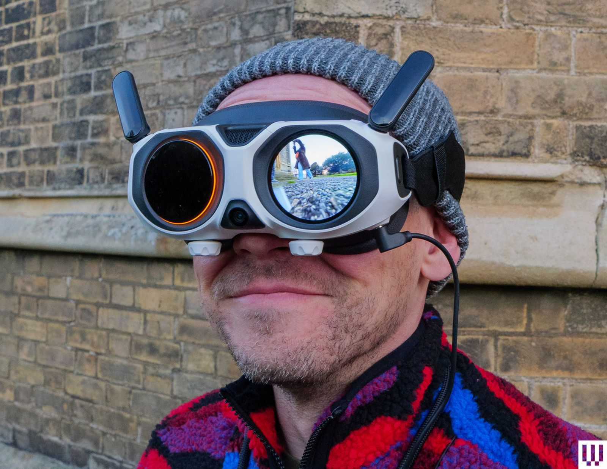

El Antigravity A1 es el primer dron 360 de consumo: la cámara va integrada en el propio fuselaje, no acoplada. Lo firma Antigravity, una marca nueva, con la tecnología de costura de Insta360 detrás, y su propuesta es tan sencilla como ambiciosa: grabar todo lo que rodea al aparato en un solo vuelo y decidir el encuadre después, ya en tierra. Pesa 249 g con la batería estándar, se pliega para transportarlo y no se pilota con dos palancas, sino con un mando de movimiento y unas gafas.

## Un dron 360 que graba todo y desaparece de la escena

El A1 lleva cuatro cámaras. Dos lentes ojo de pez, una en la parte superior y otra en la inferior, cubren cada una un hemisferio y se cosen en un único vídeo esférico; las otras dos miran hacia delante y se dedican a la detección de obstáculos, no a la grabación. El algoritmo heredado de Insta360 hace algo que ya conocemos de sus cámaras de acción: borra el propio dron y sus hélices del resultado, de modo que el aparato se vuelve invisible en la toma, igual que desaparece el palo de un selfi.

El sensor es de 1/1,28 pulgadas con apertura f/2.2, una combinación habitual en cámaras 360 ligeras. En vídeo ofrece 8K (7680×3840) a 30, 25 y 24 fps, 5.2K a 60 fps y 4K a 100 fps para cámara lenta. Las fotos llegan a 55 megapíxeles y los archivos se guardan en los formatos propietarios de Antigravity, que se exportan desde la aplicación móvil o desde Antigravity Studio. Hay 20 GB de almacenamiento interno y ranura para tarjetas microSD de hasta 1 TB.

La consecuencia práctica es la que repite el fabricante: se vuela primero y se encuadra después. De un mismo vuelo se pueden extraer vistas frontales, cenitales, laterales o traseras, algo que un dron con cámara convencional obliga a resolver durante el vuelo.

## Volar con las gafas Vision: la parte que de verdad cambia

Lo que separa al A1 de un dron al que se le acopla una cámara 360 es la vista en tiempo real dentro de las gafas. Las Vision Goggles usan dos pantallas micro-OLED de 2560×2560 por ojo a 72 Hz con óptica pancake, y siguen el movimiento de la cabeza: se puede mirar arriba, abajo o hacia atrás mientras el dron permanece quieto o avanza en otra dirección. Pesan unos 340 gramos, aguantan alrededor de dos horas y media de uso, ajustan la distancia interpupilar entre 59 y 72 mm y corrigen de −5 a +2 dioptrías. Una de las dos lentes frontales es en realidad una pantalla para que quien acompaña al piloto vea lo mismo.

El control es el Grip Motion Controller: se apunta hacia donde se quiere ir, se aprieta el gatillo y el dron vuela en esa dirección. No hay palancas ni modo acro. Antigravity ha anunciado un mando convencional de dos palancas para una actualización futura, pero por ahora el A1 se pilota únicamente con el mando de movimiento y las gafas. Hay dos modos de vuelo —FreeMotion, de apuntar y volar, y FPV, de girar la muñeca— y una cabina virtual con dragones o naves espaciales que solo funciona en el segundo.

La transmisión OmniLink 360 anuncia hasta 10 km en condiciones ideales bajo el estándar estadounidense FCC, pero en Europa la cifra homologada baja a 6 km, con una latencia media en torno a 150 ms. La vista en directo llega a 2K a 30 fps.

## Autonomía, disponibilidad y precio en España

El fabricante declara 24 minutos de vuelo con la batería estándar y 39 minutos con la de alta capacidad. En pruebas reales las cifras bajan: el análisis de Oscar Liang midió entre 15 y 17 minutos con la batería estándar y entre 25 y 28 con la de alta capacidad, algo habitual porque las mediciones oficiales se hacen sin viento y sin grabar. La autonomía es, aun así, notable para un dron por debajo de los 250 gramos.

Conviene aclarar un detalle importante para el comprador español: la batería de alta capacidad eleva el peso a 291 gramos y, según la propia Antigravity, no se vende en las regiones europeas. En España el A1 llega por tanto con la batería estándar, dentro de la clase C0 y por debajo del umbral de los 250 gramos.

El dron está disponible en España a través de cadenas y tiendas especializadas como MediaMarkt, Amazon.es, Camaralia y MurciaDrones. Se ofrece en tres packs —Standard, Explorer e Infinity— y el precio de partida del paquete estándar ronda los 849 euros según los comparadores de precios. En Estados Unidos, WIRED sitúa el punto de entrada en 1.599 dólares.

Otras especificaciones a tener en cuenta: resistencia al viento de nivel 5 (10,7 m/s) y retorno automático al punto de despegue. En el lanzamiento la evitación de obstáculos se limitaba al frente y la parte inferior; la actualización de primavera de 2026 la extendió a todas las direcciones, añadió un modo que esquiva los obstáculos en lugar de solo frenar, y sumó control por voz y grabación en timelapse.

## Lo que no convence: precio, controles obligatorios y un «8K» con matices

La propia WIRED, que le otorgó un 7 sobre 10, resume bien el equilibrio del producto. Elogia la innovadora configuración de la cámara, la calidad de las gafas y unas aplicaciones de móvil y escritorio bien resueltas, pero señala como problemas el precio elevado, unos controles de vuelo poco intuitivos, la obligación de usar gafas y mando de movimiento —sin alternativa de palancas por ahora— y la incomodidad para quienes ya llevan gafas de ver.

A esa lista se suman otros matices. La activación exige registrar el dron en la aplicación de Antigravity. No hay perfil LOG ni filtros ND físicos, de modo que el ajuste de color queda más limitado y el desenfoque de movimiento se resuelve por software. Y la latencia, superior a los 100 ms, es alta para lo que acostumbra el pilotaje FPV, aunque no lastra un vuelo de crucero tranquilo.

Queda el asunto del «8K». Esa cifra es la suma de los dos sensores, no la resolución que se obtiene en una dirección concreta: cada lente cubre 180 grados y aporta alrededor de 4K, y al reencuadrar la resolución efectiva cae todavía más. Como dron de imagen pura no sustituye a un Mini 5 Pro o a un Mavic, y quien lo compre esperando eso se llevará una decepción. Su valor está en otra parte: permitir grabarse a uno mismo mientras se vuela hacia delante, sacar varios ángulos de una sola pasada y colocar el encuadre sin repetir la toma.

¿Merece la pena? Para un creador de contenido que quiera 360 aéreo sin montar una cámara externa, el A1 es hoy una opción única y está a la venta en España. Para quien busque un dron de viaje sencillo de sacar y volar en cinco minutos, sigue siendo más caro y más engorroso que las alternativas de DJI. La innovación es real; el precio y la ergonomía del mando, todavía no acompañan. Si quieres seguir la actualidad de la sección, puedes consultar el resto de [análisis de drones](/noticias/drones/).
