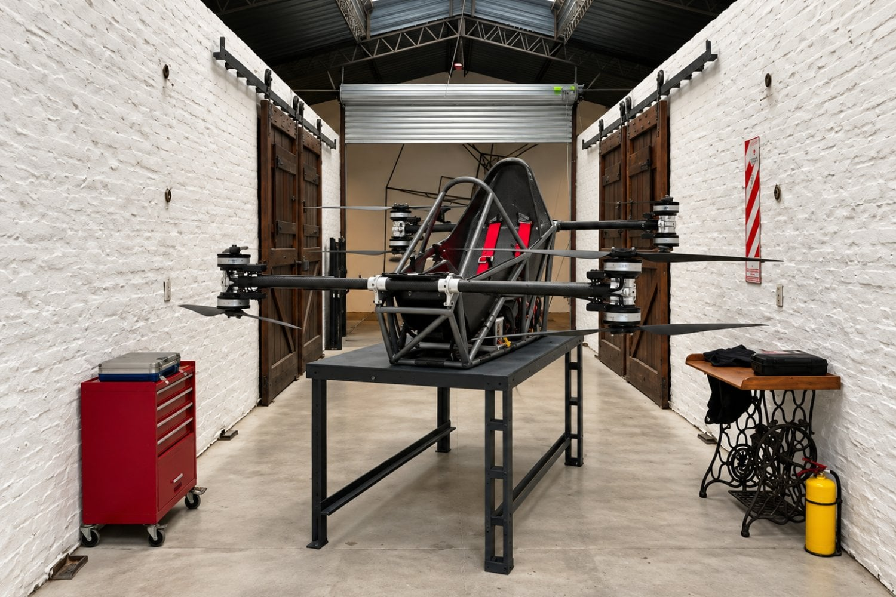

Un vehículo eléctrico que despega en vertical, pesa unos 115 kilogramos y ya ha volado con una persona a bordo. Eso es el Atol Mamba, un eVTOL monoplaza desarrollado en Argentina por un equipo que empezó el proyecto cuando varios de sus integrantes todavía estaban en la escuela secundaria.

La categoría eVTOL (electric vertical take-off and landing) agrupa a las aeronaves que despegan y aterrizan en vertical, como un helicóptero, pero con motores eléctricos y hélices. El Mamba pertenece a ese grupo y lo firma Atol Tech, empresa fundada por Nicolás Maculan, Matías Felizia y Francisco Yennaccaro junto a estudiantes y profesionales de ingeniería mecánica, aeroespacial, industrial y electrónica.

## Cómo es el Atol Mamba: ocho motores y despegue sin pista

El Mamba recurre a ocho motores eléctricos distribuidos en pares coaxiales: dos hélices montadas sobre un mismo eje. Esa configuración genera el empuje suficiente para el despegue vertical y, a la vez, añade redundancia. Según sus responsables, cada motor dispone de alimentación independiente, de modo que una avería puntual no debería traducirse de inmediato en la pérdida total de sustentación.

La aeronave suma sensores redundantes y una computadora de vuelo que asiste al piloto en tareas como mantener la estabilidad, controlar la inclinación y gestionar los movimientos verticales. El sistema de control toma ideas del mundo de los drones, aunque sus creadores insisten en que eso no significa que pueda volarse sin formación específica.

## Hasta 70 km/h y unos 20 minutos de vuelo

En las primeras pruebas, el Mamba alcanzó velocidades de hasta 70 km/h y tiempos de vuelo cercanos a los 20 minutos. El objetivo de la empresa es llegar a los 25 o 30 minutos de autonomía por carga.

El prototipo pesa unos 115 kilogramos en vacío, baterías incluidas, y usa paquetes de litio pensados para sustituirse con rapidez. Atol calcula que el cambio completo puede hacerse en menos de dos minutos, lo que acortaría el tiempo entre vuelos. En el apartado de seguridad incorpora una celda para proteger al piloto, un arnés de cuatro puntos y un paracaídas balístico capaz de frenar la aeronave completa ante una emergencia grave.

## De una idea estudiantil a la empresa y el reto regulatorio

El origen del Mamba está en proyectos que algunos de sus integrantes hicieron durante la secundaria. El interés creció tras competencias de ingeniería relacionadas con tecnologías aeroespaciales y acabó derivando en el desarrollo de una aeronave propia. En abril de 2026 el grupo formalizó Atol Tech S.A. para seguir con las pruebas, el desarrollo técnico y una eventual producción.

Que el vehículo despegue y transporte a una persona no significa que ya pueda usarse libremente. La compañía mantiene conversaciones con la Administración Nacional de Aviación Civil de Argentina para definir bajo qué categoría podría certificarse. Los eVTOL mezclan elementos de drones, helicópteros y aeronaves eléctricas, así que abren frentes regulatorios en licencias, mantenimiento, baterías, espacios de operación y procedimientos de emergencia.

Atol imagina aplicaciones recreativas y deportivas, e incluso usos en zonas de difícil acceso. Ante un panorama como el de los drones de consumo, donde ya existe una referencia clara como el [Antigravity A1 con cámara 360 integrada](/noticias/drones/antigravity-a1-dron-360/), la diferencia del Mamba es que apunta a llevar a una persona, no a una cámara. Antes de certificar nada tendrá que demostrar que puede volar de forma segura y repetible; de momento, ya superó una barrera importante: dejó de ser una idea de aula y puso a alguien en el aire.
