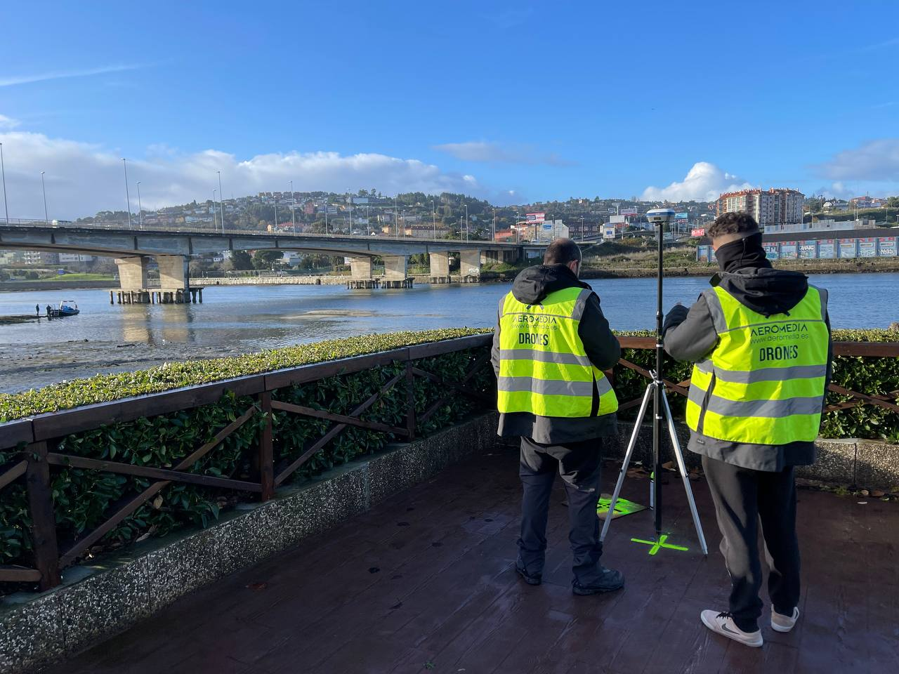

Levantar la topografía de un embalse, una presa o un tramo de costa tiene un problema que no aparece en un levantamiento terrestre: buena parte de la superficie que hay que modelar está bajo el agua. Ese es el escenario que resuelve la batimetría con dron. La empresa gallega Aeromedia aborda el reto combinando en la misma aeronave sensores LiDAR de alta precisión y sensores batimétricos, de forma que un único vuelo produce un modelo continuo que enlaza el terreno emergido con el fondo sumergido.

A diferencia de los drones de consumo orientados a la imagen, como el [Antigravity A1](/noticias/drones/antigravity-a1-dron-360/), aquí lo que se mide no es el vídeo, sino la cota del terreno y la profundidad del fondo.

## Qué es la batimetría aérea y qué resuelve

La batimetría es la disciplina que mide la profundidad y el relieve del fondo de masas de agua: embalses, ríos y zonas costeras. El método tradicional es la embarcación equipada con sonar, precisa pero lenta y limitada a las zonas navegables.

La batimetría con dron LiDAR cambia el punto de partida. El dron sobrevuela tanto la parte emergida como la sumergida y entrega ambos datos en un mismo sistema de referencia, sin desplazar una lancha y sin empalmar después dos levantamientos independientes. Según Aeromedia, esta combinación elimina la discontinuidad en la línea de costa: la cota del terreno visible y la profundidad del fondo quedan cosidas en un solo modelo digital.

## Aplicaciones: de los embalses al litoral

El interés de un levantamiento continuo aparece cuando la decisión depende de las dos superficies a la vez. Los usos que detalla la compañía son cuatro:

- **Embalses y presas:** control del volumen de agua almacenado y de la sedimentación acumulada en el vaso.
- **Zonas costeras:** modelado conjunto de la playa emergida y la plataforma sumergida próxima a la costa.
- **Cauces fluviales:** perfiles de río para estudios hidráulicos o de riesgo de inundación.
- **Infraestructura hidráulica:** apoyo a proyectos de ingeniería civil que necesitan la topografía completa del entorno de la obra.

En todos ellos el valor no está en la precisión de un sensor aislado, sino en que el modelo no se corta en la orilla. Esa continuidad es la que permite calcular, por ejemplo, cuánto sedimento se ha acumulado en un embalse o cómo evoluciona la playa sumergida.

## Los límites que conviene conocer

La técnica no funciona en cualquier masa de agua. Aeromedia señala que la profundidad y la claridad del agua deben ser compatibles con el sensor batimétrico empleado: cuanto más turbia o más profunda sea la lámina de agua, más se estrecha el margen de medición. Es la misma restricción que arrastra cualquier sistema óptico sumergido, y conviene tenerla presente antes de presupuestar un proyecto.

A ello se suma el contexto de la propia compañía, que presenta el servicio dentro de su actividad. Aeromedia UAV afirma ser la primera operadora de RPAS en España en embarcar sistemas LiDAR en drones, desde 2017, y la que tiene más de estos equipos en su flota, con cinco unidades en activo. Son datos de la empresa, no una comparación auditada de mercado: sirven para situar su experiencia, no para tomarlos como un ranking independiente.

Para quien gestiona agua o infraestructura hidráulica, la pregunta útil no es si el dron sustituye al sonar, sino si necesita un modelo continuo que una tierra y fondo. Cuando la respuesta es sí y las condiciones del agua acompañan, un solo vuelo sustituye a dos campañas. Cuando el agua no deja ver el fondo, ninguna tecnología aérea lo resuelve.
