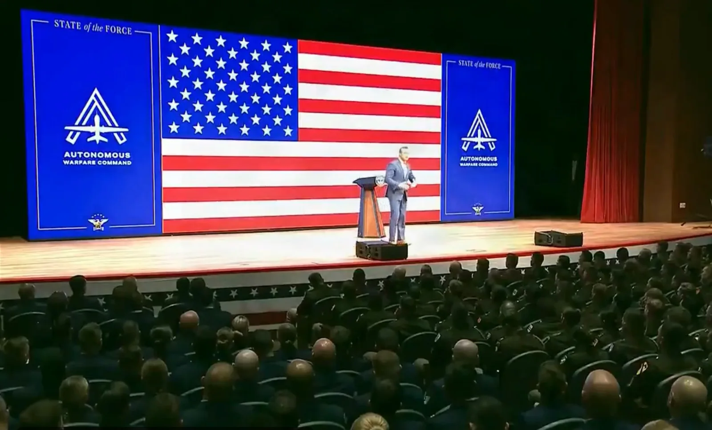

El secretario de Defensa de Estados Unidos, Pete Hegseth, anunció el 30 de septiembre la creación del Autonomous Warfare Command (AutoWarCom), un mando de combate de cuatro estrellas llamado a escalar drones, robótica e inteligencia artificial en todas las Fuerzas Armadas. Lo hizo ante unos 600 oficiales O-3 y suboficiales E-6 en la base del Cuerpo de Marines en Quantico (Virginia). La fecha objetivo es el 1 de octubre de 2027.

Según la nota del Departamento de Guerra, será un mando de combate funcional con competencias propias de una rama —presupuesto y personal incluidos— y con nuevas especialidades militares para quienes operan y combaten con sistemas no tripulados. Fue el primero de seis anuncios de la intervención y el único centrado en hardware. Hasta que ese mando exista, un esfuerzo interino llamado Project Agincourt, alojado en la oficina de sistemas no tripulados del Pentágono, debe construir el camino.

## Project Agincourt: la oficina de drones como constructora

El memorando de Agincourt, firmado el mismo día, encarga la tarea al Direct Reporting Portfolio Manager for Unmanned Systems (DRPM-UxS) y le da 30 días para presentar un plan de acción e hitos junto al jefe del Estado Mayor Conjunto. El primer plazo queda así en torno al 30 de octubre.

La DRPM-UxS es la oficina que DroneXL siguió en julio como el «zar de los drones» del Pentágono, creada el 29 de junio con autoridad de decisión sobre casi todos los programas no tripulados del departamento y línea directa con el subsecretario Steve Feinberg. Ya controla la Defense Innovation Unit (DIU), la fuerza de tarea contra drones JIATF-401 y el Defense Autonomous Warfare Group.

Agincourt añade dos misiones a esa cartera. La primera es la vía: cambios organizativos, la legislación y las trayectorias profesionales de oficiales y tropa. La segunda es un prototipo de lo que Hegseth llama adquisición de guerra. El memorando señala que el resultado buscado no es un dron concreto, sino un sistema de compra repetible que siga adaptándose en combate dentro del intercambio de costes correcto. Las decisiones y el dinero se desplazan hacia los mandos de combate y las unidades del frente, y los sistemas se prueban en ejercicios y, cuando es posible, en combate.

El nombre remite a 1415. En la versión de Hegseth, los ingleses ganan con arcos largos y trasladan a sus flecheros al frente para sostener la cadencia de fuego; los «flecheros» de la analogía son ingenieros y fundadores de startups embebidos con los operadores. Hegseth nombró a Owen West, director de la DIU desde el 2 de marzo, consejero delegado de la DRPM-UxS durante el próximo año, con el suboficial mayor de los Navy SEAL Max Strasiser como jefe de operaciones. West se ocupa del riesgo estratégico, los recursos y la escala; Strasiser, de la resolución operativa y el empleo en combate. West fue subsecretario adjunto de Defensa para Operaciones Especiales y Conflictos de Baja Intensidad y socio de Goldman Sachs, donde dirigió el negocio de gas y energía; se desplegó dos veces en Irak como marine en excedencia del banco. Strasiser es, según el departamento, el primer SEAL de tropa graduado en la Navy Test Pilot School.

La DIU se movió a la mañana siguiente. El 1 de octubre nombró a Travis Metz, su director adjunto y responsable del programa Drone Dominance, director en funciones, y afirmó en X que West «se aparta para poner en marcha Project Agincourt». Metz llegó a la DIU desde la oficina del secretario de Guerra, donde trabajó en Drone Dominance, tras una carrera en fondos de capital riesgo. Inside Defense adelantó el relevo.

## Los huecos del AutoWarCom: comandante, presupuesto y la ley

Hegseth dijo que un comandante de cuatro estrellas será nombrado pronto para izar la bandera del AutoWarCom, pero no dio ningún nombre. El memorando no fija cifra de dinero, número de efectivos ni cuartel general, y condiciona toda la estructura a una legislación que la DRPM-UxS debe ir a buscar al Congreso.

El Congreso se adelantó sobre el papel. El proyecto de ley de defensa del año fiscal 2027 del Comité de Servicios Armados del Senado, aprobado 18-9 en junio, crea un Robotic and Autonomous Systems Combatant Command de cuatro estrellas con competencias de prueba y evaluación y autoridad de adquisición limitada, según Breaking Defense. Ese texto no ha sido aprobado, y la autoridad limitada del Senado es más estrecha que las competencias propias de una rama que describió Hegseth. Conciliar ambas versiones es el trabajo legislativo que el memorando asigna a la DRPM-UxS.

El dinero ya está pedido. La solicitud del año fiscal 2027 busca 75.000 millones de dólares entre drones y trabajo contra drones, en su mayoría canalizados a través del Defense Autonomous Warfare Group que ahora cuelga de la DRPM-UxS, y Hegseth aprovechó el discurso para pedir al Congreso un paquete de reconciliación separado de 350.000 millones. Si el AutoWarCom absorbe parte de eso o recibe una línea propia no aparece en ningún documento publicado esta semana.

Hegseth enmarcó todo el mando en el coste. Durante 40 años, dijo, Estados Unidos compró calidad en lugar de cantidad. «El ritmo de la guerra cambia más rápido que el proceso para sostenerla», afirmó, antes de describir una mezcla de alta y baja gama en la que las armas exquisitas son el relámpago y los drones atricionables en masa son el viento y la lluvia de la misma tormenta.

## Qué señala el movimiento

El argumento de Hegseth se apoya en un año de resultados de Drone Dominance, el programa que Agincourt toma como plantilla. Se trata de una compra de 1.100 millones de dólares en cuatro fases de drones de ataque de un solo uso en la que los operadores militares vuelan y puntúan los aparatos de los proveedores y los pedidos siguen la clasificación. Gauntlet I generó pedidos de unos 30.000 drones. Para el 25 de agosto, los ganadores habían entregado 13.440 de los 22.320 que exigía el primer tramo, alrededor del 60 %. Gauntlet II, en Fort Carson en agosto, terminó con Neros firmando un pedido de 100 millones más 800 drones que sus rivales no lograron entregar, y el departamento abrió una ronda de fase 3 de 450 millones con un requisito de entrada de 400 drones el día antes de que hablara Hegseth. El programa prohíbe motores y baterías de China a partir de la fase II; cualquier cosa que compre el AutoWarCom heredará esa regla.

El discurso incluyó además Project Meridian, un estudio de 120 días sobre la guerra futura codirigido por Elon Musk, Palmer Luckey y Newt Gingrich bajo el director de tecnología Emil Michael, que terminará en un informe público con un anexo clasificado. Luckey fundó Anduril, que vende drones, sistemas contra drones y software de autonomía al departamento cuyos requisitos futuros ahora ayuda a escribir. La nota del departamento describe el panel como «los principales innovadores del sector privado del país» y no menciona recusaciones ni reglas de conflicto.

La brecha de entregas, más que el organigrama, decidirá si el AutoWarCom significa algo en octubre de 2027. Un mando de combate con autoridad de adquisición propia puede firmar cheques más rápido, pero no puede hacer que una startup con una cadena de suministro libre de China entregue los aparatos que se le adjudicaron si los motores no están. Quedan dos fechas por verificar: el plan de 30 días en torno al 30 de octubre mostrará si los servicios ceden estructura de fuerza o solo oficiales de enlace; el informe de Meridian a finales de enero dirá si un panel liderado por un fabricante de drones recomienda comprar más drones. Si ambos llegan a tiempo, el calendario es creíble; si el primero se retrasa, izar la bandera en 2027 será una ceremonia.
