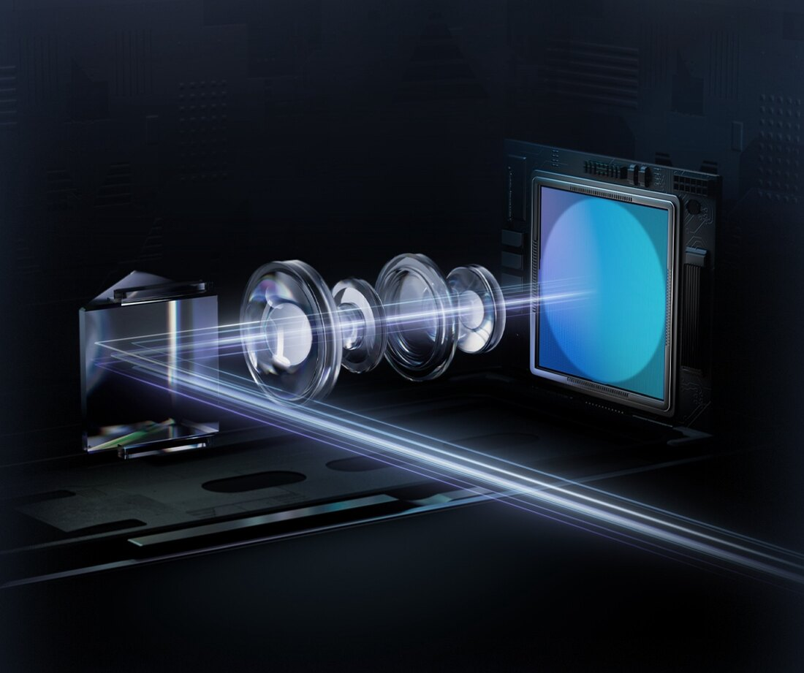

El DJI Avata 360 pesa 455 gramos y graba en 360 grados, pero no tiene modo manual ni acro. El piloto FPV Kai Vertigoh, con 260.000 suscriptores en YouTube, publicó el 28 de septiembre una prueba en la que lo somete a cinco encargos que normalmente reparte entre varios aparatos: un dron de cámara para alguien que vuela por primera vez, un dron de seguimiento autónomo, un equipo de doble operador, FPV de proximidad y una cámara de persecución para karts de derrape. Su conclusión es que, para la mayoría de compradores, el Avata 360 puede sustituir a más de un dron. Su propio análisis también marca el límite: para aprender FPV, un aparato que no vuela en acro no sirve.

## Qué es el Avata 360 y cómo se pilota

El Avata 360 es el dron insignia 360 de DJI. Pesa 455 gramos al despegue, mide 246 × 199 × 55,5 mm y se encuadra en la clase C1 europea. Lleva dos sensores cuadrados de 1/1,1 pulgadas con 64 megapíxeles efectivos cada uno y una óptica de 200 grados que se combina para producir un único vídeo esférico HDR de 8K a 60 fotogramas por segundo, además de fotos de hasta 120 megapíxeles. Los protectores de hélices vienen integrados en el fuselaje.

En el apartado de vuelo, DJI declara detección omnidireccional con un LiDAR orientado hacia delante y un sensor de infrarrojos inferior, transmisión O4+, unos 23 minutos de autonomía, 13,5 km de distancia máxima de vuelo y resistencia al viento de nivel 5 (10,7 m/s). El almacenamiento interno es de 42 GB. Hay dos modos de trabajo: grabación en 360 grados y objetivo único.

El control se resuelve con las gafas DJI Goggles 3 o N3 junto al DJI RC Motion 3 o el FPV Remote Controller 3, aunque para el modo de objetivo único también admite los mandos RC 2, RC-N2 y RC-N3. No hay modo manual ni acro: el modo más rápido, Sport, llega a 18 m/s (unos 40 mph) y desactiva la evitación de obstáculos.

## Lo que hace bien: seguir al sujeto y grabar en 360

El argumento de Vertigoh a favor de un dron sin acro se apoya en el software de seguimiento. ActiveTrack 360 y el modo que DJI llama Spotlight Free permiten que un solo piloto conduzca el vuelo mientras el aparato mantiene al sujeto encuadrado. El piloto lo compara con un Inspire 3 de doble operador, que él sitúa en unos 16.000 dólares. Spotlight Free es la función que destaca: el dron vuela en cualquier dirección mientras la pantalla mantiene un indicador sobre el sujeto marcado, de modo que se puede volver a él como si fuera un faro. En su vídeo reconoce que sobre el papel sonaba bien y que lo convenció en el aire.

La captura 360 también cambia los planos de persecución. El dron puede volar de morro hacia delante apoyándose en su LiDAR frontal mientras graba a un corredor que queda detrás, así que el sujeto aparece en el metraje sin que el aparato tenga que retroceder. Un dron de seguimiento de una sola cámara necesita volar de espaldas para filmar la cara del corredor, y Vertigoh señala que algunos de los que ha usado chocaron al hacerlo. En Battle Aero, el taller de karts de derrape de un amigo suyo, el Avata 360 se limitó a flotar y a registrar las pasadas, y los clips exportados ya salían encuadrados.

El equipo también puso a prueba la barrera de entrada. Un amigo que nunca había volado un dron aprendió los mandos en unos minutos y ejecutó la pasada mientras Vertigoh daba una voltereta sobre el aparato protegido. Grabar en 8K a 60 fps les permitió ralentizar la voltereta al 40 % sobre una línea de tiempo de 24 fps.

## Los límites: sin acro, un 8K repartido y un ecosistema cerrado

Vertigoh sitúa al Avata 360 por detrás del mejor dron FPV y del mejor dron de cámara. Su imagen de 8K se reparte entre dos lentes —en su cuenta, unos 4K por cada una— y detrás de un campo de visión ultra gran angular fijo; todo lo que vaya más allá del seguimiento automático exige poner fotogramas clave en DJI Studio después. Para calidad de imagen, remite a drones de una sola lente como el Mini 5 Pro, el Air 3S o el Mavic 4.

A eso se suma la ausencia de modo manual o acro: el Avata 360 no compite en velocidad con los cuadricópteros de 5 pulgadas, que según el piloto rondan las 100 mph (unos 160 km/h) frente a los 18 m/s del modo Sport. Y en Sport se apaga la evitación de obstáculos, que es como se rodó la persecución de los karts a la hora dorada. A la pregunta de si es el mejor dron de seguimiento, su respuesta es «posiblemente».

El vídeo no compara el Avata 360 con el Avata 2. Jeven Dovey lo hizo en abril y el informe de DroneXL sobre aquel careo encontró que la evitación de obstáculos del 360 hacía que el metraje FPV diera tirones, mientras que el Avata 2, de 377 gramos, se sentía mucho más fino con el mando de movimiento.

## ¿Para quién es?

El Avata 360 compite en la misma categoría que el [Antigravity A1, el primer dron de consumo con cámara 360 integrada](/noticias/drones/antigravity-a1-dron-360/). Frente a él, DJI admite mandos convencionales en el modo de objetivo único, además del ecosistema de gafas y mando de movimiento, y llega con la red de soporte y accesorios de la marca. En Estados Unidos la elección es más estrecha: la FCC autorizó el dron en noviembre de 2025 y meses después DJI entró en la lista de equipos cubiertos, de modo que DroneXL lo describe como probablemente el último dron nuevo de la marca que puedan comprar allí.

La propia DroneXL lo resume como «una cámara de seguimiento con protectores de hélices, y muy buena». Su valor está en grabarse a uno mismo mientras se vuela hacia delante y en resolver el encuadre después, no en ser el dron más rápido ni el de mejor imagen. Para un creador que quiera 360 aéreo sin montar una cámara externa, puede ser suficiente; para quien quiera aprender FPV, un dron que no vuela en acro no enseña. ¿Merece la pena? Como sustituto generalista convence a la mayoría de compradores, según esta prueba; como dron FPV, no.
