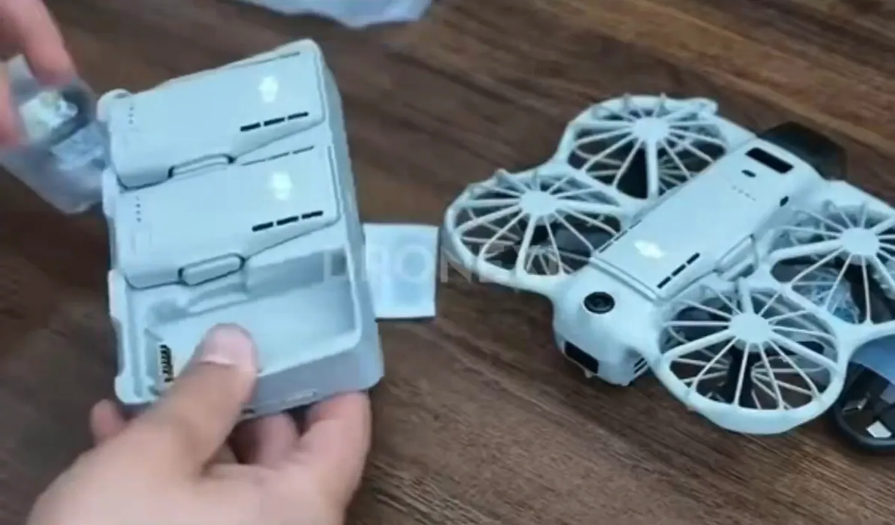

Un vídeo de unboxing del **DJI Neo 3** Fly More Combo de 49 segundos llegó este martes a X, y en esta ocasión el dron sale de la caja. El clip, difundido por el colaborador de DroneXL Jasper Ellens, muestra el aparato junto al mando DJI RC Mini con pantalla, un hub de carga, un cable USB-C y dos bolsas selladas. Tanto el vídeo como las imágenes son una **filtración**: DJI no ha anunciado el Neo 3 y no hay confirmación oficial de sus especificaciones.

El vídeo procede de una publicación filtrada en TikTok de la que un amigo de Ellens guardó una copia, según recoge DroneXL. La publicación original de la filtración tiene que leerse con la cautela habitual: los datos que siguen salen del clip y de filtraciones anteriores, no de documentación de DJI.

## Qué muestra el vídeo del DJI Neo 3

El dron aparece con **jaulas de radios sobre las cuatro hélices**, un diseño que protege las aspas de los golpes propios de un piloto principiante y que facilita volarlo en interiores. El resto del kit encaja con el panel de la caja que se filtró en septiembre: la aeronave, tres baterías de vuelo, el hub de carga, el mando DJI RC Mini y un cable USB-C. El panel también lista hélices de repuesto y un destornillador, aunque en el clip no llega a verse el contenido de las bolsas selladas.

El hub alberga dos baterías y una tercera va montada en el dron. Cada batería muestra filas de **ranuras negras en su cara superior**, además de cuatro LED de estado y un botón para consultar el nivel de carga sobre la propia batería. En uno de los planos finales se ve cómo se inserta una batería y una etiqueta regulatoria en el hueco inferior.

## Las ranuras y el peso: lo que corrige la filtración

Las ranuras son el detalle que más cambia respecto a lo que se creía. El 21 de septiembre, Ellens sostuvo que unas ranuras como estas hacían pensar que una imagen del Neo 3 que circulaba estaba generada por IA, y DroneXL escribió que una batería de vuelo con ranuras no era algo que DJI enviara de fábrica. Con el vídeo sobre la mesa, la conclusión se invierte: las ranuras existen y la imagen del 21 de septiembre era la impresión del dron en la caja de venta, así que la caja las dibujaba porque están en la batería.

El vídeo no permite saber si esas ranuras sirven para evacuar aire o son solo un acabado estético. La hoja de especificaciones filtrada el 1 de octubre tampoco da ningún dato de batería ni de tiempo de vuelo, de modo que la autonomía real sigue sin conocerse.

En el peso también hay margen para el matiz. Ellens cifra el dron en casi 200 gramos, una cifra que incluye el transceptor ahora integrado en el chasis, según DroneXL. El dato exacto viene de un listado de producción que Igor Bogdanov publicó el mes pasado: **192,7 gramos**. El DJI Neo 2 pesa 151 gramos por sí solo y 160 con el transceptor atornillado, así que, comparado en igualdad de condiciones, el salto estaría en torno a **33 gramos**.

## Qué significa para quien se plantee comprarlo

El Neo 3 mantiene la fórmula de la gama Neo —dron de iniciación, despegue desde la palma y vuelo sencillo— y añade un kit que cubre la primera tarde completa: las jaulas aguantan los golpes y las tres baterías evitan que la sesión termine cuando se agota la primera. El mando RC Mini, sin embargo, se percibe como un paso atrás si ya se vuela con un DJI RC 2 de pantalla integrada. Otras propuestas de DJI ya han pasado por nuestras páginas, como el [DJI Avata 360 a prueba en cinco encargos FPV](/noticias/drones/dji-avata-360-prueba-fpv/).

Falta lo esencial antes de sacar conclusiones: la aeronave **no tiene concesión de la FCC** en Estados Unidos, mientras que el RC Mini la obtuvo el 19 de diciembre de 2025, de modo que sin autorización DJI no podría venderla allí. Y el pequeño **panel rectangular en el morro, justo detrás del estabilizador**, que se ilumina en azul en uno de los planos, no aparece mostrando nada legible en todo el vídeo: ninguna fuente oficial explica qué muestra. Los sensores de evitación de obstáculos, con una lente redonda orientada hacia arriba en la parte trasera y ventanas oscuras en los brazos, apuntan a una detección omnidireccional, pero conviene repetirlo: nada de esto está confirmado por DJI.
