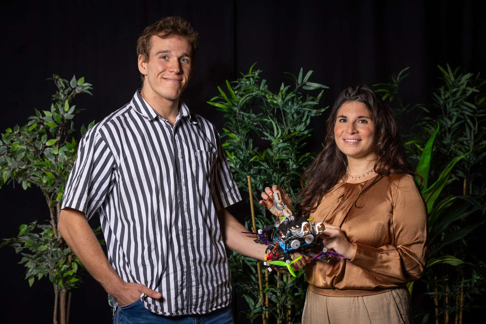

Los drones han aprendido a posarse en superficies inclinadas o heladas, pero agarrarse a una rama sigue siendo un problema sin resolver. Un equipo de la Universidad Tecnológica de Delft (TU Delft) ha presentado un prototipo que localiza y sujeta ramas guiándose por el tacto, no solo por la cámara. En las pruebas, el sistema logró una tasa de aterrizaje superior al 99 %.

## Aterrizar donde la cámara no ve

El aterrizaje es uno de los puntos más delicados de cualquier operación con drones, y en un bosque la cosa se complica. Los enfoques habituales se apoyan en una cámara para calcular dónde y cómo posarse, pero las ramas y las hojas tapan la vista del sensor, y la estimación deja de ser fiable.

La alternativa sería quedarse en el aire, pero mantener el vuelo estacionario tiene dos costes claros: consume batería a un ritmo alto y produce un ruido constante. Para observar fauna, los investigadores necesitan justo lo contrario: un equipo discreto y silencioso que no espante a los animales. Ya existen pinzas inspiradas en garras de aves para sujetar ramas, pero saber exactamente dónde está la rama es la mitad del problema.

## Cómo el dron agarra las ramas con el tacto

La inspiración viene de las aves, que tantean la rama con las patas antes de posarse. El prototipo traslada esa idea a tres dedos flexibles, cada uno dividido en tres secciones o falanges, como un dedo humano. Esa forma permite envolver la rama y ampliar la superficie de contacto.

Al principio el dron sigue usando la cámara para estimar la posición de la rama, pero después no se fía por completo de ella: extiende los dedos y los va tanteando hasta que se produce el contacto físico. Cada dedo lleva tres sensores táctiles sobre una superficie de silicona blanda, nueve en total, y cada uno responde a una pregunta muy simple: si está tocando el objeto o no.

Como el sistema sabe cuál de los nueve sensores se ha activado, puede afinar su estimación del tamaño, la posición y la orientación de la rama. Es un proceso parecido a reconocer un objeto con las manos y los ojos cerrados. «Cada sensor solo nos dice "aquí hay algo". Pero si conoces la forma de tu propia mano, eso basta para reconstruir dónde está la rama y cómo está orientada. El dron construye una imagen cada vez más precisa del objetivo simplemente chocando con él», explica Anton Bredenbeck, uno de los autores del proyecto.

Cuando el contacto se confirma, el dron ajusta el agarre, envuelve la rama con los dedos, los bloquea entre sí y se mantiene firme. Sujetarse no consume energía adicional gracias a unos muelles integrados en los dedos, de modo que la autonomía no se resiente mientras está posado.

## Qué implica para el vuelo real

Las cifras del sistema son sólidas: más de un 99 % de aterrizajes correctos y capacidad de corregir cuando la estimación visual inicial falla hasta 60 cm. El objetivo del proyecto no es sustituir la cámara, sino complementarla con el tacto cuando la información visual es poco fiable, algo habitual en entornos con vegetación densa.

El trabajo, liderado por la profesora asociada Salua Hamaza, se publicó en la revista *npj Robotics* de Nature. Para el uso real, la propuesta apunta a operaciones donde posarse y observar en silencio marca la diferencia: seguimiento de fauna, inspección en zonas con obstáculos y misiones que exigen permanecer en el sitio sin gastar batería. De momento es un prototipo de laboratorio, así que su llegada a productos comerciales dependerá de cuánto aguante la mecánica de dedos y muelles en campo abierto.

Mientras esta línea avanza en el laboratorio, el mercado de consumo sigue centrado en la imagen, con propuestas como el [Antigravity A1 y su cámara 360 integrada](/noticias/drones/antigravity-a1-dron-360/).
