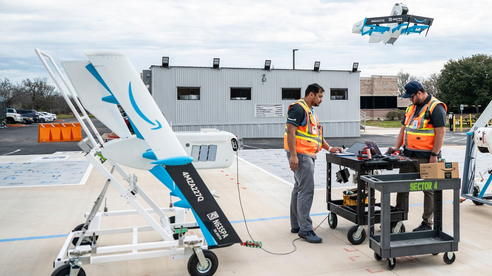
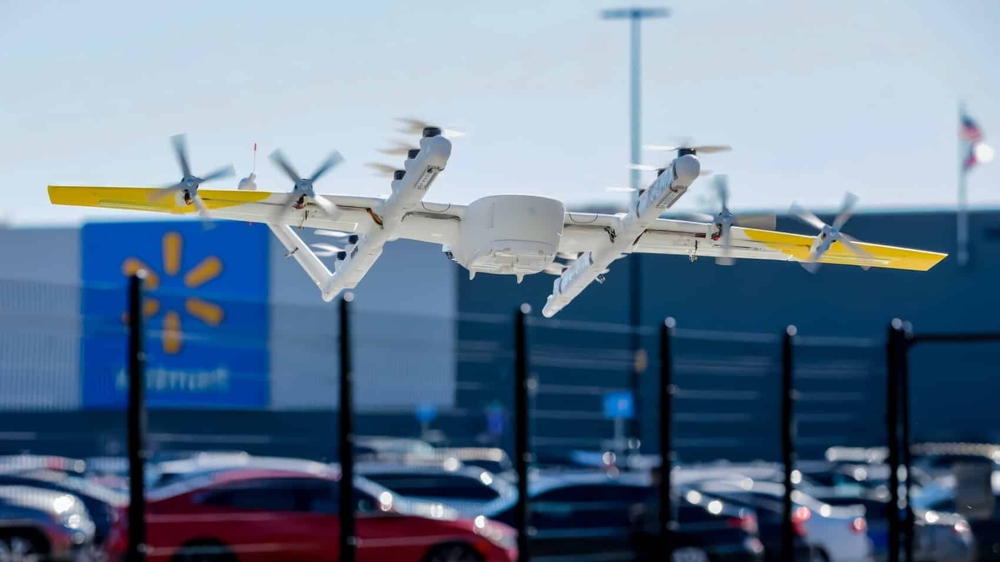

Quince estados y el condado de Harris (Texas) han demandado a la Administración Federal de Aviación (FAA) para que anule la evaluación ambiental con la que el organismo autoriza nuevos mercados de reparto de paquetes con drones en todo Estados Unidos. La demanda se presentó el lunes 28 de septiembre ante el Tribunal de Apelaciones del Segundo Circuito, con la fiscal general de Nueva York, Letitia James, como letrada de la coalición. El fiscal general de California, Rob Bonta, se ha sumado y firma la petición junto a los de Arizona, Colorado, Delaware, Illinois, Maine, Maryland, Massachusetts, Míchigan, Nuevo México, Oregón, Rhode Island, Washington y Wisconsin.

## El argumento legal: un aval nacional sin terreno

La pieza que los estados quieren tumbar es el aval que la FAA firmó el 28 de julio: una Evaluación Ambiental Programática (PEA) final, un Hallazgo de No Impacto Significativo (FONSI) y un Registro de Decisión. Ese paquete permite aprobar nuevos mercados de reparto bajo la Parte 135 apoyándose en un único estudio nacional, en lugar de repetir una evaluación ambiental por cada mercado. Antes, la FAA había completado 23 evaluaciones individuales entre 2019 y julio de 2025, además de una estatal para Carolina del Norte.

La Ley Nacional de Política Ambiental (NEPA) obliga a las agencias federales a examinar a fondo los efectos razonablemente previsibles de su acción. Para la coalición, el PEA describe entregas en lugares y fechas futuras sin identificar, sin información concreta sobre las comunidades y el entorno afectados, y sin abordar los riesgos de seguridad de un despliegue mucho mayor. «Se queda muy corta a la hora de analizar correctamente los impactos ambientales», resume Bonta.

El punto que la FAA respondió con menos profundidad, según el análisis de DroneXL, es el riesgo de incendio de las baterías de litio. La evaluación descartó un análisis detallado de materiales peligrosos confiando en que los operadores cumplan las normas de transporte y eliminación, diez meses después de que una batería de un Amazon MK30 saliera expulsada y ardiera cerca de Tolleson (Arizona), el 1 de octubre de 2025. La carta que 17 fiscales generales enviaron en enero también citaba el corte de un cable de internet por un dron de reparto en Waco. El margen judicial no es amplio: la sentencia unánime del Tribunal Supremo en *Seven County Infrastructure Coalition contra Eagle County* (mayo de 2025) pide deferencia hacia las agencias sobre cuánto análisis basta, así que un escrito que exija «más» parte en desventaja; uno que acredite que la FAA no escribió nada sobre un riesgo documentado sí tiene recorrido.

La carta de enero la firmaron 17 fiscales generales; la demanda, 15. Connecticut y Vermont se quedaron fuera. También cambió el foro: el texto de enero se apoyaba en la jurisprudencia del Noveno Circuito —el más favorable a NEPA— y cuatro demandantes (California, Arizona, Oregón y Washington) podían haber presentado allí, pero eligieron el Segundo Circuito, con sede en Nueva York. La petición no explica por qué. Y conviene recordar qué es: un aviso de revisión, no un escrito de alegatos. Los argumentos llegarán cuando la FAA aporte el expediente administrativo y el tribunal fije el calendario.

## Qué permite el aval: el reparto con drones que ya opera

Todas las aprobaciones de reparto bajo la Parte 135 que la FAA ha concedido desde el 28 de julio dependen del documento que los estados quieren anular. Amazon Prime Air lleva entregando desde 2022 en Lockeford (California) y busca ampliar a Tracy, en el mismo estado; esta primavera necesitó autorizaciones separadas para Detroit y Florida mientras preparaba Omaha y Baton Rouge. La expansión de Wing a 270 tiendas de Walmart y la solicitud de Zipline para Seattle pasan por el mismo hallazgo, igual que los vuelos de Matternet —primer dron de reparto con certificado de tipo de la FAA— y de Flytrex. DoorDash Air, que ya presentó [su propia plataforma de reparto](/noticias/drones/doordash-air-plataforma-reparto-drones/), anunció su certificado Parte 135 el 29 de julio, un día después del aval.

La Parte 108 no está en juego en este caso. El reparto de paquetes sigue bajo la Parte 135 hasta que se apruebe definitivamente la demorada norma de vuelo más allá de la línea de visión (BVLOS), y la propia FAA calcula que el reparto bajo la Parte 108 llegará uno o dos años después de eso.

## Qué cambia a partir de ahora

La coalición no ha pedido la suspensión cautelar, así que las aprobaciones siguen su curso mientras el tribunal decide. Si la Justicia anulara el hallazgo, la FAA volvería a las evaluaciones mercado a mercado que, según sus propios cálculos, tardaban entre seis y ocho meses cada una. El análisis de DroneXL sostiene que el remedio proporcionado al defecto no es tumbar todo el aval, sino exigir un análisis complementario de baterías con mitigaciones verificables.

Hay dos cosas que conviene seguir. La primera, si la coalición presenta una moción de suspensión que congele las nuevas aprobaciones mientras se decide el caso. La segunda, el calendario de alegatos una vez que la FAA registre el expediente. Hasta entonces, cada nuevo centro que la FAA autoriza lleva una nota al pie: un tribunal aún puede dictaminar que esa firma no valía nada.
