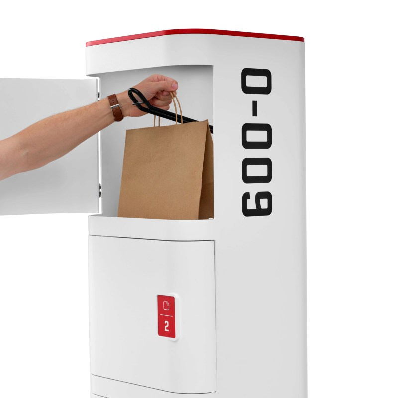

Matternet ha presentado el M3, la siguiente generación de su plataforma de reparto autónomo con drones. El fabricante, con sede en Mountain View (California), sitúa la entrada en servicio comercial en el segundo semestre de 2027 y ya ha nombrado a sus dos primeros socios de lanzamiento: la cadena de restauración Dave's Hot Chicken en Estados Unidos y la británica Apian, que opera una red sanitaria con drones para el NHS en el centro de Londres. La compañía prevé anunciar más alianzas en los próximos meses, orientadas a entregas de alto volumen.

El anuncio llega apenas unos días después de que sus acciones empezaran a cotizar. Desde el 21 de septiembre, Matternet cotiza en el mercado OTCQB Venture con el símbolo MTTN, tras una fusión inversa de 33 millones de dólares cerrada en junio. La empresa se presenta como la primera compañía cotizada dedicada en exclusiva al reparto con drones.

## Qué es el Matternet M3

El M3 no es un dron aislado, sino un sistema completo pensado para que un restaurante, una tienda o un hospital instalen un punto de reparto sin necesidad de personal de vuelo. Consta de tres piezas de hardware:

- **Aeronave M3.** Un dron autónomo con capacidad para cargas de hasta 11 libras (5 kg) dentro de un radio de servicio de 10 millas (16 km). Su bahía de carga admite envases comerciales estándar, como bolsas de comida y cajas de comercio minorista, además de configuraciones específicas para cargas sanitarias e industriales.
- **Dock M3.** Una estación que guarda y carga la aeronave entre vuelos. Puede instalarse en una azotea o a nivel de suelo.
- **Portal M3.** Un buzón de bajo coste y sin conexión a la red eléctrica donde el remitente deposita varios paquetes a la vez para su recogida posterior.

El flujo de trabajo es la parte que Matternet subraya: el empleado introduce el paquete en el Portal y se marcha. Todo lo demás —despegue, ruta, entrega y regreso— ocurre sin operador en el sitio, sin manipuladores de tierra y sin que nadie interactúe con la aeronave.

## Más carga y menos radio que el M2

Frente al M2, el M3 multiplica por 2,5 la capacidad de carga: sube a 11 libras (5 kg) desde las 4,4 libras (2 kg) del modelo anterior. El intercambio está en el alcance. El radio de servicio de 10 millas (16 km) del M3 se queda por debajo de las aproximadamente 12,4 millas (20 km) del M2. La lectura operativa es clara: más peso por viaje y una cobertura algo más corta, que en un entorno urbano denso no necesariamente se traduce en menos entregas útiles.

El movimiento se enmarca en un cambio de arquitectura que se extiende por el sector. Los operadores abandonan el modelo de centro de distribución con radio de reparto —que obliga a un mensajero a llevar cada pedido desde la cocina hasta un punto de lanzamiento— y compiten por colocar microdocks directamente en las azoteas de los comercios. Días antes, el competidor Flytrex presentó unas Rooftop Docks sin alimentación eléctrica con 8,8 libras de carga útil. Matternet se diferencia por el peso y por la flexibilidad del flujo asíncrono del Portal. El propio [DoorDash Air](https://www.techspain24.com/noticias/drones/doordash-air-plataforma-reparto-drones/) apunta en esa misma dirección con plataforma propia.

La compañía también apoya el despliegue en su alianza estratégica con SoftBank Robotics America y en la creación de capacidad de fabricación de la aeronave M3 en Estados Unidos. Según su fundador y consejero delegado, Andreas Raptopoulos, el objetivo es que el reparto con drones funcione como un servicio básico: «prácticamente invisible, fiable y barato», en sus palabras.

## Sin certificado de la FAA todavía

Aquí está el matiz que separa el producto del calendario. El M2 fue el primer sistema de reparto con drones en obtener la certificación de tipo estándar y la certificación de producción de la Administración Federal de Aviación estadounidense (FAA), en septiembre de 2022. El M3, en cambio, no tiene todavía certificado de tipo: una búsqueda en el Registro Federal solo arroja criterios de aeronavegabilidad para el M2. El propio comunicado de Matternet incluye la certificación del M3 entre los factores que podrían mover la fecha de lanzamiento.

El historial sirve de referencia. Entre la publicación de los criterios de aeronavegabilidad propuestos para el M2, en noviembre de 2020, y su certificado pasaron 22 meses. Para el M3 no hay criterios publicados y las pruebas con clientes siguen pendientes. El anuncio tampoco incluyó cifras de pedidos, número de aeronaves ni precio. En ese contexto, el segundo semestre de 2027 funciona como hoja de ruta más que como compromiso. El reparto con drones espera aún su marco definitivo, como demuestra la [demanda de quince estados contra la FAA](https://www.techspain24.com/noticias/drones/estados-demandan-faa-reparto-drones/) por el aval ambiental a estas operaciones.

Con esas cifras sobre la mesa, el M3 es una propuesta coherente para el cuello de botella real del sector —el coste por entrega y la mano de obra en el punto de origen—, pero su fecha depende de un certificado que todavía no ha empezado a tramitarse.
