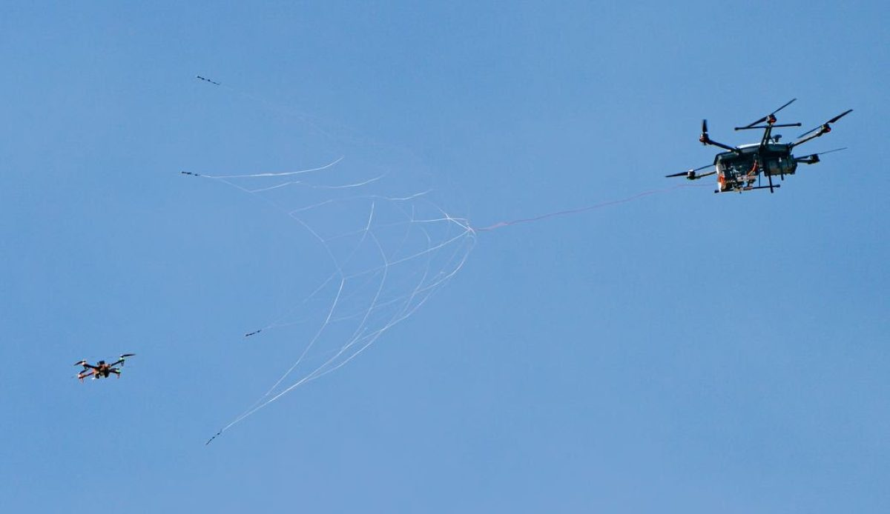

Dos movimientos del mismo día apuntan en la misma dirección: el dinero que entra en sistemas antidron capaces de detectar y detener aeronaves no tripuladas. Echodyne se ha asegurado un contrato marco de hasta 250 millones de dólares para el programa Domestic Shield de la Fuerza de Tarea Interinstitucional Conjunta 401 (JIATF-401) de Estados Unidos. En paralelo, Fortem Technologies ha cerrado una ronda Serie B de 50 millones liderada por Lockheed Martin. Ninguna de las dos cifras es un ingreso inmediato, y esa letra pequeña es la que explica dónde está de verdad el mercado.

## Echodyne: 250 millones como techo, no como ingreso

El contrato de Echodyne es de tipo IDIQ —entrega indefinida y cantidad indefinida—, una figura con la que el Gobierno se asegura un vehículo de compra en lugar de un pedido cerrado. El techo es de 250 millones de dólares y el periodo de pedidos llega hasta 36 meses. Es decir, el Ejército podrá ordenar capacidades antidron cualificadas a medida que aparezcan necesidades concretas, no de golpe.

Los radares MESA de la compañía quedarán disponibles a través del mercado C-UAS de la JIATF-401, tanto para fuerzas estadounidenses como aliadas. La tecnología se llama Metamaterials Electronically Scanned Array: una arquitectura de estado sólido que orienta electrónicamente el haz y promete un seguimiento detallado sin el tamaño, el peso, el consumo y el coste de los radares de barrido electrónico de mayor formato.

El modelo pensado para esta misión es EchoShield, un radar de alcance medio con seguimiento continuo a 10 Hz y una precisión angular inferior a 0,5 grados en azimut y elevación. Sus modelos de inteligencia artificial clasifican objetos, incluidos drones de ala fija y multirrotores. El tamaño reducido y el bajo consumo permiten instalarlo de forma fija, desplegarlo con rapidez o montarlo en plataformas móviles.

«La defensa antidron depende de saber con precisión dónde está una amenaza, mantener ese seguimiento y hacer llegar rápido los datos útiles a los sistemas que pueden responder», resume el consejero delegado de Echodyne, Eben Frankenberg. Detrás de la capacidad de fabricación, la empresa abrió hace poco una planta de 86.350 pies cuadrados (unos 8.020 metros cuadrados) en el estado de Washington, con capacidad para más de 30.000 radares al año.

## Fortem: 50 millones y un socio que también compra

La ronda de Fortem no es solo capital nuevo. Lockheed Martin lidera los 50 millones de la Serie B y ya había comprometido 25 millones en el primer tramo, anunciado a comienzos de este año. En la operación participan también Unusual Machines y otros inversores estratégicos e institucionales. Para una empresa con sede en Lindon (Utah), el respaldo del mayor contratista de defensa de Estados Unidos vale tanto como el dinero: refuerza una relación que ya existe.

El destino de los fondos es concreto: acelerar la fabricación en su planta de Utah y ampliar el despliegue de la familia SkyDome, que combina sensores radar TrueView, software de mando y control con inteligencia artificial e interceptores autónomos DroneHunter. El conjunto está diseñado para detectar, seguir, clasificar y, llegado el caso, neutralizar amenazas aéreas.

Fortem acumula contratos que dibujan el tamaño del mercado. El Departamento de Seguridad Nacional (DHS) la eligió para proteger recintos durante el Mundial de Fútbol de 2026, tiene un contrato con el Ejército estadounidense para la defensa de instalaciones en todo el mundo, integra su tecnología en la arquitectura antidron Sanctum de Lockheed Martin y en agosto quedó como la única pequeña empresa seleccionada como contratista principal del contrato quinquenal de hardware y software antidron del DHS, con un techo inicial estimado de 1.011 millones de dólares.

«La amenaza es real, la demanda está aquí y nuestra tecnología está probada en entornos reales», afirma el director de negocio de Fortem, Charlie O'Connell. Stephanie C. Hill, presidenta de Lockheed Martin Rotary and Mission Systems, añade que los clientes buscan sistemas que se puedan desplegar rápido, escalar en volumen y adaptar a medida que evolucionan las amenazas.

## Qué cambia en el negocio antidron

Las dos operaciones cuentan la misma historia desde ángulos distintos. Echodyne vende el sensor que ve y sigue; Fortem vende la cadena completa que además intercepta. En ambos casos el comprador es el mismo —Gobierno y fuerzas armadas— y el cuello de botella se ha movido del diseño a la producción: plantas capaces de fabricar por miles de unidades y contratos marco pensados para comprar por volumen cuando la necesidad aprieta.

Para el sector civil, la consecuencia es indirecta pero real. La misma tecnología de radar de bajo coste que se despliega para proteger una base acaba definiendo el precio y la disponibilidad de los sistemas que vigilan aeropuertos, estadios o infraestructuras críticas. Y todo ello ocurre mientras el espacio aéreo de bajo nivel se llena de aeronaves no tripuladas y la pugna regulatoria por quién puede volar y dónde sigue abierta, como muestra la [demanda de quince estados contra la FAA por el reparto con drones](/noticias/drones/estados-demandan-faa-reparto-drones/).

La duda que queda no es si habrá más dinero, sino cuánto de estos 250 y 50 millones se convierte en radares desplegados y en interceptores en servicio. Los contratos marcos se agotan ordenando, no firmando.
