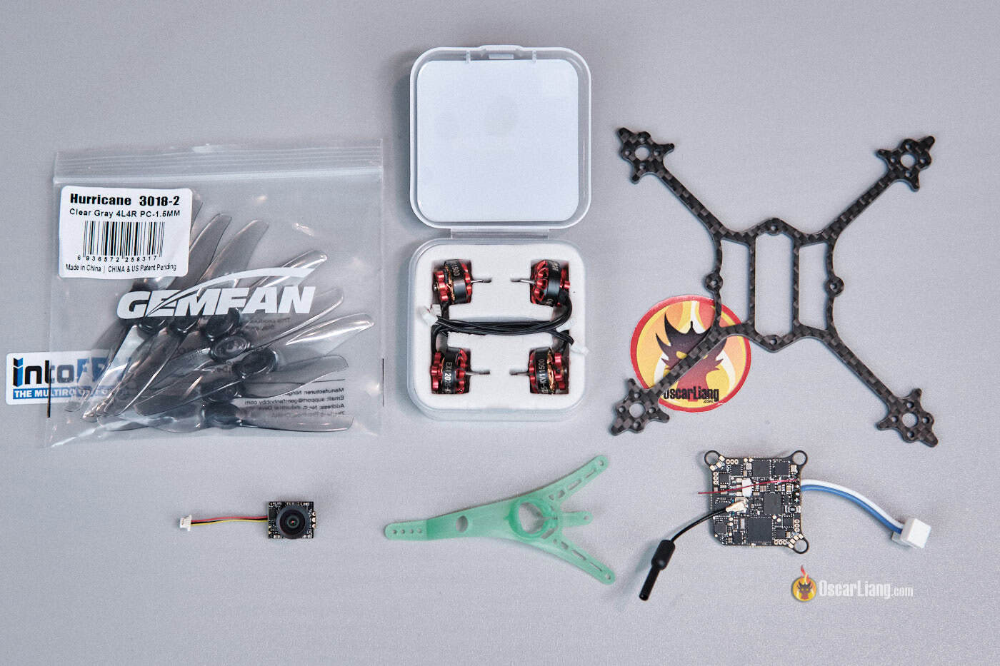

Un toothpick de 1S y 3 pulgadas es una de las plataformas más prácticas para volar cerca de casa: pesa menos de 50 g, es silencioso y no necesita grandes espacios. El montaje que reproduce esta guía se queda en **49 g con batería**, ofrece algo más de **5 minutos de vuelo** y se arma en unos **30 minutos**, sin soldadura ni cableado complicado. La clave está en reaprovechar la electrónica de un Tiny Whoop —la controladora 5 en 1, la cámara y la cúpula de un Air65— y trasladarla a un chasis de 3 pulgadas.

## De qué consta el montaje

Todo el conjunto es de tipo plug and play. Si se usan las mismas piezas, no hace falta soldador. La siguiente lista es la combinación exacta del montaje analógico de Oscar Liang:

- **Controladora 5 en 1 Matrix**: hay que elegir la versión con conectores para los motores.
- **Cúpula Air65 II**.
- **Cámara FPV C03**: también sirve la cámara del Air.
- **Batería LiHV 1S Lava II**: en versiones de 480, 580 o 680 mAh.
- **Kit de chasis Crux3, motores y hélices**: se puede comprar como conjunto, y es la opción con mejor relación calidad-precio.
- Alternativa por separado: **chasis Crux3**, **motores Happymodel 1202.5 11500 KV** y **hélices Gemfan 3018-2**.

Además, hacen falta unos herrajes sueltos: 4 tornillos M2x10 para la cúpula, 4 tuercas de nylon M2, una goma elástica para sujetar la batería y un trozo pequeño de espuma para apoyarla.

## Pasos para montar el toothpick de 1S y 3 pulgadas

El orden importa poco porque no hay soldadura, pero conviene respetarlo para no desmontar después. Cada paso es reversible.

1. **Montar los motores en el chasis.** Se fijan con los tornillos incluidos. Basta con poner dos tornillos en diagonal en lugar de los cuatro: es suficientemente firme y ahorra algo de peso.

2. **Colocar la goma elástica alrededor del chasis.** Servirá para sujetar la batería. También hace de soporte para los cables de los motores. Si se prefiere, se puede imprimir en 3D un soporte de batería para el Crux3; hay diseños gratuitos disponibles.
3. **Fijar la controladora 5 en 1 Matrix al chasis** con los tornillos M2x10.
4. **Insertar la cámara en la cúpula** comprobando que la orientación es la correcta. No conviene montarla al revés.
5. **Conectar la cámara a la controladora.**
6. **Instalar la cúpula con las tuercas de nylon.** Para doblar el plástico sin romperlo, conviene calentarlo antes con un secador de aire. No hay que apretar las tuercas en exceso: si se comprimen demasiado las gomas, el montaje blando pierde eficacia.
7. **Conectar los motores a la controladora.**
8. **Pegar un trozo pequeño de espuma bajo el chasis** como almohadilla de la batería. Cualquier espuma blanda sirve; lo importante es que nada afilado pueda clavarse en la batería.
9. **Sujetar la batería con la goma elástica.**
10. **Comprobar el peso.** El conjunto en seco queda en 36,3 g; con una batería de 1S y 480 mAh, el peso al despegue es de 49 g.
11. **Revisar las hélices.** Según lo ajustadas que queden en el eje del motor, pueden no necesitar tornillos. Si van sueltas y se salen en los impactos, se aseguran con tornillos M2x7.

## Configuración en Betaflight

No es necesario actualizar el firmware: el de serie funciona bien y basta con configurarlo. Estos son los ajustes que conviene revisar:

1. En la pestaña **Sensors**, colocar el dron sobre una superficie plana y pulsar **Calibrate** en el acelerómetro.
2. En **Configuration**, activar las dos opciones de **DShot Beacon Configuration**.
3. En **Power & Battery**, fijar la tensión mínima en 3,2 V y la de aviso en 3,4 V.
4. En **PID Tuning**, entrar en **Rateprofile** e introducir los rates propios. Se pueden dejar los de serie.
5. En **Modes**, configurar los interruptores para Arming, Angle mode, Beeper, etc.
6. En **OSD**, configurar los elementos que se quieran ver en pantalla.
7. En **Motors**, poner **Motor Poles** en 12. Opcionalmente se puede activar «Motor direction is reversed» para volar con las hélices hacia dentro (*props out*); el valor por defecto también funciona.
8. De nuevo en **Motors**, pulsar **Reorder motors** y recorrer el proceso para comprobar que el orden es correcto.
9. Otra vez en **Motors**, pulsar **Motor Direction** y recorrer el proceso para confirmar el sentido de giro de cada motor.

Un punto crítico: hay que revisar la alineación de la placa en Betaflight (**Sensor** tab). Ante la duda, lo más seguro es usar el asistente **Auto-detect board alignment**. Los valores de referencia son **Roll 0, Pitch 0, Yaw 315** y **CW180 First Gyro**.

Después, toca enlazar el receptor ExpressLRS con la emisora. El método más sencillo es pulsar el botón **Bind receiver** en la pestaña del receptor de Betaflight. Por último, se instalan las hélices.

## Cómo verificar que funcionó

- En Betaflight, los motores giran en el orden y el sentido correctos tras los pasos 8 y 9.
- La alineación de la placa coincide con los valores de referencia o con lo que devuelve el asistente.
- El dron arma y despega sin cabeceos raros en el primer vuelo de prueba.
- La autonomía ronda los 5 minutos y el peso al despegue se mantiene cerca de los 49 g con la batería de 480 mAh.

## Advertencias y limitaciones

Un 1S no destaca por potencia bruta, y no es lo que se busca aquí: el atractivo está en la ligereza, la eficiencia y lo fácil que resulta volarlo. Tampoco es un dron duro. Sobre hierba aguanta bien los golpes, pero sobre hormigón conviene conocer el límite. La sujeción de la batería con goma elástica es simple y eficaz; si se quiere algo más firme, un soporte impreso en 3D resuelve el problema. Y antes de doblar la cúpula, calentarla con aire evita romperla.

El ajuste de PID y filtros de serie funciona correctamente en este cuadricóptero, aunque siempre hay margen de mejora. Para quien se acerque por primera vez al micro FPV, es un montaje sencillo, barato de mantener y divertido de volar: hardware simple, poco ruido, autonomía suficiente y sin necesidad de un gran espacio. Si el micro FPV te interesa, puedes seguir el resto de nuestra [cobertura de drones](/noticias/drones/).
