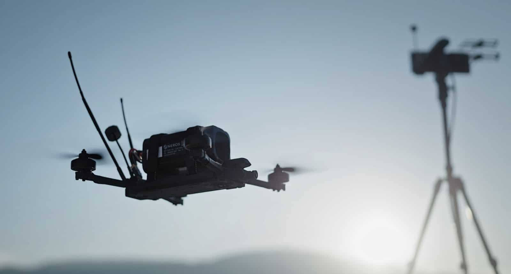

El programa Drone Dominance del Pentágono ha pedido a Neros Technologies 14.000 drones y cargas explosivas a través de Gauntlet II, un pedido que la compañía de Torrance (California) valora en más de 100 millones de dólares. El encargo llega después de que la empresa se llevara el primer puesto en la misión Close Quarters Battle y el tercero en Deep Strike, ambas disputadas en Fort Carson (Colorado) en agosto. A esa adjudicación se suma otra más pequeña: 800 drones del programa anterior, retirados a competidores que no cumplieron el plazo de entrega.

## Qué incluye el pedido de Neros en Gauntlet II

El pedido cubre el Archer AI, un dron FPV de 10 pulgadas con guiado terminal que vuela por sí mismo hasta el objetivo que marca el operador, y un Archer de 5 pulgadas pensado para el combate urbano y en interiores. Neros no detalla cuántas unidades de los 14.000 corresponden a cada modelo; solo señala que el departamento prioriza el Archer AI, el modelo con el que la compañía se presentó en agosto junto a su ronda de financiación Serie C de 250 millones de dólares.

Es también el primer envío en serie de drones construidos bajo APEX (Adaptive Payload Exchange), el estándar abierto que Neros presentó para que los operadores puedan intercambiar en campaña cargas convencionales, de fibra óptica y repetidores.

## Por qué el total supera los 100 millones

Los precios unitarios que fijó el programa en Gauntlet II son de 3.500 y 4.500 dólares. A esa tarifa, 14.000 drones cuestan entre 49 y 63 millones: la diferencia hasta rebasar los 100 millones está en las cargas explosivas, el único concepto que Neros menciona además de los aparatos. La tarifa de 4.500 dólares de Deep Strike excluía la militarización, de modo que, incluso si los 14.000 fueran drones de Deep Strike, al menos 37 millones quedarían fuera del precio de lista de la aeronave. El total equivale a más de 7.100 dólares por dron, una cifra que la propia hoja de precios del programa nunca muestra.

Neros no ofrece desglose. Para ponerlo en contexto, Swarm Defense, quinta en Deep Strike, anunció la semana pasada un pedido de 4.000 drones con un valor mínimo de 25 millones que incluía municiones y software de control, es decir, unos 6.250 dólares por unidad. Tectonic Defense, que adelantó la cifra de 14.000 el 23 de septiembre antes de que Neros la confirmara, calculaba unos 70 millones solo por los drones.

El programa movió ficha: al abrir la Fase 3 el 28 de septiembre subió el precio de Deep Strike a 5.000 dólares y bajó el de Close Quarters Battle a 3.000. La cantidad encaja además con la escalera del Request for Solutions de abril, que asignaba 8.000 drones al primer puesto y 6.000 al tercero en cada área de misión.

## Los 800 drones retirados a rivales que no entregaron

El pedido no se limita a Gauntlet II. Neros recibió un segundo bonus de Gauntlet I: 800 drones que se retiraron a competidores que no cumplieron el plazo de producción. Es su segunda bonificación de esa fase, porque entregó y obtuvo la aceptación de los 2.400 drones de su pedido de marzo en julio, lo que le valió un primer bonus de 2.000 unidades. En total, suma 5.200 drones de Gauntlet I.

El resto del campo no siguió el ritmo. Gauntlet I exigía a los 11 ganadores entregar la mitad de 22.320 drones en dos meses y medio y el resto en cuatro y medio. Al 25 de agosto habían llegado 13.440, alrededor del 60 %. Solo Neros, Ukrainian Defense Drones y Griffon Aerospace habían completado sus pedidos, y los lotes de UDD, Skycutter y ModalAI seguían pendientes de inspección. El retraso se atribuye a la escasez de motores, baterías, sensores y chips conformes con la normativa NDAA.

Neros no precisa qué competidores perdieron esos 800 drones. Su consejero delegado, Soren Monroe-Anderson, describió el programa como una prueba de si las empresas saben construir buenos drones y «producirlos en cantidades masivas con poco aviso». La compañía sostiene que es el único fabricante con más de un bonus de Gauntlet I.

## Qué cambia en la fabricación de drones de defensa

Neros fabricaba unos 1.200 Archer por semana en agosto, de modo que un pedido de 14.000 unidades equivale a menos de tres meses de producción. Los rezagados de Gauntlet I, en cambio, seguían sin terminar el pedido de marzo a finales de agosto. Para optar a una plaza en Gauntlet III hay que superar primero la puerta de 400 drones entregados que el programa abrió el lunes, en unos dos meses.

La lectura de industria es clara: la capacidad de entrega pesa tanto como la puntuación en las pruebas. Un programa que reparte drones de quienes no los fabrican a quien sí lo hace convierte el cumplimiento en el criterio que decide quién permanece. Para el fabricante estadounidense de drones de defensa, el cuello de botella ya no es solo diseñar un buen aparato, sino asegurar componentes conformes y escalar la cadena de suministro a tiempo.

Puedes seguir la actualidad del sector en la sección de [drones de defensa y su industria](/noticias/drones/).
