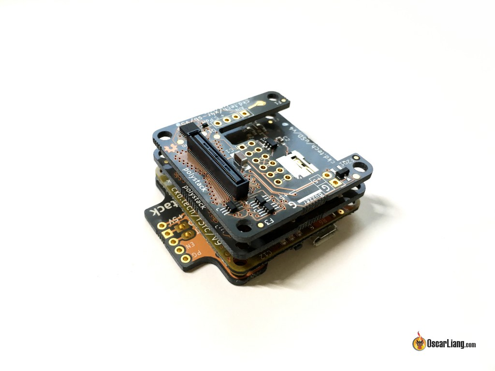

El FPV evoluciona a un ritmo que deja ideas por el camino. Cada pocos meses alguien propone una forma nueva de montar un dron: cableado más limpio, menos peso, mejor aislamiento de vibraciones, reparaciones más fáciles o más integración. Algunas propuestas se convierten en estándar y otras desaparecen en silencio. Y desaparecer no siempre significa que fueran malas: en muchos casos la tecnología tomó otro camino, otra solución salió más barata o más sencilla, y en algún caso la idea llegó unos años antes de tiempo. El repaso retrospectivo que firma Oscar Liang reúne siete de esos conceptos que no llegaron a cuajar, y leerlo hoy ayuda a entender por qué los drones actuales se montan de una forma tan distinta.

## Montajes FPV que quedaron atrás: motores inclinados y aislamiento de vibraciones

Los motores inclinados fueron uno de los primeros experimentos de la época dorada del FPV de carreras, hacia 2014 y 2015. En lugar de montar los cuatro motores planos sobre los brazos, se colocaban cuñas debajo para inclinarlos hacia delante. La lógica era sólida: cuando un cuadricóptero vuela rápido tiene que inclinar todo el cuerpo hacia delante, y por eso los drones de carrera necesitan ángulos de cámara tan extremos —hasta 50° o 60°— para ver el horizonte a plena velocidad. Inclinando los motores, el aparato genera empuje hacia delante sin inclinarse tanto, y de paso el fuselaje puede mantenerse más nivelado y reducir la resistencia del aire. Fueron un accesorio genuinamente popular durante un par de temporadas.

¿Por qué desaparecieron? Sobre todo porque el hardware, el peso y la complejidad extra no compensaban. Los chasis de carreras se volvieron más ligeros y aerodinámicos, y los pilotos sencillamente se acostumbraron a volar con una inclinación de cámara agresiva.

Años después llegó el aislamiento de los motores, alrededor de 2017. Con motores más potentes, mayores tasas de muestreo del giroscopio y tiempos de bucle de PID más agresivos, la vibración y el ruido del giroscopio se convirtieron en un problema serio. La solución propuesta era aislar físicamente los motores del chasis con goma, TPU, espuma u otro material amortiguador. La idea tenía sentido: si la vibración nace en el motor, se corta antes de que entre en el chasis. Pero introdujo otros problemas. Los tornillos del motor podían aflojarse, porque para que el aislamiento funcione no conviene apretarlos a fondo; los soportes sumaban peso y complejidad, y amortiguar el propio motor no siempre era necesario.

Lo que de verdad acabó con la tendencia fue la integración: los fabricantes de controladoras empezaron a montar el giroscopio sobre amortiguación y, con el tiempo, a aislar la placa entera con ojetes de goma. A eso se sumó que el filtrado por software en Betaflight mejoró muchísimo.

## Placas y ESCs a medida: cuando el cableado era el enemigo

Hubo una época en la que solo un puñado de chasis FPV eran verdaderamente populares, y los fabricantes empezaron a hacer PCB con la forma exacta de su placa inferior para soldar toda la electrónica directamente encima. El caso más recordado es el ZMR250, un clon del icónico Blackout Mini H que, al ser mucho más barato y accesible, se convirtió en uno de los chasis más vendidos de su momento. La idea era sustituir la placa inferior por una PDB con la forma del chasis y soldar ahí la controladora, el BEC, los ESC, el cable XT60 de batería, la cámara, el OSD, el VTX, el receptor y el zumbador. Visto entonces, parecía el futuro: las instalaciones quedaban limpísimas porque desaparecía buena parte del cableado.

El problema fue la compatibilidad. Esas PDB solo existían para un puñado de chasis concretos, así que limitaban la elección de montura. Hoy hay más chasis de los que se pueden contar y la fórmula ya no es práctica. Además, las controladoras y los ESC se integraron cada vez más: una FC moderna incluye BEC, sensor de corriente y OSD, y los ESC 4 en 1 se encargan también de la distribución de energía, de modo que una PDB separada ya casi no hace falta.

En esa misma lógica encaja el ESC 4 en 1 modular. El Xracer Quadrant 25A fue quizá el primer intento —y el último— de combinar la flexibilidad de los ESC individuales con la comodidad de un 4 en 1: eran ESC sueltos que se podían ensamblar de cuatro en cuatro. Sobre el papel ofrecía lo mejor de ambos mundos: ESC individuales para un aparato poco habitual, cuatro soldados bajo la controladora para montar en torre, y la posibilidad de sustituir un solo módulo en lugar de tirar una placa 4 en 1 completa si se quemaba uno. La razón de su desaparición fue prosaica: los 4 en 1 convencionales se volvieron muy asequibles, fiables y compactos. Se impusieron, y los ESC individuales, que fueron el estándar, hoy son una opción de nicho.

## Cámaras y stacks que llegaron antes de tiempo

Antes de que el FPV digital se generalizara, el piloto vivía atrapado en un compromiso: o baja latencia en la señal de vídeo, o grabación en alta calidad. Las cámaras de acción grababan imágenes excelentes, pero tenían demasiada latencia para usarlas como señal de vuelo. La respuesta de algunos fabricantes fue meter dos sensores en el mismo módulo: uno para la señal analógica de baja latencia y otro para grabar 1080p o incluso 4K en una tarjeta. El RunCam Hybrid, en 2019, fue una de las implementaciones más conocidas. Lo que lo borró del mapa fue el FPV digital: sistemas como el DJI O4 Pro entregan la señal de vuelo y graban a alta resolución a bordo, y quien exige la mejor imagen posible sigue llevando una cámara dedicada, como la DJI Action 6.

El otro ejemplo claro de idea adelantada es la cámara FPV en 3D. En lugar de una sola, se montaban dos cámaras separadas entre sí imitando los ojos humanos, y el sistema enviaba vídeo estereoscópico a unas gafas VR compatibles para percibir profundidad en vez de una imagen plana. Funcionaba. Para volar cerca de obstáculos, la sensación de profundidad suena ideal, porque permite calcular la distancia a una rama de forma más natural. Pero todo el sistema se volvía más complejo: dos cámaras, procesamiento de vídeo específico, transmisión y gafas compatibles. Añadía coste, peso y complicaciones para resolver algo que el cerebro ya calcula sorprendentemente bien con el movimiento, la perspectiva y la experiencia. Mientras tanto, el FPV convencional mejoró en resolución, campo de visión y latencia. El 3D nunca desapareció del todo como experimento, pero tampoco fue la revolución que se imaginó.

El último de la lista es el stack modular de controladora. En 2016, Chickadee planteó un ecosistema en el que se partía de la FC y se apilaban placas o «mods» según lo que hiciera falta: un módulo de tarjeta microSD para almacenamiento de blackbox, otro para el receptor concreto, un breakout para sumar conexiones serie. Todas las placas usaban conectores de alta densidad y eran plug and play, se podían encadenar varias en la misma torre y el proyecto era de código abierto. La filosofía era impecable: ¿por qué cambiar una controladora entera solo para añadir una función? El problema es que la modularidad cuesta dinero y ocupa espacio: la FC ya era relativamente cara y encima había que comprar los módulos, y quien necesitaba muchas funciones acababa con una torre voluminosa. Justo en ese momento, las controladoras normales empezaron a incluir OSD, BEC, barómetro, memoria de blackbox y varios UART de serie en una sola placa barata.

## ¿Merece la pena mirar atrás?

La conclusión del repaso es que la mayoría de estas iniciativas no eran malas ideas; eran intentos de resolver problemas reales. Lo que las mató fue la integración: en vez de añadir hardware especializado, los componentes que ya existían aprendieron a hacer más. Es la dirección que repite el FPV una y otra vez: menos placas, menos cables, menos conectores y más funciones concentradas en cada pieza.

Al mismo tiempo, el FPV tiene la costumbre de reciclar viejas ideas. Con una electrónica cada vez más potente, no sería extraño que algunos de estos conceptos volvieran en una forma completamente distinta. A veces una tendencia desaparece porque era un callejón sin salida, y a veces simplemente llegó diez años antes de tiempo. Para el aficionado, la lectura práctica es otra: entender esta historia explica por qué hoy un dron se monta con una sola controladora integrada y un ESC 4 en 1, en lugar de con la maraña de placas y cables de hace una década. Si te interesa hacia dónde va esa integración, el [Antigravity A1 y su cámara 360 integrada](/noticias/drones/antigravity-a1-dron-360/) son un buen ejemplo de la siguiente vuelta de tuerca.
