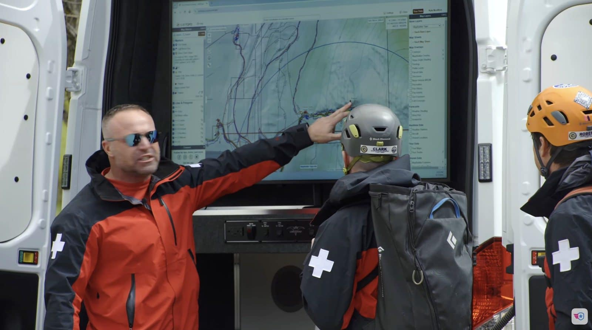

El capitán Kyle Nordfors, coordinador de drones de Weber County Search and Rescue (Utah), publicó el 2 de octubre una tribuna en The Hill en la que sostiene que la propuesta de la Comisión Federal de Comunicaciones (FCC) para vetar los drones de fabricación extranjera costaría vidas. Su unidad, formada por voluntarios, atribuye a estos aparatos entre 25 y 30 rescates y una reducción del tiempo medio de búsqueda, de cuatro horas y media a menos de una.

## Qué prohíbe el veto de la FCC y por qué alcanza al rescate

La propuesta, registrada en el expediente PS Docket 26-189, impediría la importación y la venta de drones de fabricación extranjera que lleven cámara térmica o LiDAR, entre otras categorías. Nordfors asegura que esa descripción cubre casi todos los aparatos que vuela su equipo, incluida la aeronave que localizó a un practicante de snowboard en la oscuridad hace dos años.

El argumento se apoya en cifras concretas. Weber County compró su flota completa de 12 drones por unos 90.000 dólares, según la tribuna. Un helicóptero cuesta millones antes de contar tripulación, combustible y tiempo de espera. En el rescate del snowboarder, el dron térmico lo tuvo localizado en 10 minutos, horas antes de lo que habría tardado un equipo terrestre o el despegue de un helicóptero.

## La alternativa nacional no iguala a la flota actual

Nordfors afirma que ha probado los drones fabricados en Estados Unidos y que ninguno iguala a su flota actual. Las empresas llamadas a sustituirla cobran entre tres y ocho veces más y ofrecen menos de la mitad de capacidad, con tiempos de vuelo más cortos, sensores térmicos más débiles y un rendimiento menos fiable con viento fuerte y frío. «Los he probado y ninguno ha podido igualar lo que hace la flota actual de mi equipo», escribe.

El propio laboratorio de pruebas del Gobierno federal llegó a una conclusión parecida. Un anexo del Departamento de Seguridad Nacional (DHS) marcado como de uso oficial, difundido el 1 de octubre, puntuó el Matrice 30T con 4,3 sobre 5 en Hudson Yards, frente al 3,7 del Skydio X10D, y situó el Matrice 4T en 4,6, la nota más alta de la serie Blue UAS. Los dos aparatos de DJI superaron a los Blue UAS comparados en los nueve criterios evaluados, y el DHS no incluyó esas notas en el informe público.

## La tensión política: 16 comentarios frente a 3.824

Nordfors cita el análisis del expediente que hizo Pilot Institute, que revisó y codificó los 3.824 escritos con texto legible: el 98,6 % de los comentarios rechazaba la propuesta y solo 16 la apoyaban. Sobre el impacto económico, 1.701 escritos se pronunciaron y solo uno dio la razón a la FCC.

El análisis económico tentativo de la propia propuesta concluía que el impacto sería menor y acotado, porque la producción nacional tiene más peso en las categorías de gama alta. El registro de comentarios, y las cifras de coste que aporta Nordfors, apuntan en la dirección contraria.

Cerró su tribuna con la misma invitación que ya había trasladado a la Comisión: que viaje a Utah y observe una búsqueda. «Vean lado a lado cómo se comparan los drones estadounidenses con el equipo que quieren prohibir», escribió. Un mes después del cierre del registro, la FCC no ha emitido ninguna orden.

Nordfors es coordinador del equipo de sUAS de Weber County Search and Rescue y presidente de UAS de la Mountain Rescue Association, que agrupa a más de 90 equipos de rescate en Norteamérica. Es veterano de la aviación con 25 años de trayectoria y capitán de Boeing 737 en una aerolínea estadounidense.

El caso ilustra una tensión que va más allá de un expediente: el esfuerzo por cerrar el mercado a los fabricantes extranjeros por motivos de seguridad nacional choca con unidades de emergencia que dependen de esas aeronaves. En paralelo, [quince estados demandan a la FAA por el aval ambiental al reparto con drones](/noticias/drones/estados-demandan-faa-reparto-drones/), otra pieza del mismo pulso regulatorio en Estados Unidos.
