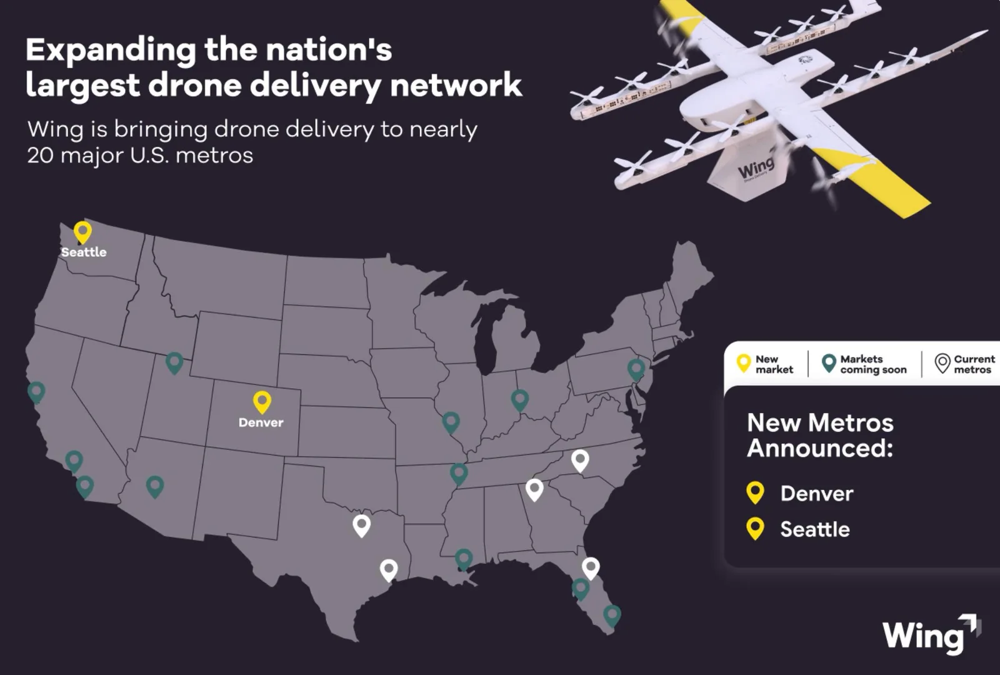

Wing, la filial de reparto con drones de Alphabet, y Walmart llevarán su servicio a las áreas metropolitanas de Denver y Seattle en 2027. Con esas dos plazas, la alianza que ambas compañías mantienen desde hace años suma 19 áreas metropolitanas en Estados Unidos, aunque el reparto real sigue concentrado en muy pocos lugares.

De esos 19 mercados, solo cinco tienen aeronaves volando hoy: Dallas-Fort Worth, Houston, Atlanta, Charlotte y Orlando. Los otros catorce están anunciados y esperan, doce de ellos sin fecha de lanzamiento pública, según el recuento que maneja la propia Wing. La compañía afirma que más de tres millones de clientes ya tienen acceso al servicio.

## Qué se vuela y cuánto carga un Hummingbird

La operación se apoya en el Hummingbird de Wing, una aeronave que cruza a hasta 97 km/h, transporta hasta 2,3 kilogramos de carga útil y no aterriza para entregar: desciende la caja hasta el jardín mediante un cable. Es el mismo formato de reparto que la compañía usa en los mercados que ya operan.

El objetivo declarado para 2027 pasa por más de 270 tiendas de Walmart y 40 millones de clientes potenciales. La directora de negocio de Wing, Heather Rivera, vinculó la ampliación a la adopción del reparto con drones, y sostuvo que los nuevos mercados muestran la velocidad con la que el público lo está asumiendo.

Ni Denver ni Seattle aparecían en las listas que Wing y Walmart publicaron en enero ni en junio. Ambas ciudades surgieron en septiembre, en expedientes urbanos de uso del suelo.

## Denver: las normas suburbanas llegaron antes que el anuncio

El detalle que ordena la historia de Denver no es la elección de la ciudad, sino que la regulación local se movió antes que la empresa. Castle Rock aprobó el 20 de julio una ordenanza de emergencia que congela durante seis meses las solicitudes de hubs de drones, y Parker hizo lo propio el 21 de julio con una pausa de nueve meses. Ambos municipios están al sur de Denver.

Al norte, la Comisión de Planificación de Northglenn votó el 15 de septiembre recomendar la primera ordenanza de reparto con drones de Colorado. Walmart había sondeado a la ciudad para volar drones de Wing desde su Neighborhood Market de la calle Washington. El borrador fija los puntos de despegue a 61 metros de viviendas y colegios, limita el ruido en el límite de la parcela a 65 decibelios y restringe el horario entre las 7:00 y las 22:00. El Concejo tiene prevista una primera lectura el 12 de octubre y la votación final el 26.

Thornton redacta su propia norma de hubs y Longmont mantiene dos pre-solicitudes de Walmart sin audiencia programada. Todas esas reglas gobiernan el aparcamiento, no el aire: un nido en el municipio vecino puede atender cualquier dirección de la ciudad porque el espacio aéreo es competencia de la FAA. Los nidos de Wing tienen un alcance de unos 9,7 kilómetros, de modo que el hub que una localidad bloquee puede cubrir a su vecina.

El caso no es aislado: la oposición municipal al reparto aéreo ya frenó el despliegue de Amazon Prime Air en otras localidades de Estados Unidos.

## Seattle: un permiso en Tacoma y Zipline por delante en el papeleo

La primera señal de Wing en Washington fue un permiso de obra para el Walmart Supercenter de Tacoma, presentado en septiembre y sin expediente asociado ante la FAA. El anuncio del lunes cita al alcalde de Federal Way, Jim Ferrell, en lugar de a responsables de Tacoma o de Seattle, y en la lista pública de revisiones ambientales de la FAA no aparece ninguna autorización de Wing en el estado.

El competidor Zipline va por delante sobre el papel. La FAA publicó en septiembre de 2025 un borrador de evaluación ambiental para hasta 75 emplazamientos y 500 bases de Zipline en el área de Seattle, recibió comentarios hasta el 2 de noviembre de ese año y todavía no ha emitido una decisión.

La FAA firmó el 28 de julio una evaluación ambiental programática de alcance nacional que podría permitir a Wing saltarse los expedientes mercado a mercado. La compañía no ha aclarado si piensa acogerse a ella.

## Qué significa para el despliegue

La ampliación a Denver y Seattle es un movimiento de red, no de tecnología: el cuello de botella no está en el dron, sino en los puntos de despegue repartidos por los aparcamientos de Walmart. Una moratoria municipal no detiene el vuelo, pero sí la base, y sin bases cada 9,7 kilómetros la red no cubre una ciudad. Cada mes de pausa es un mes de cobertura que Wing no puede facturar, y el calendario regulatorio de Colorado sugiere que la compañía tendrá que negociar cifra a cifra —altura, ruido, número de aeronaves y frecuencia de vuelo— antes de que el primer paquete despegue de un aparcamiento de Denver.
