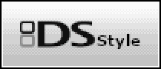
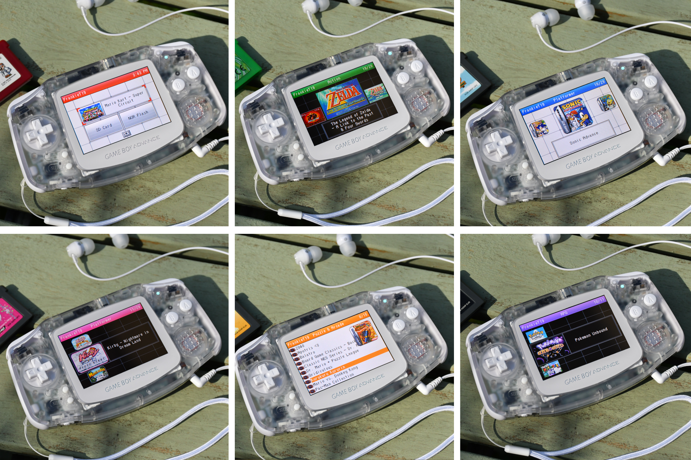

**DS Style** es un kernel personalizado para las flashcarts **EZ-Flash Omega** y **EZ-Flash Omega Definitive Edition** que sustituye el lanzador de fábrica por una interfaz inspirada en la de la **Nintendo DS**. El desarrollador FrankieT19 lo publicó en el foro de **GBAtemp** como proyecto aficionado para conmemorar el 25.º aniversario de la Game Boy Advance, y desde entonces el hilo no ha dejado de crecer: supera las 44.000 visualizaciones y las 300 respuestas. La descarga oficial se ofrece hoy en la versión 7.4, actualizada el 8 de septiembre de 2026.

## Qué incluye DS Style

El cambio más visible es la pantalla de inicio, que reproduce con animación la del sistema operativo de la Nintendo DS. A partir de ahí, el lanzador se moderniza con cuatro modos de vista —lista, lista con arte, carrusel horizontal y carrusel vertical— y una capa de ajustes pensada para el día a día: favoritos y partidas recientes accesibles desde la portada, arranque directo al último juego jugado y un modo de arranque configurable para saltarse el menú de selección.

En cuanto a la apariencia, DS Style incorpora los 16 colores originales de la Nintendo DS, modo oscuro y miniaturas de carátula y de pantalla de título. Quien quiera ir más allá puede generar sus propias imágenes con el DS Style Thumbnail Scraper, que admite paquetes locales o de libretro y funciona con cualquier juego, archivo o carpeta. La personalización sigue por otros frentes: nombre de usuario en la barra superior, efectos de sonido conmutables y el DS Style Customiser, una herramienta de escritorio para editar colores, textos, imágenes e idiomas.

El resto del kernel no se queda atrás. DS Style conserva toda la funcionalidad del kernel oficial de EZ-Flash, incluye las funciones del tema Simple —compatibilidad con complementos de PogoShell y copias de seguridad de partidas— y se ofrece en 13 idiomas, entre ellos el español. Además, el proyecto se actualiza de forma continua: el propio hilo documenta hitos como la incorporación de un selector de temas integrado en el dispositivo, que evita recurrir al ordenador para cambiar de color.

## Compatibilidad: dos cartuchos y una revisión que queda fuera

La primera regla de instalación es que **cada cartucho tiene su archivo**. Existe una compilación para el EZ-Flash Omega original y otra distinta para la Omega Definitive Edition, y usar la equivocada provoca fallos: en el propio hilo, un usuario que flasheó la versión para la Definitive Edition en una Omega original vio cómo dejaban de guardarse las partidas. La versión para la Definitive Edition admite las revisiones Rev.A (firmware 5.0) y Rev.B (firmware 7.0).

Queda fuera, de momento, la **Omega Definitive Edition B**, una revisión de hardware presentada por EZ-Flash el 26 de mayo de 2026 con placa azul marcada `EZODE-B`. No confundir con la Rev.B anterior: usa un kernel distinto y EZ-Flash aún no ha publicado su código fuente, por lo que DS Style no puede funcionar en ella hasta que eso ocurra. El proyecto ya tiene, por otra parte, una versión propia para el portátil Anbernic RG SP, con descarga y repositorio independientes.

También conviene tener presente que se trata de un proyecto aficionado: el autor recomienda respaldar la tarjeta SD antes de instalar y publica además una vía de desinstalación que pasa por mover el contenido de la carpeta `SYSTEM` a la raíz de la SD y flashear de nuevo el kernel oficial de EZ-Flash.

## Qué conviene saber antes de instalarlo

Además del kernel, la publicación de GBAtemp enlaza toda la documentación y las herramientas alrededor del proyecto: la guía de usuario en PDF, el DS Style Online Manager para instalar y actualizar desde la tarjeta SD, el Customiser de escritorio y el Thumbnail Scraper. El código fuente del kernel y de las herramientas está publicado en GitHub, y la discusión, las incidencias y las traducciones se resuelven en el hilo del foro.

Para el lector hispanohablante, el interés doble. Por un lado, DS Style demuestra que la Game Boy Advance sigue viva como plataforma de proyecto, en línea con otras iniciativas de la comunidad como el adaptador que conecta una [Game Boy Advance con la Switch 2 para transferir Pokémon](/noticias/gba-switch-2-pokemon-transfer/). Por otro, sitúa a GBAtemp como punto de encuentro de la escena de las flashcarts, algo que ya se había visto con [su hilo de referencia sobre el cartucho MIG Switch](/noticias/switch-flashcart-mig-thread/). Quien quiera probarlo solo tiene que descargar la compilación que corresponde a su cartucho y seguir la guía de usuario incluida en el paquete.
