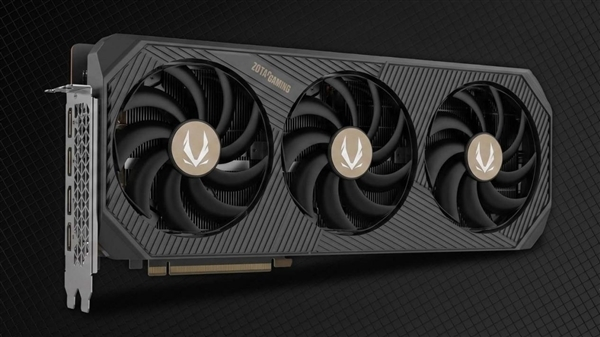

El medio alemán PC-WELT ha publicado la primera prueba de carga real de su HMX 6, un equipo de sobremesa de unos 40.000 euros que la publicación presentó en la Gamescom y que combina dos GeForce RTX 5090 con un procesador de gama alta. El objetivo era sencillo de enunciar y complicado de ejecutar: medir cuánta energía consume de verdad una configuración así cuando se le exige el máximo. La respuesta, con el vatímetro en la pared, fue de **1.450 W** en el escenario más agresivo, y con matices que apuntan a un techo todavía más alto.

## La escalada de consumo, paso a paso

La prueba no fue una única medición, sino una progresión en la que se fueron sumando cargas hasta saturar el sistema. Estas son las cifras que recoge PC-WELT:

| Escenario | Consumo en la pared |
| --- | --- |
| Escritorio, en reposo | ~230 W |
| Reproducción de vídeo en streaming | ~240 W |
| Juego (Halo: Campaign Evolved) | ~800 W |
| Cinebench + FurMark sobre una RTX 5090 | ~1.050 W |
| Lo anterior + carga de IA local sobre la segunda RTX 5090 | ~1.300 W |
| Cinebench + dos instancias de FurMark en Vulkan | 1.450 W |

El consumo en reposo llama la atención por sí solo. En escritorio, sin hacer nada, el equipo ya gasta alrededor de 230 W; con vídeo en streaming sube ligeramente hasta unos 240 W. Al jugar en la campaña de *Halo: Campaign Evolved*, con una pantalla ultrapanorámica de 5.120 × 1.440 píxeles y 240 Hz, el ajuste Ultra, DLSS nativo y la generación de fotogramas desactivada, el sistema completo se fue a unos 800 W con una media de unos 80 fotogramas por segundo. Con DLSS en modo Balanced y generación de fotogramas activada, la tasa ascendió hasta unos 210 fotogramas por segundo.

El salto definitivo llegó con la carga sintética: Cinebench multihilo y dos instancias de FurMark en Vulkan a la vez, es decir, CPU y ambas tarjetas al máximo de forma simultánea.

## Por qué importa: la fuente de 2.200 W y un techo que no se ha tocado

El dato de 1.450 W no describe el consumo de una tarjeta, sino el del equipo entero medido en el enchufe. Y, sobre todo, no es el límite: durante la prueba más dura, la segunda RTX 5090 solo alcanzó el **81 % de utilización** y el overclocking todavía no estaba activado. Es decir, hay margen para que la cifra real sea superior cuando PC-WELT complete la puesta a punto.

Para alimentar todo esto, el equipo monta una fuente **Seasonic PRIME PX-2200 de 2.200 W**, compatible con ATX 3.1 y PCIe 5.1 y pensada por el fabricante para sistemas multi-GPU extremos y estaciones de trabajo. A 1.450 W, esa fuente trabaja en torno al 66 % de su capacidad nominal, lo que deja un colchón considerable para picos transitorios y para los futuros ajustes de frecuencia. Dicho de otro modo: la fuente de 2.200 W no responde a un consumo sostenido de 2.200 W, sino a la necesidad de tener reserva ante los picos instantáneos.

El resto del conjunto explica el resto del consumo. El procesador es un **AMD Ryzen 9 9950X3D2 Dual Edition** de 16 núcleos y 32 hilos, con ambos CCD equipados con caché 3D V-Cache, hasta 5,6 GHz de impulso y un TDP de 200 W, al que se le ha practicado un *delid* con refrigeración directa al silicio. Las dos tarjetas son modelos personalizados de ZOTAC, una RTX 5090 AMP Extreme INFINITY reconvertida a bloque de agua y una RTX 5090 ARCTICSTORM AIO. Acompañan 192 GB de memoria DDR5, 32 TB de almacenamiento en SSD, una placa MSI MEG X870E GODLIKE X EDITION y dos circuitos de refrigeración líquida independientes para CPU y GPU.

Conviene recordar un matiz importante sobre las dos GPU: NVIDIA no certifica la RTX 5090 como compatible con NVLink o SLI, así que los juegos no escalan por sí solos entre ambas. La segunda tarjeta tiene sentido para renderizado, IA local y otras cargas de cómputo en paralelo, que es justo lo que PC-WELT usó para exprimirla en la prueba.

## Qué cambia para el lector

Este experimento no es un producto que se pueda comprar tal cual, sino un banco de pruebas que sirve para poner cifras a una tendencia: el consumo y la refrigeración se han convertido en el verdadero cuello de botella del hardware de gama alta. Para quien monta un equipo en casa, las conclusiones prácticas son tres.

La primera es de escala: los 1.450 W corresponden al sistema completo, no a una sola gráfica, y hacen falta dos RTX 5090 y un procesador de gama extrema para llegar ahí. La segunda es eléctrica: en España, una toma doméstica Schuko estándar de 16 A a 230 V admite teóricamente unos 3.680 W, por lo que el enchufe no es el problema; el reto está en elegir una fuente con reserva real ante picos, en la refrigeración y en el gasto de la factura. La tercera es térmica: 1.450 W sostenidos equivalen prácticamente a un radiador de 1,5 kW dentro de la habitación, lo que convierte la disipación en un problema tan importante como la potencia.

Y, sobre todo, este tipo de pruebas recuerda que los picos instantáneos, no el consumo medio, son lo que dimensiona una fuente. Los 2.200 W del HMX 6 no son una exageración caprichosa, sino la constatación de que, cuando se juntan dos tarjetas tope de gama, el margen de seguridad deja de ser un lujo.
