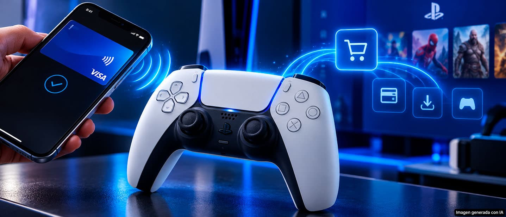

Sony Interactive Entertainment ha presentado una solicitud de patente que convertiría el
mando de PlayStation en un intermediario de pago. La idea es que el propio **DualSense** reciba los
datos de pago almacenados en un teléfono móvil u otro dispositivo cercano y los envíe
después a la consola, de modo que el jugador no tenga que teclear nada para completar una
compra. La solicitud se publicó el 17 de septiembre de 2026 y describe un sistema, no un
producto que ya exista.

## Qué describe la patente del DualSense

El planteamiento parte de un problema cotidiano: cada consola necesita un método de pago y
hoy ese dato se introduce a mano con el teclado virtual del sistema, del ordenador o del
móvil. La patente propone dar ese papel al mando.

Según la documentación, el controlador detectaría que hay un dispositivo electrónico
autorizado a una distancia determinada y establecería comunicación con él. Ese dispositivo
podría guardar información de una tarjeta de crédito, una cuenta bancaria, una tarjeta
regalo, un monedero digital o incluso identificadores asociados a carteras de
criptomonedas.

A partir de ahí, el teléfono enviaría al mando los datos necesarios y el DualSense actuaría
como intermediario autorizado, reenviándolos a la consola. El texto contempla distintas
formas de detectar que el dispositivo está lo bastante cerca, con tecnologías como el NFC o
el Bluetooth, y que el mando puede avisar al usuario de que lo ha reconocido mediante
vibración háptica, iluminación, un sonido o una combinación de estos.

## Menos pasos entre la decisión y el pago

El objetivo práctico es que comprar desde una PlayStation resulte más rápido. Hoy es posible
guardar información de pago en PlayStation Network, pero este sistema permitiría mantener
las credenciales en otro dispositivo y transferirlas solo cuando haga falta una transacción.
La patente enmarca el proceso en un evento concreto solicitado por la consola, como la
confirmación de una compra, en lugar de tener los datos circulando de forma permanente.

El alcance cubriría juegos completos, contenido descargable, créditos para videojuegos,
microtransacciones y compras dentro de los juegos. Para Sony hay además una ventaja
comercial evidente: cuantos menos pasos haya entre la decisión de comprar y el pago
efectivo, menor es la probabilidad de que el usuario abandone el proceso antes de terminar.
Dicho de otro modo, el pago se convierte en una pieza más del ecosistema cerrado de la
compañía.

## Una patente no es un producto

Conviene no sacar conclusiones precipitadas. La solicitud se presentó el 17 de marzo de 2025
y la Oficina de Patentes de Estados Unidos la publicó el 17 de septiembre de 2026 con el
número **US 2026/0273403 A1**. Se trata de una solicitud en trámite, no de una patente
concedida ni de un anuncio de producto: que Sony explore la idea no garantiza que el sistema
llegue a un DualSense actual o a un mando futuro pensado para la PS6, cuyos
[rumores sobre fecha y precio](/noticias/ps6-release-date-price-rumor/) siguen sin
confirmación oficial.

Tampoco está resuelto el detalle que más dudas genera. El análisis del registro señala que
la solicitud no especifica qué tecnología inalámbrica concreta realiza la detección y que no
aborda cómo se protege la seguridad de los datos en esos saltos inalámbricos. Esa pregunta,
la de si el usuario confiaría sus credenciales a este circuito, será tan decisiva como la
comodidad que promete.
