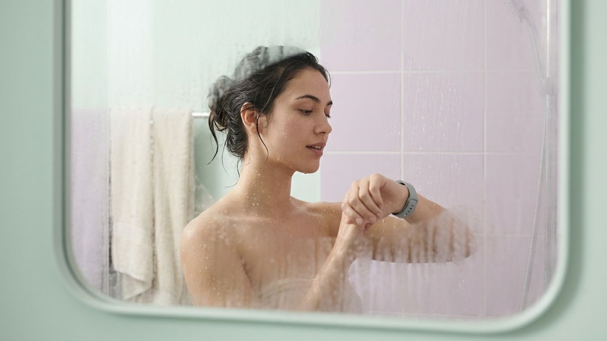
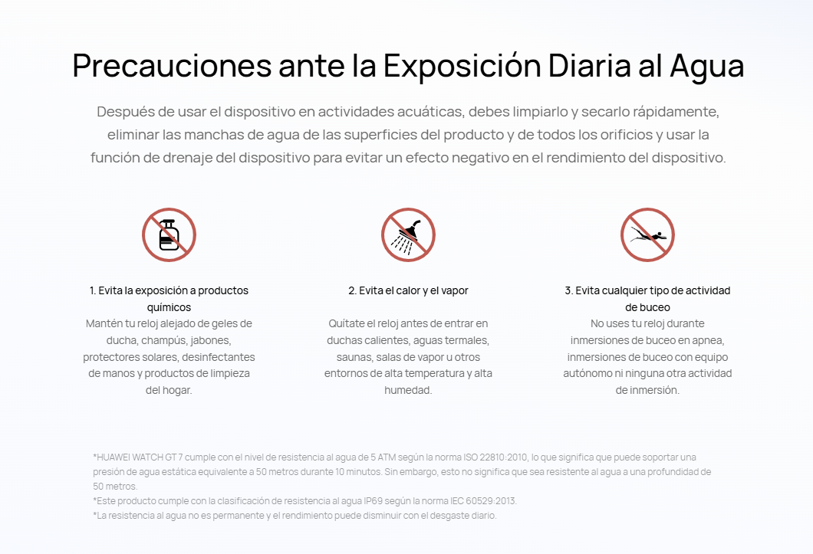
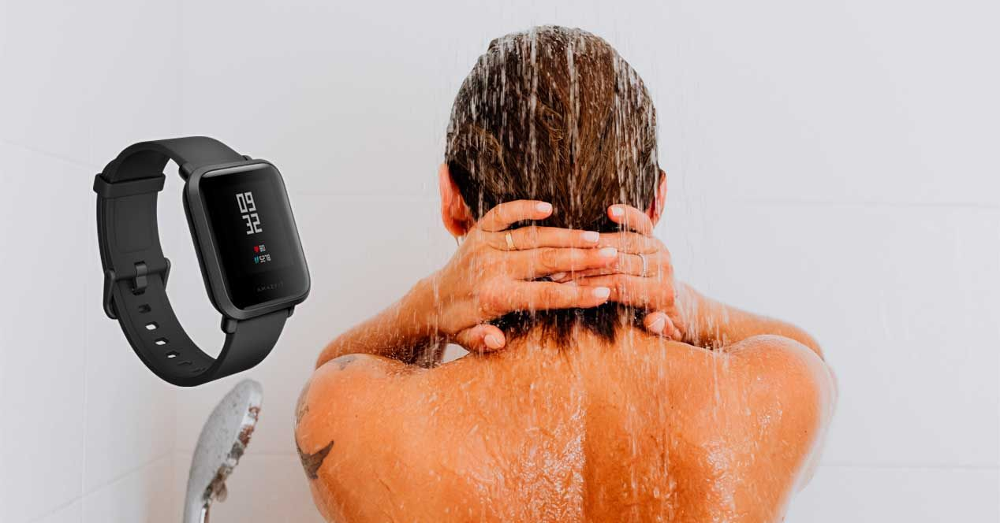

Muchos relojes inteligentes presumen de resistencia al agua con certificaciones 5 ATM o IP69, y eso lleva a pensar que unos minutos bajo la ducha no suponen ningún riesgo. Sin embargo, los propios fabricantes advierten de lo contrario: el agua caliente, el vapor y los productos de higiene degradan el sellado del reloj con el tiempo, aunque el dispositivo esté pensado para nadar.

## El aviso de Huawei: ni duchas calientes ni jabón

La advertencia aparece en la propia página de compra del Huawei Watch GT 7 Pro. La compañía pide quitarse el reloj antes de entrar en duchas calientes, aguas termales, saunas y salas de vapor, y mantenerlo alejado de geles de ducha, champús, jabones, protectores solares, desinfectantes de manos y productos de limpieza del hogar.

No es una postura aislada. La página de soporte de Apple desaconseja exponer el Apple Watch al jabón o al agua con jabón al bañarse o ducharse, así como llevarlo a baños de vapor o saunas, porque esas sustancias químicas afectan a las juntas y a las membranas acústicas. Samsung, por su parte, indica que las cremas, los desinfectantes y el agua jabonosa obligan a enjuagar el Galaxy Watch con agua del grifo y secarlo bien, y advierte de que el calor de secadores, saunas y salas de vapor compromete la resistencia al agua.

## 5 ATM no significa que puedas sumergirlo a 50 metros

Buena parte del malentendido viene de la propia certificación. En el caso del Watch GT 7 Pro, los 5 ATM se refieren a la norma ISO 22810:2010: el reloj soporta una presión estática de agua equivalente a 50 metros durante 10 minutos en laboratorio. Eso no significa que pueda usarse a 50 metros de profundidad ni que cualquier exposición al agua sea segura.

Además, los tres fabricantes coinciden en un punto clave: la resistencia al agua no es permanente y disminuye con el desgaste diario, los golpes y el paso del tiempo. Y conviene recordar que los daños por líquidos derivados de un uso inadecuado, como ducharse con agua caliente o exponer el reloj a jabón, pueden quedar fuera de la garantía.

## Qué cambia para ti: quítatelo antes de ducharte

La recomendación práctica es sencilla: quitarse el reloj antes de ducharse y aprovechar ese momento para ponerlo a cargar. Se evita así la combinación de calor, vapor y productos químicos que más castiga las juntas, y se alarga la vida útil del dispositivo.

Si el reloj entra en contacto accidental con jabón o champú, tanto Apple como Samsung recomiendan enjuagarlo con agua limpia y secarlo con un paño suave antes de volver a usarlo. Y si se nada en piscina o en el mar, conviene aclararlo con agua dulce al terminar, tal como indica Huawei en sus precauciones de uso diario.
