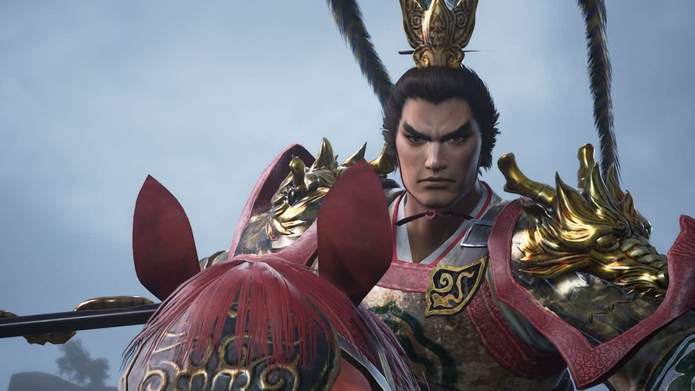

Koei Tecmo, como editora, y Omega Force, como desarrolladora, han desvelado nuevos detalles de **Dynasty Warriors 3: Complete Edition Remastered** de cara a su llegada a Nintendo Switch 2. La información confirmada incluye el espacio que ocupará la versión digital y los precios oficiales de cada edición, dos datos que suelen decidir la compra cuando hay que mirar la memoria libre de la consola.

## Tamaño de la descarga en Switch 2

La descarga del juego en Nintendo Switch 2 asciende a **27,8 GB**. Ese es el espacio que deberán tener libre en la memoria de la consola quienes lo compren en formato digital a través de la eShop. También está prevista una versión física, aunque se distribuirá como *game key card*: una tarjeta que incorpora la clave de descarga y no el juego completo, por lo que la instalación sigue ocupando espacio en el almacenamiento interno.

## Precios oficiales de cada edición

Los importes comunicados están en **euros**, la moneda que declara la fuente. La **edición estándar** cuesta **39,99 €**, mientras que la **Digital Deluxe Edition** se sitúa en **69,99 €**.

## Qué incluye la Digital Deluxe Edition

La edición deluxe añade al juego principal un paquete de contenido adicional:

- **DYNASTY WARRIORS 3 Retro Costumes (42 en total)**: un conjunto de atuendos retro inspirados en el Dynasty Warriors 3 original. Se pueden cambiar en la pantalla de selección de personaje.
- **Wind Scroll x1 y Tiger Amulet x1**: objetos que aumentan el alcance de ataque en 10 y el atributo de ataque en 10.
- **Six Secret Teachings x1**: un objeto que incrementa la obtención de Merit de los officers.
- **Armas para fusión (42 en total)**: armas con habilidades útiles que sirven como materiales de síntesis e incluyen opciones para todos los officers. Pueden cambiarse al preparar la batalla.
- **Officer Concept Art Collection**: arte conceptual original de Dynasty Warriors 3 con comentarios de producción. Se consulta dentro del juego, en la base de datos, y no puede descargarse como archivo independiente; además, los comentarios de producción están solo en japonés.

## Lanzamiento de Dynasty Warriors 3: Complete Edition Remastered

Dynasty Warriors 3: Complete Edition Remastered se estrena el **1 de octubre de 2026**. El lanzamiento estaba previsto inicialmente para el 19 de marzo de este año, pero se retrasó. Además de Nintendo Switch 2 y la Switch original, el título llegará a PlayStation 5, Xbox Series y PC (Steam). Su demo se publicó el 24 de septiembre de 2026, pocos días antes de la fecha de estreno.

## Qué cambia para el jugador

Con estos datos sobre la mesa, la decisión pasa por dos frentes. En el plano del almacenamiento, los 27,8 GB obligan a revisar el espacio libre del sistema o a ampliarlo con una tarjeta microSD Express si se apuesta por la versión digital. En el plano del precio, la diferencia entre ambas ediciones —30 euros— corresponde a los atuendos retro, los objetos de combate y el arte conceptual, extras que no alteran el contenido jugable principal. Quien solo quiera el musou clásico tiene la opción estándar; quien busque completarlo encontrará todo ese añadido en la deluxe. El juego se suma así a la lista de lanzamientos recientes para la consola, como [Dragon Quest XI S y su Definitive Edition](/noticias/dragon-quest-xi-switch-2-launch/), que llegaron a la plataforma hace unos días.
