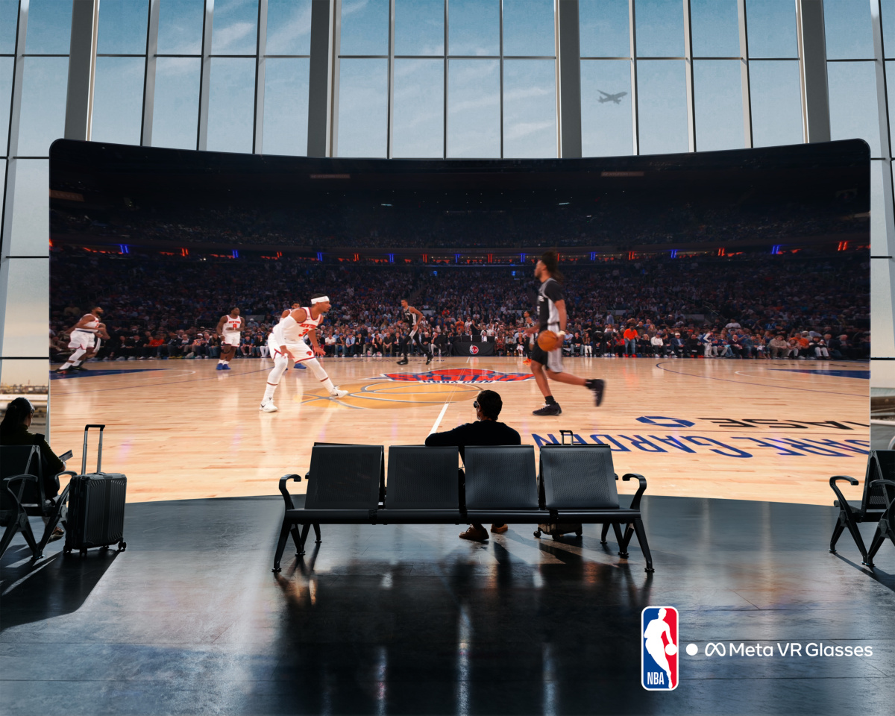

Meta ha presentado Immersive Sports, un formato de retransmisión de deporte en directo para Meta Quest con ESPN que combina una cámara situada en primera fila, emisión en 8K y vistas de 180 grados. El anuncio llegó el 23 de septiembre de 2026 durante Meta Connect, la misma conferencia en la que la compañía presentó sus [Meta VR Glasses](/noticias/meta-vr-glasses-anuncio/), y el único deporte confirmado para este año es el fútbol americano universitario.

## Qué es Immersive Sports y qué llega este año

La propuesta de Meta consiste en colocar al espectador en una posición de cámara privilegiada, junto al terreno de juego, y ofrecer la señal en 8K con un campo de visión de 180 grados. El nombre Immersive Sports es de Meta, y de momento solo ha comprometido un deporte para 2026: el fútbol americano universitario. La compañía afirma que habrá más deportes en 2027, sin concretar cuáles.

La información disponible es deliberadamente escueta. Meta no ha dado una fecha de inicio más allá de «este año», ni un precio, ni condiciones de suscripción, ni un calendario de partidos. Tampoco ha dicho qué aplicación de Quest repartirá las emisiones ni en qué países podrán verse. El anuncio es además exclusivo de Meta: ESPN no ha publicado ninguna declaración propia, de modo que tanto la especificación como los plazos y la forma del acuerdo responden únicamente al relato de Meta.

## Los más de 100 eventos al año pertenecen a unas gafas que llegan en 2027

Meta también puso una cifra a su deporte inmersivo: más de 100 eventos en directo cada año, con MLB, NBC Sports, TNT Sports y UFC señalados como socios. Ese volumen, sin embargo, está atado a las Meta VR Glasses, que no se pondrán a la venta hasta la primavera de 2027 por 1.299,99 dólares en Estados Unidos. La propia Meta condiciona el cálculo con un matiz: «una vez se lancen las Meta VR Glasses».

En la práctica, quien ya tiene unas Quest no recibirá un centenar de eventos, sino un deporte este año y más deportes en 2027. Meta solo nombra Meta Quest para 2026 y describe la ampliación de 2027 como más deportes, no como más hardware, pero no ha aclarado si hará falta un modelo concreto de visor.

## El 8K describe la emisión, no las gafas

Conviene separar dos cosas que el titular mezcla. La cifra de 8K describe la señal que Meta distribuye, no la resolución que el usuario percibe. Repartido a lo largo de 180 grados, un fotograma en 8K cubre el doble de arco que ese mismo fotograma repartido en 90 grados. En unas Quest 3, ese contenido llega a unos paneles de 2.064 x 2.208 píxeles por ojo.

Es decir, el 8K no convierte al visor en una pantalla de cine: es la forma de conservar la nitidez cuando el campo de visión se abre. La ganancia de calidad depende, en última instancia, de los paneles que el espectador tenga puestos.

## Qué cambia para quien ya tiene unas Meta Quest

El deporte en directo dentro de Quest no es nuevo. Meta ya ha retransmitido 52 partidos de la NBA en realidad virtual para usuarios de Quest, recuperó la WNBA para la temporada de 2025 y emitió eventos de la UFC a través de Xtadium y Horizon Worlds en 2023.

Lo que cambia ahora es la especificación y la marca asociada. Ninguna de aquellas emisiones venía con una cifra de 8K ni llevaba el sello de ESPN.

El fútbol americano universitario es la carta de presentación, y Meta se ha comprometido a que llegue en 2026, lo que deja algo más de tres meses. No ha dicho qué partido, qué fin de semana ni cuánto costará verlo. Para una conferencia construida en torno a un dispositivo que no aparecerá hasta la primavera de 2027, una única emisión en 8K sobre el visor que la gente ya tiene es la parte comprobable este año.
