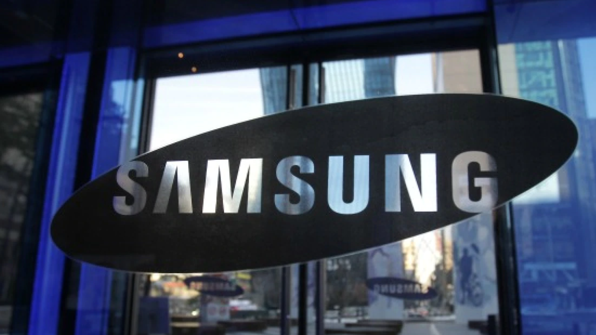

Samsung se ha sumado al grupo de inversores que respalda a Euclyd, un pequeño diseñador de chips con sede en los Países Bajos que aspira a competir con Nvidia en el terreno del hardware para inteligencia artificial. La operación coloca a la compañía neerlandesa en el mapa de las alternativas a las GPU, aunque su producto tardará todavía varios años en llegar al mercado.

Según confirmó a CNBC su consejero delegado, Bernardo Kastrup, la startup cerró una ronda de 231 millones de dólares —200 millones de euros— que servirá para financiar dos líneas de negocio distintas.

## Una ronda con Samsung como socio

Euclyd nació en 2024 y su Serie A estuvo codirigida por Somerset Capital Partners, el Scaleup Europe Fund gestionado por EQT e Innovation Industries, además de la propia Samsung. La entrada del gigante surcoreano no se limita al capital: la empresa también aporta conocimiento industrial y acceso a su cadena de suministro.

El reparto de la ronda coloca a Samsung junto a fondos europeos especializados, una combinación habitual en el segmento de semiconductores, donde los inversores financieros suelen ir acompañados de un socio industrial con capacidad de fabricación y compras a gran escala.

## Dos vías de negocio y un chip que no llegará hasta 2028

El dinero recaudado sostendrá dos estrategias paralelas. La primera consiste en vender hardware y sistemas en rack directamente a empresas que quieran ejecutar inferencia de IA en sus propias instalaciones, con el control de seguridad que ello implica. La segunda pasa por licenciar su propiedad intelectual a compañías que prefieran construir sus propios chips a partir de diseños ya existentes.

Euclyd está desarrollando un sistema de chips basado en una arquitectura distinta a la de las GPU convencionales, que abarca tanto la capa del procesador como la de memoria. Sin embargo, Kastrup ha sido explícito con los plazos: el hardware comercial no llegará a los clientes hasta 2028, y no es hasta 2030 cuando la compañía espera atender a miles de clientes empresariales. Sus sistemas, además, todavía no se han probado a escala comercial, por lo que el rendimiento real sigue siendo una incógnita.

## Por qué importa: la dependencia de Nvidia

Las GPU de Nvidia se diseñaron originalmente para videojuegos, pero su reutilización para entrenar y ejecutar modelos de IA convirtió a la compañía en una de las más valiosas del mundo. Ese dominio se extiende hoy al mercado de los chips de mayor rendimiento, y es precisamente el punto donde han empezado a aparecer competidores.

No se trata de un fenómeno aislado. OpenAI presentó en agosto su primer chip propio, denominado Jalapeño, con cifras que la compañía califica de líderes en velocidad y eficiencia. Google, Amazon Web Services y Meta también desarrollan procesadores para sus propias cargas de trabajo de IA. Euclyd asegura que sus sistemas de silicio para modelos fundacionales reducen las necesidades energéticas y los costos de la infraestructura de los centros de datos de IA, un argumento que apela directamente al bolsillo de quien los opera.

## Qué cambiaría para el lector

Más allá de la cifra de la ronda, el interés de Samsung tiene una lectura práctica: es uno de los mayores fabricantes de memoria del mundo, hace mucha ingeniería, conoce los sistemas y la cadena de suministro y cuenta con una red enorme. Para una startup que aún no ha enviado producto, ese respaldo industrial puede pesar tanto como el dinero.

Para empresas y profesionales, la promesa de una inferencia local, segura y más económica resulta atractiva, sobre todo cuando la dependencia de un único proveedor de GPU encarece cualquier despliegue de IA. Aun así, conviene tomar el anuncio con cautela: el calendario es largo, no hay producto comercial disponible y el rendimiento de la arquitectura propuesta está por demostrarse. La duda de fondo, como resume el propio Kastrup, es si un fabricante pequeño y sin producto enviado puede recortar de forma significativa la posición de Nvidia dada la escala del mercado en juego.
