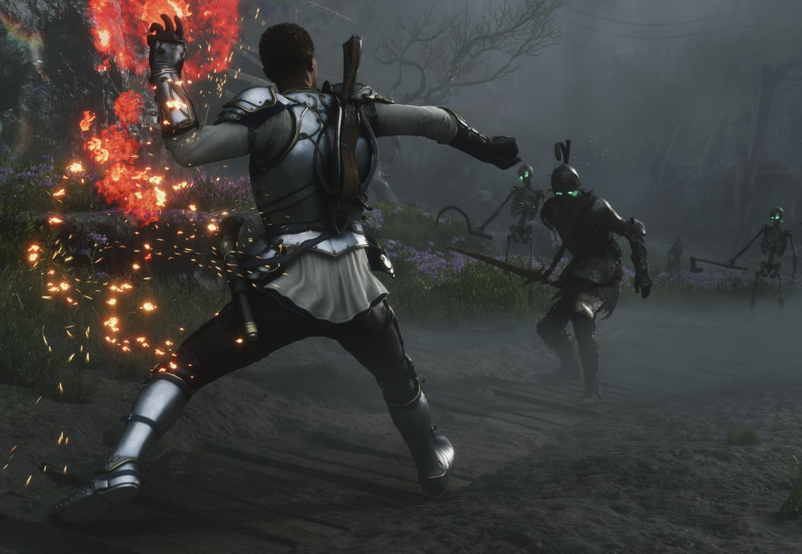
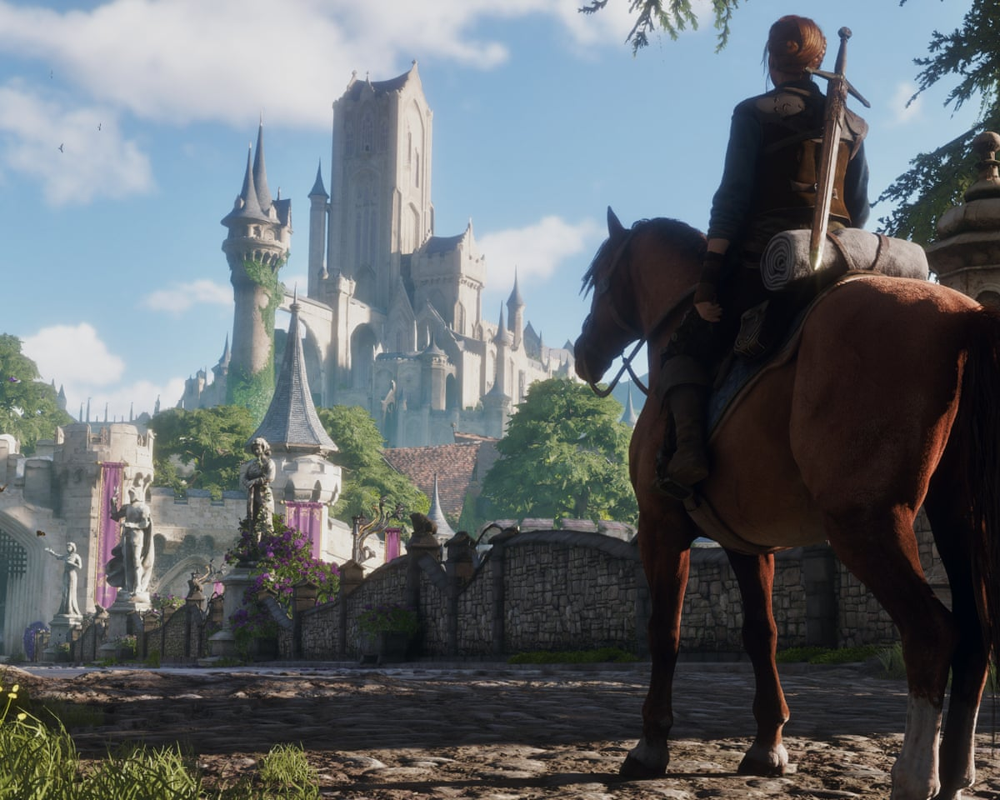

El reinicio de Fable acumula alrededor de una década de desarrollo, un periodo en el que
Microsoft ha cerrado estudios y ha recortado miles de puestos de trabajo en su división
de videojuegos. La pregunta inevitable era por qué este proyecto, precisamente, había
sobrevivido a esa criba. La respuesta la dio Ralph Fulton, cofundador de Playground
Games y director del juego, en una entrevista con **The Guardian** publicada el 15 de
septiembre y recogida después por otros medios especializados.

## Qué ha dicho el director de Fable

Fulton no atribuye la continuidad del proyecto a su estado de desarrollo ni a cifras
internas, sino al lugar que la saga ocupa dentro de la propia marca Xbox:

> «Creo sinceramente que Fable es un juego importante. Lo que nos ha protegido durante
> un ciclo de desarrollo tan largo es que mucha gente dentro de Xbox ve Fable como algo
> vital para el ADN de la plataforma.»

El director va un paso más allá y sitúa la importancia de la franquicia fuera de los
límites de su compañía:

> «Iría un paso más allá y diría que es importante para los videojuegos en su conjunto.
> Ofrece una combinación de elementos que simplemente no existe en ningún otro sitio.»

Playground Games es conocida sobre todo por la saga de conducción Forza Horizon. Según
Fulton, asumir un RPG de acción fue también una cuestión de orgullo profesional: querían
demostrar que el estudio podía competir en otro género. «Cuando Xbox mencionó Fable,
cualquier otra oportunidad se disolvió en el fondo. Era lo único en lo que podíamos
pensar», relata en la entrevista.

## Por qué importa: una marca que Xbox no puede permitirse perder

Fable nació en 2004 de la mano de Lionhead Studios para la primera Xbox y se convirtió
en una de las franquicias más reconocibles de la plataforma. Microsoft cerró Lionhead en
2016, después de reconvertir la saga en un juego multijugador que nunca llegó a
publicarse. El encargo de resucitarla recayó en Playground, que firmó el acuerdo en 2017
y tuvo que construir un equipo enorme desde cero, con cientos de personas llegadas de
todo el mundo.

Ese carácter de marca histórica es, según Fulton, lo que ha mantenido el proyecto a
salvo mientras caían otros estudios del grupo. La lectura encaja con el historial
reciente de la compañía: los cierres han afectado a equipos con propiedad intelectual
menos icónica, pero no a los nombres que la empresa usa como seña de identidad de Xbox.

La entrevista también deja algunos detalles del juego. Fulton subraya que el estudio
mantuvo la apuesta por las decisiones con peso, con un tramo final que, en sus palabras,
culmina en una elección que obliga al jugador a pensar en quién es. El reparto de voces
incluye a nombres conocidos de la comedia británica como Richard Ayoade, Natasia
Demetriou y Matt King. Fulton cuenta que Ayoade improvisó prácticamente un guion nuevo
para sus escenas y que Demetriou introdujo un nivel de insultos que sorprendió al
equipo.

## Qué cambia para el jugador (y qué no)

Conviene ser claro con el alcance de estas declaraciones: **no son un anuncio oficial**.
Fulton no confirma una fecha de lanzamiento ni anuncia movimientos de la compañía; solo
explica, en el marco de una entrevista, por qué cree que el proyecto ha resistido. El
titular de que Fable es «vital para el ADN» de Xbox es una valoración de su director, no
un compromiso público de Microsoft.

Lo que sí aporta la entrevista es contexto para quien siga la saga en España y
Latinoamérica: el reinicio sigue adelante tras una década de trabajo, conserva el tono
británico y el humor de la serie original y mantiene la promesa de decisiones con
consecuencias. Para los jugadores de habla hispana, la conclusión práctica es que el
proyecto no está cancelado, pero tampoco hay todavía una ventana de lanzamiento
confirmada por la compañía.
