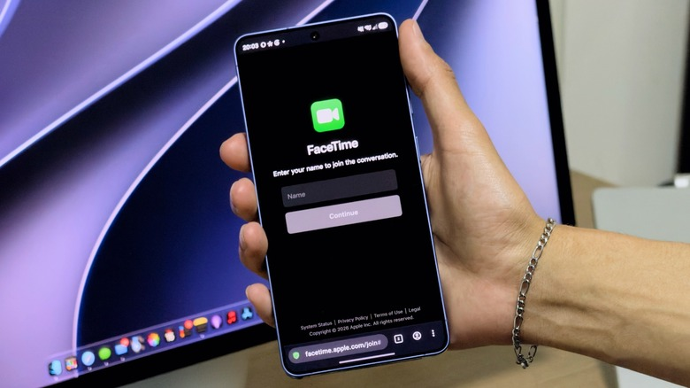
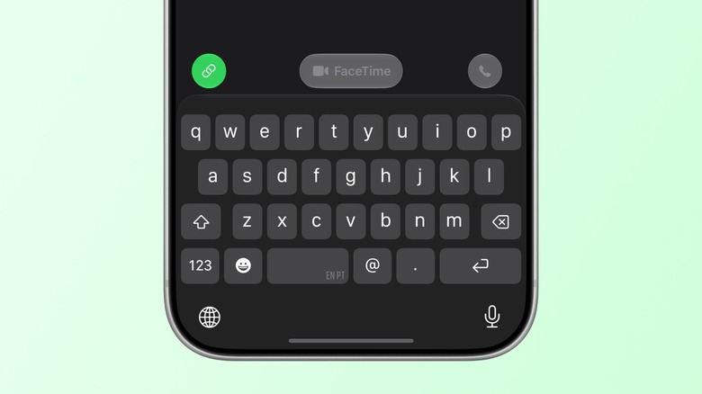

FaceTime nació atado al ecosistema de Apple, igual que iMessage, y durante años fue así. Sin embargo, desde 2021, con iOS 15 y macOS Monterey, es posible entrar en una llamada de FaceTime desde un móvil Android o un PC con Windows a través del navegador. No funciona igual de fino que en un dispositivo de Apple y sigue haciendo falta que alguien con un iPhone, un iPad o un Mac inicie la conversación, pero ya no hay que quedarse fuera del chat del grupo. Esta guía explica, paso a paso, cómo unirse y qué se puede esperar de la experiencia.

## Requisitos previos

Antes de empezar, conviene tener claro qué se necesita:

- Un dispositivo con conexión a internet: vale un móvil Android o un PC con Windows.
- Un navegador actualizado. Apple recomienda usar la última versión de Chrome o Edge.
- Alguien con un dispositivo Apple (iPhone, iPad o Mac) que cree la llamada y envíe el enlace de invitación.
- Una señal de internet estable, que es la única recomendación adicional de Apple para mantener la llamada sin cortes.

No hace falta tener una Apple Account ni instalar ninguna aplicación: todo ocurre en el navegador.

## Paso 1: recibe el enlace de la llamada de FaceTime

El primer punto que hay que asumir es que **desde Android o Windows no se puede iniciar una llamada de FaceTime**. La conversación tiene que arrancarla una persona con un dispositivo Apple, que genera un enlace y lo comparte contigo. Ese enlace es la puerta de entrada.

## Paso 2: abre el enlace y únete

1. Abre el enlace que te han enviado.
2. Escribe tu nombre cuando la página te lo pida.
3. El navegador puede solicitar permiso para usar la cámara y el micrófono. Concédelo.
4. Pulsa el botón **Join** para entrar en la llamada.

A partir de ahí estarás dentro de una llamada de FaceTime desde el navegador de un dispositivo no Apple. El método admite tanto llamadas de audio como de vídeo.

## Paso 3: usa los controles de la llamada

Una vez dentro, tendrás a mano las opciones habituales de FaceTime, entre ellas:

- Cambiar a vídeo a pantalla completa.
- Silenciar el micrófono.
- Girar la cámara para mostrar lo que tienes delante.

## Cómo envía la invitación la persona con un iPhone

Si quien organiza la llamada usa un iPhone, el proceso para invitar es sencillo. Debe abrir la aplicación FaceTime y tocar **New Call**; en la esquina inferior izquierda aparece un botón de enlace en verde. Al tocarlo puede enviar el enlace de la llamada a la persona o al grupo que quiera invitar y, después, elegir por dónde mandarlo, por ejemplo Mensajes o WhatsApp.

Ese enlace es justamente el que permite que la otra persona entre desde el navegador, sin depender de un dispositivo Apple.

## Cómo verificar que funcionó

Si la llamada se abrió en el navegador, puedes verte y oírte con el resto de participantes, y los botones de silencio, pantalla completa y giro de cámara responden, la conexión se ha realizado correctamente. También es buena señal que el audio y el vídeo se mantengan estables durante unos minutos: si notas cortes, revisa la conexión, que es el factor que Apple señala como clave.

## Advertencias y limitaciones

Merece la pena conocer los límites antes de confiar en este método:

- **No se puede iniciar la llamada** desde Android o Windows: siempre depende de que alguien con un dispositivo Apple la cree y comparta el enlace.
- **No hay compartir pantalla.** La función de compartir pantalla de FaceTime no está disponible en dispositivos que no sean de Apple.
- **SharePlay no funciona.** Tampoco se puede usar la función que permite disfrutar juntos de música, películas, juegos y otros contenidos durante la llamada.
- **La experiencia no es idéntica** a la de un dispositivo Apple. Si el objetivo es que todo el mundo participe con comodidad, las aplicaciones multiplataforma suelen ofrecer un resultado más pulido que el navegador; si FaceTime es la única opción, al menos ya sabes que no está reservado en exclusiva a los dispositivos de Apple.

Si quieres exprimir mejor las llamadas desde el lado de Apple, en este portal ya explicamos [cómo mejorar la calidad de audio de tu iPhone paso a paso](/noticias/mejorar-audio-iphone/).
