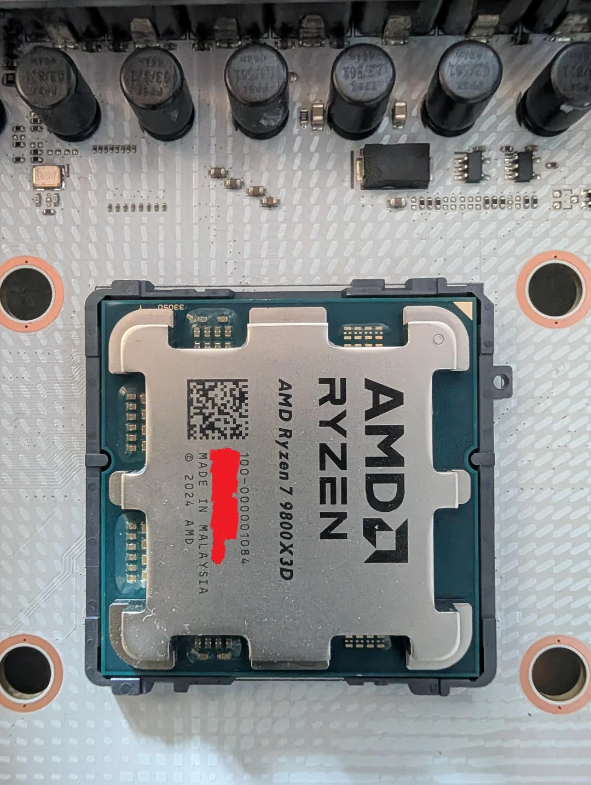

Comprar hardware en una tienda física ya no es garantía de autenticidad. Un usuario ha denunciado en un foro que adquirió un procesador AMD Ryzen 7 9800X3D en una tienda local de Walmart por cerca de 500 dólares y que, al abrir la caja e instalarlo, descubrió que se trataba de una unidad falsificada. El caso, recogido por el medio chino MyDrivers, pone el foco en una técnica de fraude que hasta ahora se asociaba sobre todo a las compras por internet.

## Un fallo de arranque que destapó el engaño

Según el relato del comprador, ya tenía un 9800X3D y necesitaba un segundo procesador porque el controlador de memoria integrado del primero presentaba problemas. Un empleado de la tienda le entregó delante de él una caja minorista precintada, retirada de la vitrina de exposición, con un aspecto completamente normal.

El problema apareció al montar la nueva unidad: el equipo no arrancaba. Al volver a colocar el procesador antiguo, el sistema funcionó con normalidad, lo que descartó la placa base y el resto de componentes como causa del fallo. El primer indicio claro llegó en el momento de la devolución, cuando el personal del establecimiento detectó que el número de serie impreso en el procesador no coincidía con el de la caja. Con esa discrepancia, la tienda se negó a tramitar el reembolso.

## Las pistas visuales de un 9800X3D falso

La comparación con otras unidades 9800X3D de la vitrina dejó más diferencias a la vista. En la pieza falsificada, el color de la PCB tira a azul, mientras que la disposición y la posición del texto sobre la tapa metálica (el IHS) tampoco reproducen el patrón de una unidad original. Además, al introducir el número de serie en la herramienta de verificación oficial de AMD, el resultado fue que no existía ninguna coincidencia.

El detalle más incómodo es que los falsificadores también han aprendido a imitar el precinto de seguridad. El autor del aviso sostiene que los estafadores ya han encontrado la forma de volver a sellar la caja minorista, de modo que encontrar un embalaje aparentemente intacto no basta para confirmar que el procesador de su interior es auténtico.

## Cómo verificar un Ryzen antes de comprarlo

Para reducir el riesgo, la recomendación que se desprende del caso es comprobar no solo el estado del envoltorio, sino los datos que identifican la pieza:

- Contrastar el código OPN y el número de serie entre el procesador y la etiqueta de la caja.
- Antes de abrir el precinto, observar el procesador a través de la ventana transparente de la caja AM5 y comparar el aspecto de la PCB y la serigrafía del IHS.
- Validar el número de serie en la página de consulta oficial de AMD.

Estos pasos no eliminan el fraude por completo, pero sí atacan su punto débil: una unidad falsa rara vez logra que todos esos datos coincidan a la vez.

## Qué se sabe del origen de las unidades falsas

MyDrivers no detalla cómo llegó ese procesador falso a las estanterías de la tienda. La especulación recogida en la sección de comentarios apunta a un patrón conocido: alguien compra una unidad auténtica, vuelve a colocar una falsificación en el envase original, lo precinta y lo devuelve; el establecimiento lo recibe como stock sin abrir y lo repone en la vitrina. El comercio debería revisar que las devoluciones sean producto genuino, pero los precintos imitados dificultan la detección a simple vista.

Mientras el comercio no aceptaba la devolución, el usuario inició una reclamación de contracargo ante su entidad de tarjeta y publicó el caso para advertir a otros compradores. El episodio deja una lección práctica: el sello intacto ya no es prueba suficiente de autenticidad y la verificación del número de serie, el código OPN y el aspecto de la pieza sigue siendo la defensa más fiable.
