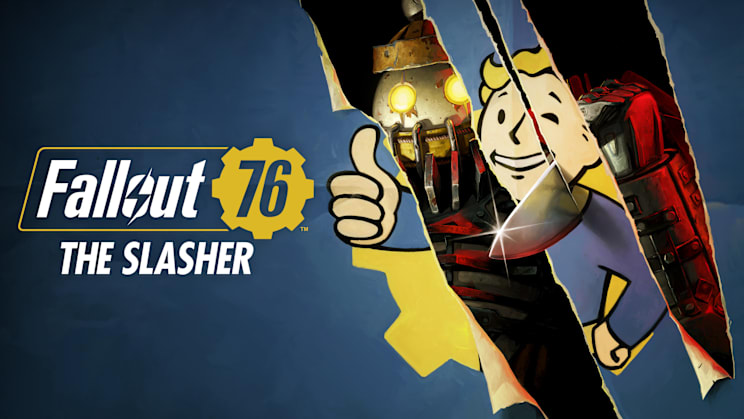
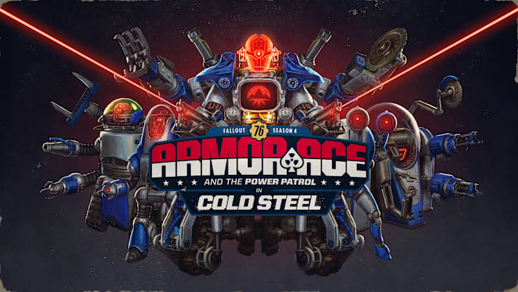
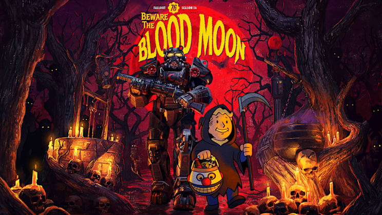

Bethesda ha publicado las notas de la actualización **The Slasher** de Fallout 76, correspondiente a la versión 1.7.26.13 y fechada el 15 de septiembre de 2026. Junto al contenido temático de terror, el parche introduce algo que la comunidad reclamaba desde hace años: **versiones nativas del juego para Xbox Series y PlayStation 5**, disponibles por separado en cada tienda y con una descarga completa obligatoria.

El anuncio llegó en el marco del showcase de Xbox en el Tokyo Game Show 2026, donde el juego presentó un tráiler de The Slasher. Fallout 76 se lanzó en 2018, antes de que existieran las consolas de actual generación, y estas llegaron al mercado en 2020 sin una edición nativa del título.

## Qué incluye el parche The Slasher

Estos son los puntos destacados que Bethesda detalla en sus notas oficiales:

- **The Slasher**: una secta de fanáticos siembra el caos en la región de Appalachia. La historia se despliega a lo largo de las semanas posteriores a la actualización mediante transmisiones de The Debunker Radio. La experiencia arranca sintonizando la emisora "Breaking News" en el Pip-Boy.
- **Actualización nativa para Xbox Series y PlayStation 5**: ya están disponibles las versiones nativas en las respectivas tiendas, con mejor rendimiento y estabilidad.
- **Fabricación de objetos únicos**: las armas y armaduras únicas pueden cambiar sus modificadores legendarios y recibir un cuarto modificador legendario.
- **Legacy Seasons**: se recupera una temporada pasada para que conviva con la actual. La primera es «Armor Ace and the Power Patrol in Cold Steel» y durará toda la temporada.
- **Nuevos peces de temporada**: aparecerán el 22 de septiembre de 2026. El capitán Raymond ofrece pistas sobre dónde encontrarlos.
- **Temporada 26: Beware the Blood Moon**: recompensas inspiradas en la próxima temporada de Halloween.

El parche también incluye numerosas correcciones de errores y ajustes de equilibrio, que Bethesda detalla en sus notas de la versión.

## Qué significa el soporte nativo (y en qué se diferencia de la retrocompatibilidad)

Hasta ahora, si jugabas Fallout 76 en una Xbox Series X|S lo hacías mediante **retrocompatibilidad**: la consola ejecutaba la versión de Xbox One, diseñada para un hardware de 2013, y se limitaba a "tirar" de ese código heredado. La consola puede ejecutarlo, pero no aprovecha sus capacidades reales, por lo que el juego quedaba lejos de exprimir el equipo.

Una **versión nativa** es una compilación distinta, hecha para la consola actual. Al estar construida para ese hardware, sí puede usar sus recursos para elevar la tasa de refresco y la resolución, y además abre la puerta a ajustes más finos entre generaciones en el futuro. La contrapartida es que es una aplicación aparte: hay que **volver a descargar el juego completo** desde la tienda de Xbox o PlayStation para acceder a ella.

Según las notas de Bethesda, el rendimiento queda así:

| Plataforma | Rendimiento objetivo |
| --- | --- |
| Xbox Series X\|S, PS5 y PS5 Pro | 60 FPS |
| Xbox Series X, Xbox One X y PS5 Pro | 4K en pantallas compatibles |
| Xbox Series S, Xbox Series X, PS5 y PS5 Pro | VRR (limitado a 60 FPS en pantallas compatibles) |
| PS5 y PS4 Pro | 1440p |
| Generación anterior | 1080p |

## Qué cambia para el jugador

El primer paso es entrar en la ficha del juego en la tienda de tu consola y localizar la versión de Xbox Series o de PlayStation 5 según corresponda. Bethesda subraya que su intención es que la versión nativa quede disponible para todos los propietarios de Fallout 76, dentro de los límites que permite cada plataforma.

Conviene tener en cuenta el tamaño: la compañía ha reempaquetado el juego en todas las plataformas para reducir su peso final, de modo que la descarga de The Slasher será más grande de lo habitual. Los tamaños indicados son **119 GB en PC (Steam), 119,7 GB en PC (Microsoft Store), 101 GB en Xbox y 92,2 GB en PlayStation**, aunque una vez instalado el juego ocupará menos que antes.

Para el lector hispanohablante que juega en consola, la actualización supone poder disfrutar de Appalachia a 60 FPS y en 4K sin depender del rendimiento de una versión pensada para la generación anterior. Eso sí, el salto no alcanza a todas las consolas: las plataformas de generación anterior sin la etiqueta Pro siguen apoyándose en la versión de 1080p.
