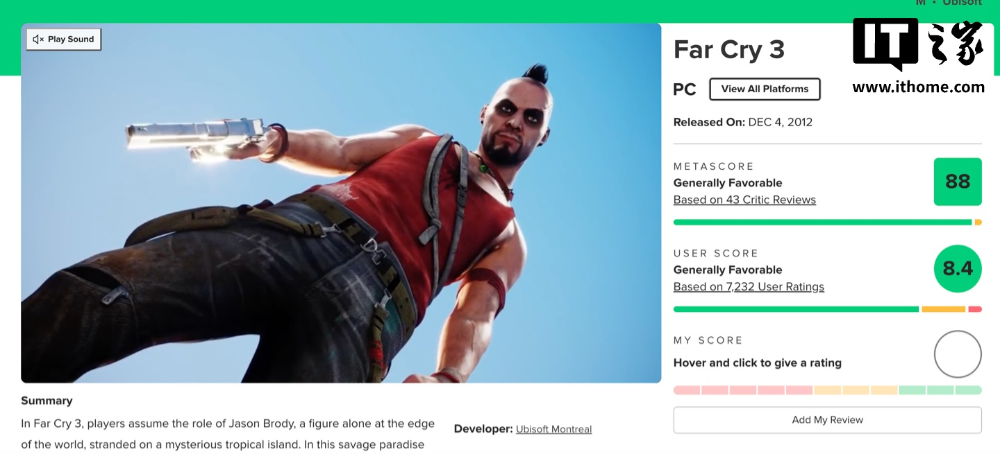
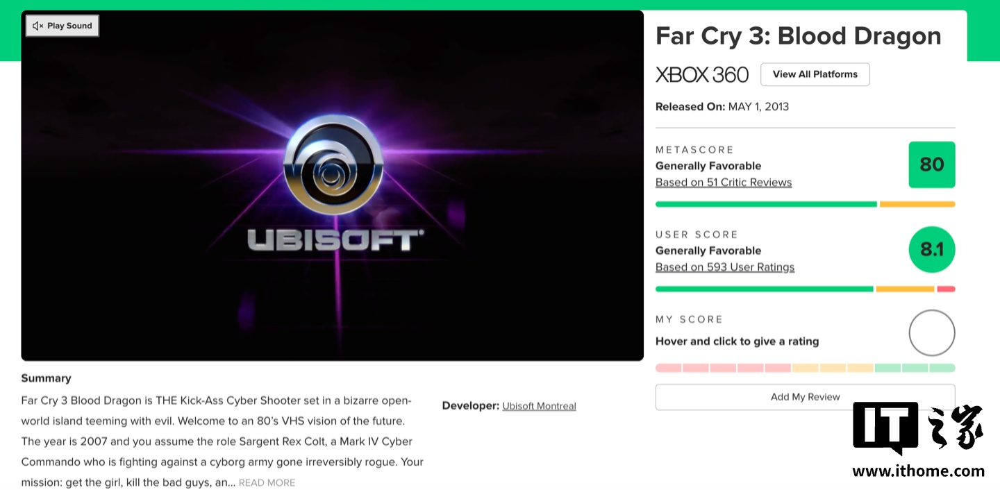

Ubisoft ha anunciado que **Far Cry 3 Classic Edition** y su expansión **Far Cry 3: Blood Dragon** llegarán a **Nintendo Switch 2** en la primavera de 2027. La compañía francesa no ha detallado por ahora precios ni una fecha concreta dentro de esa ventana, pero sí ha confirmado que ambos títulos formarán parte del catálogo de la consola híbrida.

El anuncio llega en un momento en el que Nintendo está reforzando el catálogo de su nueva máquina con ports de juegos de generaciones anteriores. Para Ubisoft, supone recuperar uno de los títulos más celebrados de su franquicia de mundo abierto.

## Un clásico de 2012 que regresa a la portátil

Far Cry 3 se lanzó originalmente el **29 de noviembre de 2012**. Su acción transcurre en una isla tropical situada en la confluencia de los océanos Índico y Pacífico, donde el protagonista, **Jason Brody**, sufre un accidente durante unas vacaciones. A partir de ahí debe rescatar a sus amigos secuestrados por los piratas liderados por **Vaas Montenegro** y escapar de una isla en la que la humanidad de sus habitantes se ha desvanecido.

El juego recibió críticas muy positivas en su momento, con elogios hacia el diseño de su mundo, su propuesta de mundo abierto y su historia. En Metacritic acumula una puntuación de **88 en PC, 90 en PS3 y 91 en Xbox 360**. La posterior Far Cry 3 Classic Edition, orientada a consolas de la generación de PS4 y Xbox One, se quedó en **70** en esa misma plataforma de agregación.

## Blood Dragon, el giro más excéntrico de la saga

La expansión **Far Cry 3: Blood Dragon** traslada al jugador a la piel del sargento cyborg **Rex Colt**, que recorre la isla en una versión deliberadamente disparatada de la fórmula original. El DLC conserva los mecanismos de Far Cry 3, aunque recorta o elimina varios de los sistemas del juego base, y añade el elemento que le da nombre: unos enormes dinosaurios capaces de **disparar láseres desde los ojos**, que el jugador puede atraer hacia las bases enemigas para que las ataquen.

Blood Dragon también cosechó una acogida favorable. La crítica destacó su jugabilidad, su banda sonora y su estética inspirada en los años ochenta, aunque el humor de la propuesta generó opiniones divididas. En Metacritic registra **81 en PC, 82 en PS3 y 80 en Xbox 360**.

## Qué significa para los jugadores de Switch 2

La llegada de Far Cry 3 a Switch 2 tiene un interés doble. Por un lado, acerca a la consola un referente del mundo abierto de principios de la década pasada que hasta ahora no estaba disponible de forma nativa en el ecosistema de Nintendo. Por otro, sienta un precedente sobre el tipo de ports que Ubisoft está dispuesta a traer a la plataforma.

Queda por ver cómo rinde la versión en el hardware de Nintendo, especialmente en modo portátil, y si el port incluye las mejoras visuales de Classic Edition o alguna optimización adicional. La primavera de 2027 es una ventana amplia, así que conviene tomar la fecha con cautela hasta que Ubisoft concrete el calendario y el precio.

