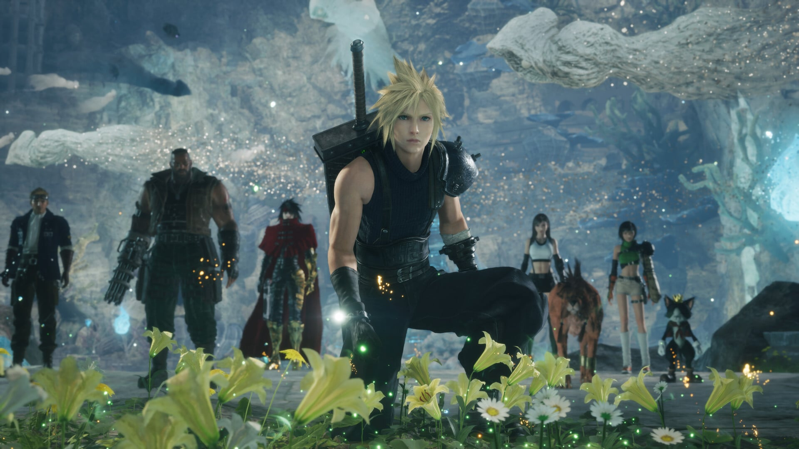
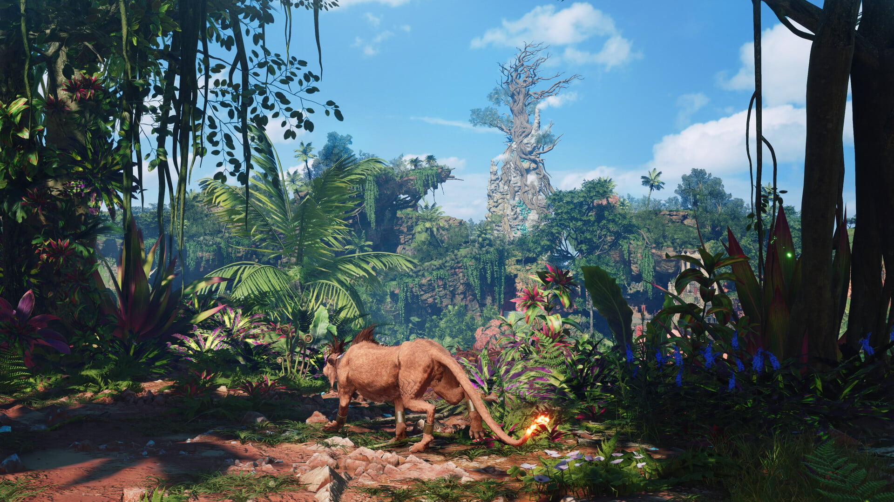

Final Fantasy VII Revelation, la entrega que cerrará la trilogía de remake de Square Enix, apunta a un tamaño de instalación de en torno a **200 GB**. La cifra la puso su propio director, Naoki Hamaguchi, durante una entrevista con el medio británico **Video Games Chronicle (VGC)** en el marco de la Tokyo Game Show 2026, y confirma una tendencia que ya venían anticipando sus predecesores: cada capítulo de la saga ocupa más que el anterior.

## Una cifra todavía provisional

La pregunta era directa: si la descarga del juego sería mayor que los dos discos Blu-ray en los que se distribuyeron las entregas previas. La respuesta de Hamaguchi también lo fue, según recoge VGC: en una palabra, sí. El director explicó que el trabajo de ajuste continúa y que, por ahora, el cálculo ronda los 200 GB de juego instalado.

Conviene subrayar dos matices. El primero es que se trata de una **estimación**, no de un requisito definitivo, por lo que el número podría moverse antes del lanzamiento. El segundo es que Hamaguchi no precisó a qué plataforma corresponde esa cifra, de modo que las especificaciones oficiales por sistema —y con ellas el tamaño real que verá cada jugador— aún están por publicarse.

## De los 90 GB de Remake a los 200 GB de Revelation

Para dimensionar el salto basta mirar la propia saga. Final Fantasy VII Remake arrancó pidiendo unos 90 GB, y Rebirth subió la vara hasta los 155 GB en PC. Si se confirma, Revelation casi duplicaría el tamaño de aquel primer capítulo.

El motivo que traslada Hamaguchi es la ambición del proyecto: la tercera parte aspira a un mundo de gran escala sin renunciar al nivel de detalle visual, algo que, en sus palabras, obliga a «superar los límites del hardware hasta cierto punto». El director reconoció que existe un debate abierto sobre este asunto, pero defendió que es el coste de ofrecer la experiencia que el equipo tiene planeada. En la misma conversación restó importancia a las críticas sobre la magnitud del juego y aseguró que no le preocupa su escala.

## Por qué el disco físico ya no lo cubre todo

El tamaño tiene una consecuencia práctica que Square Enix ya había confirmado: **todas las versiones físicas de Revelation requerirán una descarga adicional de datos en cualquier formato**. La razón es aritmética. Un disco Blu-ray de PS5 almacena como máximo 100 GB, de modo que un lanzamiento completo en soporte óptico habría necesitado al menos dos discos, como ocurrió con Remake y Rebirth.

La compañía optó por la vía contraria: una sola unidad física más una descarga obligatoria para completar la instalación. Hamaguchi justificó la decisión en su deseo de que exista un producto físico —«era muy importante para nosotros», dijo a VGC— pese a que el disco no pueda contener el juego entero.

## Qué significa para el jugador

Quien piense comprar el juego el 8 de abril de 2027, fecha prevista para su llegada a **PlayStation 5, Xbox, Switch 2 y PC**, hará bien en planificar el espacio con antelación. La recomendación es reservar margen sobre los 200 GB estimados, porque la instalación suele crecer con parches y contenido posterior, y porque el sistema operativo y otros títulos ya consumen parte del almacenamiento disponible.

- En consola, conviene revisar si queda espacio libre suficiente o si hará falta una unidad de ampliación.
- En PC, una unidad SSD con ese espacio holgado evita tener que desinstalar otros juegos cada vez que se actualice la trilogía.
- Y como el dato aún no es oficial por plataforma, lo prudente es esperar a los requisitos definitivos antes de comprar almacenamiento adicional.

Por ahora, la advertencia está hecha: si la cifra se sostiene, Final Fantasy VII Revelation será uno de los juegos más pesados del catálogo reciente y obligará a más de un jugador a hacer limpieza en el disco.
