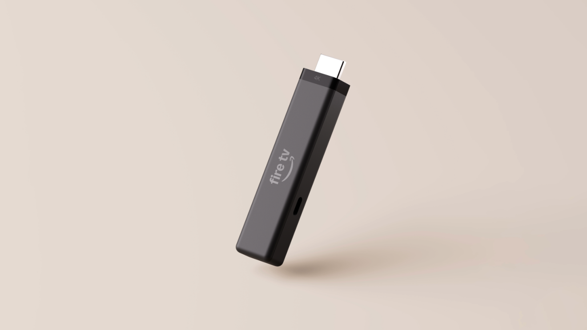

Amazon ha presentado un nuevo Fire TV Stick 4K que confirma el giro de la compañía hacia su software propio. El dispositivo llega hoy al mercado estadounidense por 59,99 dólares, estrena el sistema operativo Vega OS en lugar de Android y se acompaña de un mando rediseñado. La novedad, anunciada por la propia Amazon y recogida por 9to5Google, deja una consecuencia clara para los usuarios más avanzados: se pierde la posibilidad de instalar aplicaciones al margen de la tienda oficial.

## Un reproductor más delgado y con menos cables

El nuevo Fire TV Stick 4K adopta un formato más compacto, en la línea del Fire TV Stick HD lanzado a principios de año, y estrena lo que Amazon llama Direct Power: puede alimentarse desde el puerto USB del propio televisor con el cable incluido. Eso reduce el número de cables y facilita esconder el dispositivo detrás del televisor o llevarlo de viaje. La compañía aprovecha para simplificar su catálogo de reproductores en tres niveles: Fire TV Stick HD, Fire TV Stick 4K y Fire TV Stick 4K Max, con el Fire TV Cube por encima.

En rendimiento, Amazon asegura que el equipo enciende y llega al contenido entre un 20 % y un 40 % más rápido que un reproductor 4K de precio similar de otra marca líder, y que supera a la experiencia integrada de tres televisores 4K de gran venta en las tres aplicaciones más usadas de Fire TV. La ficha técnica incluye 8 GB de almacenamiento interno, un procesador de cuatro núcleos a 1,7 GHz, Wi-Fi 6 y Bluetooth 5.3 con soporte para Bluetooth Low Energy, además de compatibilidad con HDR10, HDR10+, HLG, H.265, H.264, VP9 y AV1, con salida de hasta 2160p a 60 fotogramas por segundo.

## Vega OS: más aplicaciones, pero sin instalación lateral

El cambio de fondo respecto a la generación anterior es el sistema operativo. El Fire TV Stick 4K funciona con Vega OS, la plataforma propia de Amazon, y llega con Alexa+ y la nueva experiencia de Fire TV preinstaladas. Según la compañía, desde el primer producto con Vega OS se han añadido más de 2.000 aplicaciones, entre ellas Spotify, Xbox, VLC y varios clientes de VPN, que se suman a Netflix, Disney+, YouTube, Prime Video, HBO Max, Peacock, Tubi, Pluto o Instagram.

El precio de esa modernización es la pérdida de la instalación lateral (sideloading), es decir, la posibilidad de añadir aplicaciones ajenas a la tienda oficial. Era una práctica habitual entre quienes exprimían sus Fire TV, y de momento no hay indicios de que vaya a volver.

## Un mando nuevo y precios para España

Junto al reproductor, Amazon renueva su mando con un diseño asimétrico: plano en la parte superior y curvo y lastrado en la inferior, para saber de un vistazo cómo sostenerlo. El botón de inicio estrena una superficie metálica propia —se pulsa más de 100 millones de veces al día en el conjunto de dispositivos Fire TV—, otras teclas tienen formas o relieves distintos para reconocerlas al tacto y el botón de estrella es personalizable. Mantiene los controles integrados de televisor, barra de sonido y receptor (encendido, volumen y silencio) y es compatible con todos los televisores Amazon Ember y los reproductores Fire TV lanzados desde 2019. La idea de gobernar el televisor desde otro dispositivo ya tiene precedentes, como la app que permite [usar el Pixel Watch como mando de Google TV](/noticias/pixel-watch-controlar-google-tv/).

El Fire TV Stick 4K cuesta 59,99 dólares y empieza a enviarse hoy en Estados Unidos, Canadá, Japón, México, Reino Unido, Alemania, Francia, Italia, España, Suiza y Australia, con más países a finales de octubre. En Estados Unidos estará a 29,99 dólares durante los Prime Big Deal Days, la mitad de su precio. El nuevo mando se puede reservar hoy como accesorio suelto por 14,99 dólares y se enviará a finales de octubre. La compañía también ha anunciado el Fire TV Remote Plus, con cuerpo de aluminio y botones retroiluminados, que llegará a principios de 2027 para sustituir al Alexa Voice Remote Pro y añadirá una función para localizar el mando con la voz.

## Qué cambia para el lector

Para quien ya tiene un Fire TV, la compra tiene sentido sobre todo si busca un arranque más ágil y un mando mejor pensado. Para quien exprimía la instalación lateral, en cambio, este modelo cierra esa puerta: la comodidad de Vega OS se paga con menos control sobre lo que se instala. La buena noticia es que el desembarco incluye a España desde el primer día, algo que no siempre ocurre con los lanzamientos de dispositivos de Amazon.
