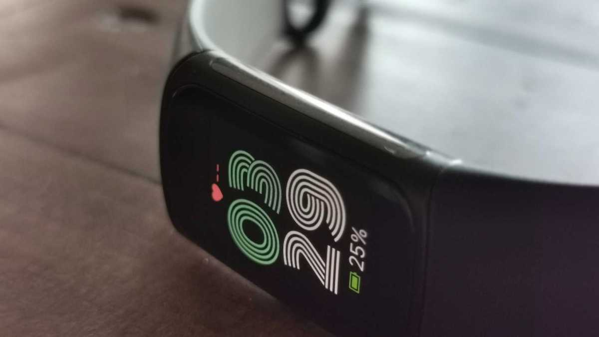
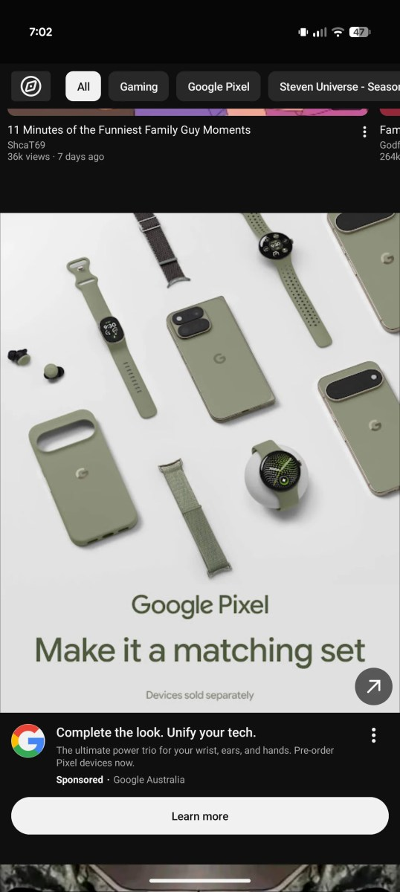

El **Fitbit Charge 7** no es todavía un producto oficial, pero acaba de dar un paso que en el sector se lee como señal de que el lanzamiento se acerca. Una certificación de la FCC —la agencia estadounidense que autoriza la venta de equipos con conectividad inalámbrica— describe un «dispositivo inalámbrico» fabricado por Weifang Goertek Electronics, el mismo socio industrial que construyó el Fitbit Air para Google. La pista la detectó 9to5Google y la recoge Tech Advisor, y encaja con la pulsera que Google nunca presentó pero que apareció hace unas semanas en unos anuncios australianos.

Conviene subrayar desde el principio qué es y qué no es esta información: una certificación no es un anuncio, no confirma el nombre comercial ni revela fecha o precio. Lo que sí hace es mostrar que existe un dispositivo real, ya construido, en proceso de autorización para venderse.

## Qué revela la certificación del Fitbit Charge 7

El registro de la FCC no entra en detalles técnicos, pero deja entrever lo suficiente para situar el producto. El documento menciona Bluetooth y GPS, dos funciones que el Charge 6 ya incorporaba, y todo apunta a que el dispositivo contará con pantalla: el organismo explica que el usuario tendrá que entrar en los ajustes para consultar la información regulatoria, un planteamiento idéntico al del Pixel Watch 5 y que solo tiene sentido en un equipo con pantalla propia.

El detalle más revelador es el número de modelo, que termina en «G8BL6» y guarda un parecido evidente con el del Fitbit Air, «GW9C8». A ello se suma que el fabricante es el mismo en ambos casos. Son indicios encadenados, no pruebas, pero dibujan un patrón coherente: Google estaría preparando un nuevo rastreador de muñeca en la estela del Air.

Lo que la certificación **no** confirma es si el Charge 7 llevará Wear OS. Que el Pixel Watch 5 recurra a los ajustes para mostrar los datos regulatorios no implica que este modelo comparta su sistema operativo.

## El rastro que nació en un anuncio australiano

La historia viene de más atrás. Poco después del evento Made by Google del mes pasado, en el que se presentaron los Pixel 11, apareció en unos anuncios australianos un wearable sin identificar con un aspecto a medio camino entre un Pixel y un Fitbit. Nunca fue un producto oficial, lo que alimentó la confusión y las especulaciones; la hipótesis más repetida fue que se trataba del Fitbit Charge 7.

El contexto ayuda a entender por qué esa lectura resulta plausible. Los rastreadores Fitbit anteriores siguen a la venta, pero acumulan años sin renovarse, y la marca ha recuperado protagonismo en 2026 con el Fitbit Air. Para una línea tan longeva como la Charge, una renovación es más una cuestión de cuándo que de si.

## Pantalla sí, Wear OS no necesariamente

Aquí está el punto que decidirá buena parte de la experiencia de uso. Los Fitbit han construido su reputación sobre un sistema operativo propio y ligero, y ese enfoque tiene un impacto directo en la autonomía: es una de las razones por las que estos dispositivos aguantan varios días lejos del cargador. Adoptar Wear OS acercaría el producto al Pixel Watch, pero también a su consumo energético.

La explicación más razonable, apuntan desde Tech Advisor, es que Google mantenga el sistema propio y se limite a actualizar el diseño para que la pulsera encaje visualmente con la familia Pixel Watch. La imagen de los anuncios australianos se parece algo a Wear OS, pero podría tratarse solo de una capa de diseño coherente con la marca, no de un cambio de plataforma.

## Qué cambia para el lector y qué queda pendiente

Para quien busque una pulsera de actividad sencilla, la relevancia de este movimiento es que el relevo del Charge 6 empieza a tomar forma. Quien prefiera formatos sin pantalla puede mirar hacia propuestas como la [Garmin CIRQA, una pulsera que precisamente renuncia al panel](https://www.techspain24.com/noticias/garmin-cirqa-screenless-band/), mientras que quien quiera un sistema propio con pantalla tiene alternativas consolidadas como el [OPPO Watch S2](https://www.techspain24.com/noticias/oppo-watch-s2-coloros-watch-17/). Ese es el dilema de fondo que el Charge 7 tendrá que resolver: pantalla para competir en funciones, o sistema ligero para conservar la autonomía que define a la gama.

En el bando de Wear OS, la referencia sigue siendo la familia Pixel Watch y propuestas como el [Moto Watch Ultra LTE](https://www.techspain24.com/noticias/moto-watch-ultra-lte/), que apuestan por un sistema más capaz a costa de visitar el cargador con más frecuencia.

Lo que todavía no se sabe es lo que de verdad decide una compra:

- El nombre comercial definitivo y la fecha de presentación.
- El precio en España y los mercados donde se venderá.
- Si Google mantiene el sistema propio de Fitbit o da el salto a Wear OS.
- Las funciones de salud y entrenamiento nuevas frente al Charge 6.

La certificación en la FCC es, por tanto, la señal más sólida hasta la fecha, pero no una garantía de lanzamiento inminente. A título personal, el autor de la información original deja constancia de que sigue esperando un anillo inteligente de Fitbit, una posibilidad ajena a esta filtración. Habrá que esperar a un anuncio oficial para dar cualquier cifra por buena.
