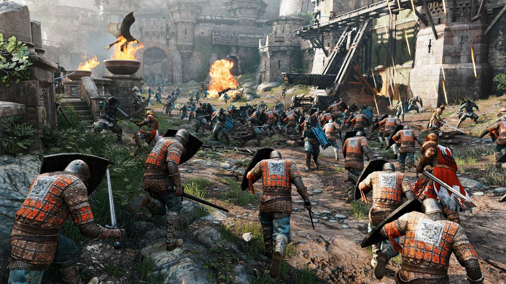

Ubisoft ha puesto **For Honor** gratis para conservar en su tienda oficial hasta el **28 de septiembre**, apenas unas semanas después de vetar a todos los jugadores que accedían al juego desde **Linux** o **SteamOS**, el sistema de la Steam Deck. La promoción, detectada por Notebook Check, permite reclamar la **edición Estándar** sin coste alguno y quedársela de forma permanente, aunque no todos los usuarios podrán aprovecharla de la misma manera.

## For Honor, gratis para siempre hasta el 28 de septiembre

El reclamo funciona en la [Ubisoft Store](https://store.ubisoft.com/us/for-honor/659ea90829c01c38968dce19.html): quien añada el juego a su cuenta antes del 28 de septiembre lo conserva para siempre sin pagar nada. La edición que se entrega es la **Estándar**, la versión base sin los contenidos adicionales de las variantes superiores.

Para el lector hispanohablante conviene subrayar que la oferta es de tiempo limitado y que el juego se queda en la biblioteca una vez canjeado, no es un acceso temporal de fin de semana. Es el movimiento comercial clásico de un título multijugador veterano que busca ampliar su base de jugadores antes de un cambio de ciclo.

## Descuentos del 90 % en Steam y Epic

Quien prefiera comprar For Honor en otra plataforma también encuentra rebajas agresivas. En **Steam** y en la **Epic Games Store** el juego no es gratuito, pero la edición Estándar aparece con un descuento del **90 %**, lo que rebaja bastante su precio. En Steam, además, las ediciones **Gold** y **Ultimate** quedan al **85 %** de descuento, una opción a considerar para quien quiera los contenidos extra.

La diferencia entre plataformas es relevante: solo la Ubisoft Store entrega el título sin coste, mientras que en el resto se trata de una rebaja profunda. Conviene revisar el precio final de cada tienda antes de decidir dónde reclamarlo.

## El veto a Linux y SteamOS sigue vigente

El detalle que empaña la promoción es que **el sistema antitrampas a nivel de kernel sigue bloqueando el juego en línea a los usuarios de Linux y SteamOS**. Ubisoft justificó su decisión alegando que no puede desplegar una protección eficaz cuando el kernel es de código abierto, y esa restricción no ha cambiado con la rebaja. Dicho de otro modo: un jugador de Linux puede reclamar el juego, pero no podrá disputar partidas en línea.

La comunidad de Linux recibió el veto con malestar, sobre todo entre quienes habían comprado el juego, superado la ventana de reembolso de Steam y, aun así, se encontraron fuera. El caso de un usuario que logró recuperar su dinero después de varios intentos se convirtió en la excepción que confirma la norma. Es un episodio más de la tensión entre las protecciones antitrampas y los sistemas abiertos, un debate que también ha marcado otros proyectos recientes en el ecosistema de consolas y Linux, como el abandono del desarrollo de [PS5 Linux por parte de su creador](/noticias/ps5-linux-creator-departs/).

## Qué cambia para el jugador

Para quien juega en Windows, la noticia es sencilla: For Honor puede reclamarse gratis en la Ubisoft Store hasta el 28 de septiembre o comprarse con un 90 % de descuento en Steam y Epic. Para quien usa Linux o SteamOS, la promoción no resuelve el problema de fondo, porque el modo en línea seguirá cerrado. Y para el conjunto del sector, el episodio deja una pregunta abierta: hasta qué punto las políticas antitrampas pueden excluir a una plataforma entera sin afectar a la reputación de la compañía que las aplica.
