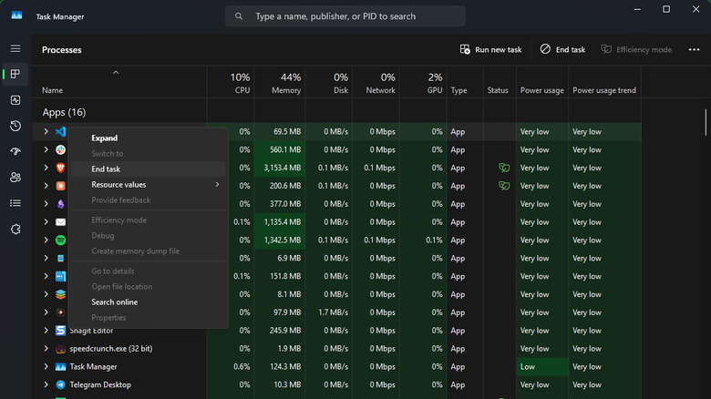
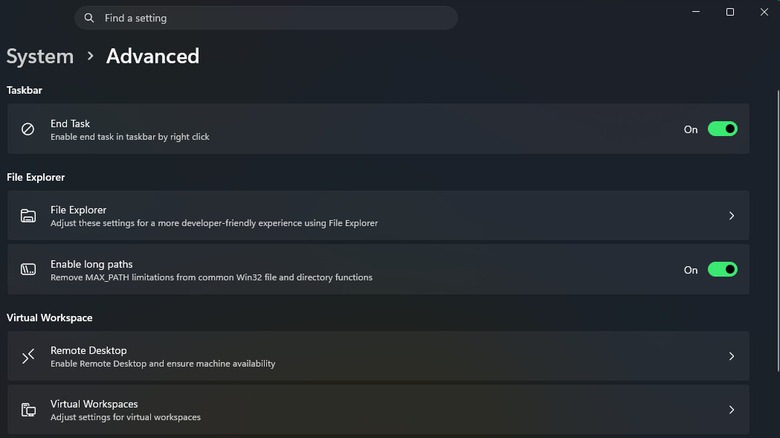

Cuando una aplicación se queda bloqueada y deja de responder, los gestos habituales no sirven: ni el botón de cerrar ni el atajo de teclado consiguen nada. En Windows, ese cierre forzado recibe el nombre de **Finalizar tarea** y permite terminar un proceso aunque el programa se resista, algo especialmente útil si el equipo parece congelado y no hay forma de recuperar el control.

Conviene aclarar una diferencia clave desde el principio: pulsar la **X** de una ventana no siempre cierra el programa. Muchas aplicaciones se limitan a esconder su ventana en la bandeja del sistema y siguen ejecutándose en segundo plano. Esta guía recorre las opciones disponibles, de la más suave a la más contundente, para que elijas la adecuada según lo atascado que esté el programa.

## Requisitos previos

- Un equipo con Windows 10 u 11 en funcionamiento.
- Conocer el nombre o la ventana de la aplicación que quieres cerrar.
- Para los métodos con línea de comandos, no se necesitan permisos especiales, aunque sí cuidado al escribir los parámetros.

## Paso 1: intentar primero el cierre normal

Antes de recurrir a la fuerza, prueba el cierre estándar. Haz clic en la **X** de la esquina superior derecha de la ventana: ese gesto envía la orden de cierre habitual y da al programa la oportunidad de terminar lo que estaba haciendo. Si hay cambios sin guardar en un documento o una descarga en curso, lo más probable es que la aplicación te pida confirmación y te avise de que podrías perder trabajo.

El atajo **Alt + F4** hace exactamente lo mismo. Ahorra tiempo frente al ratón, pero tiene una trampa: cierra la ventana activa, es decir, la última sobre la que hiciste clic, y a menudo no hay una pista visual clara de cuál es. Con varios monitores o muchas ventanas abiertas, es fácil equivocarse de destino.

Según el programa, este método puede terminar el proceso por completo o limitarse a dejarlo en la bandeja del sistema. Las utilidades pensadas para seguir en segundo plano, como clientes de mensajería o reproductores de música, normalmente no se cierran del todo: siguen notificando o reproduciendo. Otras aplicaciones más tradicionales sí se cierran como esperas. Si un programa concreto no termina, busca en sus ajustes la opción para cambiar ese comportamiento.

Muchas de estas aplicaciones ofrecen además una salida explícita en su menú **Archivo > Salir** o **Archivo > Cerrar**, con un atajo asociado del estilo **Ctrl + Q**. También funciona hacer clic con el botón derecho sobre su icono en la bandeja del sistema (pulsa la flecha pequeña para verlos todos) y elegir **Salir** o **Cerrar**.

## Paso 2: cerrar el programa a la fuerza con el Administrador de tareas

Cuando la aplicación se congela y no atiende ni siquiera la orden de cierre amable, toca forzar. El equivalente en Windows al "force quit" de macOS es el Administrador de tareas. Ábrelo con **Ctrl + Shift + Esc** o haciendo clic con el botón derecho en una zona vacía de la barra de tareas y eligiendo **Administrador de tareas**. En el panel izquierdo, entra en la pestaña **Procesos** para ver todo lo que se está ejecutando.

Lo más cómodo suele ser ordenar la lista pulsando **Nombre** y recorrerla en orden alfabético, lo que separa las **Aplicaciones** activas de los **Procesos en segundo plano** y los **Procesos de Windows**. También puedes usar el cuadro de búsqueda de la parte superior. Si lo que buscas es cerrar las aplicaciones que consumen más recursos, haz clic en un encabezado como **Memoria** para ordenarlas por consumo. Un número junto al nombre de una aplicación indica que agrupa varios procesos.

Para forzar el cierre, selecciona el proceso y pulsa **Finalizar tarea** en la esquina superior derecha, o haz clic con el botón derecho sobre él y elige la misma opción en el menú. Esto termina el proceso sin darle ocasión de apagarse correctamente, así que se pierde cualquier trabajo no guardado. Una vez que el programa bloqueado se cierra del todo, ya puedes volver a abrirlo.

Hay un caso que conviene tratar con cuidado: la entrada **Explorador de Windows**, dentro de los procesos de Windows. Como ese proceso controla el Explorador de archivos y buena parte de los elementos visuales del sistema, incluida la barra de tareas, terminarlo causa estragos. Por eso ofrece la opción **Reiniciar tarea** en lugar de simplemente finalizarla. Si lo has terminado por otro método, pulsa **Ejecutar nueva tarea** en el Administrador de tareas y escribe `explorer.exe` para volver a levantarlo.

## Paso 3: activar "Finalizar tarea" en Configuración

El Administrador de tareas es perfecto para gestionar procesos de forma puntual, pero existe una vía más rápida para terminar con ellos. Está escondida en la aplicación **Configuración**: ábrela con **Win + I**, ve a **Sistema > Avanzado** y activa el interruptor que hay junto a **Finalizar tarea**. A partir de ese momento aparecerá una opción extra al hacer clic con el botón derecho sobre una aplicación abierta en la barra de tareas.

Así evitas tener que bucear en el Administrador de tareas, pero atención al comando que eliges: **Finalizar tarea** destruye el proceso sin preguntar, mientras que **Cerrar ventana** envía la solicitud de apagado normal.

## Paso 4: terminar el árbol de procesos

Si los métodos anteriores no bastan para cerrar una aplicación congelada, cambia a la pestaña **Detalles**, en el panel izquierdo del Administrador de tareas. Localiza allí el proceso atascado, haz clic con el botón derecho y elige **Finalizar árbol de procesos** para intentar un cierre más contundente que termina también todos los procesos relacionados.

## Paso 5: crear un atajo con taskkill

Los símbolos del sistema son otra forma de terminar procesos que no responden, pero resultan engorrosos. Un método más cómodo consiste en crear un acceso directo que cierre de golpe todas las aplicaciones bloqueadas, sin tener que averiguar el nombre de cada proceso:

1. Haz clic con el botón derecho en una zona vacía del escritorio y elige **Nuevo > acceso directo**.
2. En el cuadro de texto, escribe `taskkill /f /fi "status eq not responding"`. El parámetro **/f** fuerza el cierre del proceso y **/fi** filtra el comando para que solo actúe sobre los procesos que cumplan la condición indicada, en este caso los que están bloqueados.
3. Pulsa **Siguiente**, dale al acceso directo un nombre claro y termina con **Finalizar**.
4. Si lo deseas, puedes asignarle un atajo de teclado propio. Haz clic con el botón derecho sobre el elemento recién creado y elige **Propiedades**. Haz clic dentro del cuadro **Tecla de método abreviado** e introduce la combinación que prefieras. Cambia el cuadro **Ejecutar** a **Minimizado** para no ver una ventana cada vez que lo lances y pulsa **Aceptar**.

## Paso 6: recurrir a SuperF4 como último recurso

Si necesitas cerrar procesos a pantalla completa o hay situaciones en las que ni siquiera puedes abrir el Administrador de tareas, una utilidad como SuperF4 ayuda. Añade el atajo **Ctrl + Alt + F4** para forzar el cierre de la aplicación actual, además de un comando **Win + F4** que permite terminar el proceso de cualquier aplicación haciendo clic sobre su ventana.

## Cómo verificar que funcionó

Comprueba en el Administrador de tareas (pestaña **Procesos**) que la aplicación ya no aparece en la lista. Si el programa se había quedado con la ventana congelada, la ventana debería desaparecer y el sistema volver a responder con normalidad. Con el acceso directo del paso 5, ejecútalo y observa que las aplicaciones bloqueadas se cierran solas sin mostrar ninguna ventana, ya que está configurado para ejecutarse minimizado.

## Advertencias y limitaciones

- Finalizar un proceso no da tiempo al programa a guardar su estado: perderás cualquier cambio que no hayas guardado. Los métodos normales del paso 1 son siempre la primera opción.
- Terminar el **Explorador de Windows** afecta a la barra de tareas y a otros elementos visuales del sistema. Usa **Reiniciar tarea** siempre que sea posible.
- Los símbolos del sistema y las utilidades de terceros son soluciones de emergencia para casos en los que no puedes abrir el Administrador de tareas.
- Cuando nada funciona, reiniciar el equipo termina con cualquier programa atascado. Reiniciarlo con cierta regularidad reduce las probabilidades de que las aplicaciones se bloqueen, y si un programa concreto se cuelga una y otra vez, conviene instalar sus actualizaciones disponibles o desinstalarlo y volver a instalarlo.
