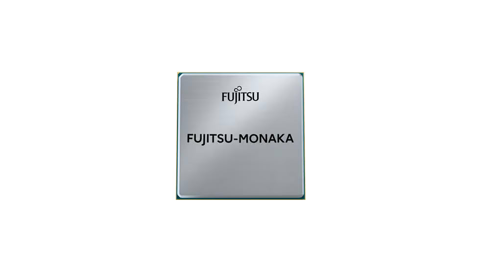
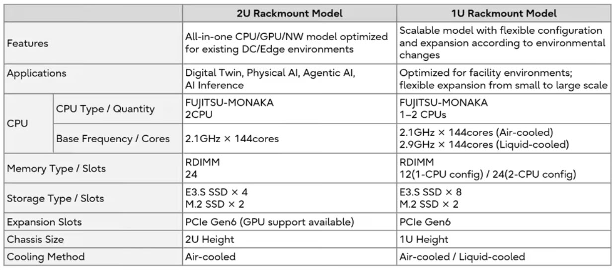
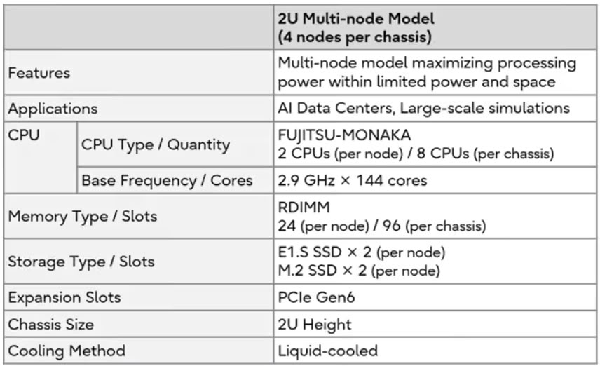

Fujitsu anunció el inicio de la venta global de su nueva CPU para centros de datos, FUJITSU-MONAKA, diseñada y desarrollada en Japón, a partir de noviembre de 2026. El procesador se comercializará como producto independiente para operadores de nube, centros de datos y fabricantes de servidores, y también como parte del nuevo Fujitsu MONAKA Server, que la compañía presenta como una infraestructura de IA soberana de alta fiabilidad y eficiencia energética.

La nota de prensa, recogida por TechPowerUp, sitúa el lanzamiento en plena escasez de recursos de cómputo para IA generativa y ante un encarecimiento de la energía. Fujitsu quiere responder con una CPU de bajo consumo que permita construir plataformas de inferencia de IA sin depender de infraestructura especializada como la refrigeración líquida.

## Una arquitectura apilada en 2 nm y el doble de inferencia

El FUJITSU-MONAKA combina una arquitectura de apilado 3D con un proceso de última generación de 2 nm para el núcleo y de 5 nm para las secciones de caché y entrada/salida. La idea, explica Fujitsu, es aplicar a cada función el proceso óptimo para mejorar la eficiencia de costes, el rendimiento y el consumo, apoyándose en una tecnología propia de operación a voltaje ultrabajo.

En cifras, el procesador alcanza una frecuencia máxima de 3,8 GHz y una velocidad de transferencia de memoria de 8800 MT/s. Incluye aceleración por hardware para operaciones matriciales mediante instrucciones dedicadas que, combinadas con las operaciones vectoriales SVE2 y la optimización por software, duplican la capacidad de inferencia de IA frente a otras CPU. Según Fujitsu, esto permite recortar a la mitad el número de servidores y el consumo energético necesarios para una carga de procesamiento equivalente.

La seguridad es el tercer pilar: el chip incorpora computación confidencial que protege con cifrado por hardware los datos y las aplicaciones que se ejecutan en memoria, algo pensado para entornos de nube multiinquilino.

## El servidor: fabricación nacional y refrigeración eficiente

El Fujitsu MONAKA Server se diseña, desarrolla y fabrica en Japón, concretamente en la planta de Kasashima, con el objetivo de garantizar la trazabilidad de los componentes y de su historial de fabricación. Desde noviembre de 2026, Fujitsu venderá servidores de rack 2U (dos CPU) y 1U (una o dos CPU) en Japón y Europa, orientados a agentes de IA e inferencia.

El modelo 1U adopta la tecnología CDI/CXL para asignar memoria y aceleradores más allá de los límites físicos del propio servidor, mitigando las carencias de memoria habituales en inferencia de IA. Gracias a la tecnología de refrigeración de Fujitsu, este equipo puede operar con refrigeración por aire a temperaturas ambiente de hasta 40 °C y con refrigeración por agua a 45 °C, sin infraestructura especializada, lo que reduce el consumo de refrigeración hasta un 80 %.

Sobre esta base, Fujitsu plantea un modelo de IA soberana integrado verticalmente, que combina su plataforma de IA Fujitsu Kozuchi y su IA generativa empresarial Takane con modelos específicos por sector. La propuesta busca ofrecer trazabilidad, seguridad y transparencia operativa para que empresas e instituciones públicas puedan usar IA generativa con control de sus datos.

## Hoja de ruta y qué significa para el lector

Fujitsu prevé suministrar el MONAKA a operadores de nube y centros de datos durante el cuarto trimestre de su año fiscal 2026, con disponibilidad global que incluirá Estados Unidos y la región Asia-Pacífico. El servidor llegará primero a clientes seleccionados de los sectores financiero, de telecomunicaciones y de fabricación, con envíos secuenciales a partir de abril de 2027. A futuro, la compañía planea añadir servidores de alta densidad para centros de datos de IA y soluciones a escala de rack con operación autónoma, incluido el mantenimiento automatizado con robots.

El movimiento tiene una lectura clara en el mercado de componentes para centros de datos: frente a la hegemonía de x86 y a la demanda creciente de silicio para IA, Japón apuesta por una alternativa propia, de origen nacional, que prioriza la soberanía tecnológica y la eficiencia energética. Si Fujitsu cumple con las cifras anunciadas —el doble de inferencia y la mitad de consumo—, el MONAKA podría convertirse en una opción relevante para operadores europeos que buscan reducir costes de refrigeración y dependencia de un único proveedor.
