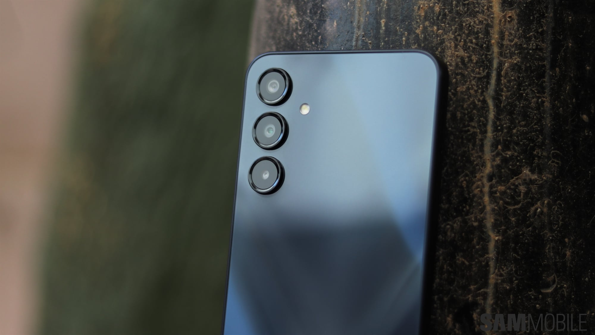

Samsung ha abierto el programa beta de **One UI 9.0**, la versión de su capa de personalización construida sobre **Android 17**, para el **Galaxy A16**. De momento el programa está disponible solo en India, según recoge SamMobile, y llega una semana después de que ya circularan indicios de que la compañía tenía esa intención. La actualización pesa 2.761,46 MB y arranca con el número de firmware A166PXXU9ZZIE.

La beta permite a los usuarios del terminal probar el software nuevo antes de que Samsung lance la versión estable para este modelo.

## Qué incluye la beta de One UI 9.0

SamMobile resume los cambios en tres frentes. El primero son **más opciones de personalización del panel rápido** (Quick Panel), el menú desplegable desde el que se accede a los accesos del sistema. El segundo son **funciones nuevas en Samsung Notes y en Samsung DeX**, la solución de Samsung para usar el teléfono con teclado y ratón como si fuera un ordenador. El tercero son **mejoras en las opciones de accesibilidad** del sistema.

El original no detalla esas funciones una a una, así que habrá que esperar a que los participantes del programa publiquen sus hallazgos concretos.

## Cómo instalar la beta en el Galaxy A16

El proceso, tal y como lo describe SamMobile, pasa por cuatro pasos:

1. Abrir la aplicación **Samsung Members**.
2. Buscar y tocar el banner del programa de beta del nuevo software para el Galaxy A16.
3. Registrar el dispositivo en el programa.
4. Ir a `Settings > Software update > Check for updates` para descargar la actualización.

Quien pruebe una beta de Android debe tener en cuenta que es software en pruebas: puede llegar con errores y, en casos extremos, obligar a volver a una versión anterior perdiendo datos. Conviene hacer una copia de seguridad antes de registrarse.

## Qué cambia para el usuario

Lo que hace relevante la noticia es el terminal sobre el que llega la beta. El Galaxy A16 es uno de los modelos más asequidos de la oferta de Samsung, y su propietario suele recibir el software cuando ya está terminado, no cuando se está probando. Que Samsung haya abierto el programa de pruebas para este modelo significa que los usuarios del A16 podrán probar One UI 9.0 con Android 17 antes de la versión estable.

También es una señal sobre el recorrido que le queda al teléfono: el A16 sigue dentro de la hoja de ruta de actualizaciones de Samsung, algo que en los rangos de precio más bajos nunca está garantizado. Esa es la lectura que importa para quien ya lo tiene: el camino hasta la versión estable está abierto, aunque la beta siga limitada a India por ahora.

Para el resto de mercados, incluido el español, toca esperar a que Samsung extienda el programa o, directamente, a que publique la actualización estable. Sobre el estado de las betas de Android 17 hay contexto en nuestro artículo sobre [Android 17 QPR2 Beta 6](/noticias/android-17-qpr2-beta-6/), y sobre una de las funciones que Samsung sigue trabajando en One UI, en [el truco que permite usar DeX en la pantalla interior del Galaxy Z Fold 8](/noticias/galaxy-z-fold-8-dex-inner-screen/).
