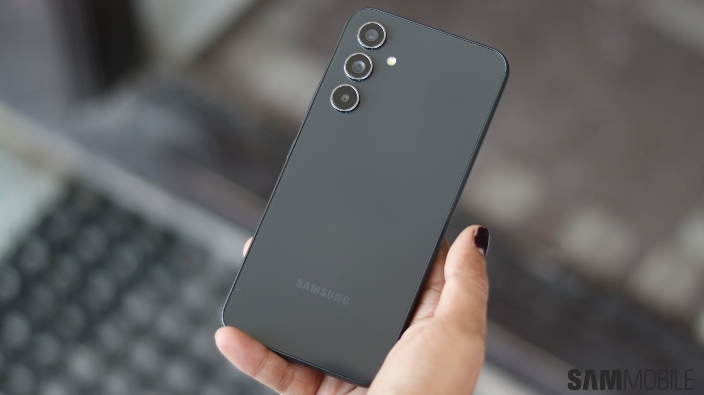

Samsung ha abierto el programa beta de **One UI 9.0 (Android 17) para el Galaxy A54**, tal como informa SamMobile. La inscripción ya está activa en India, donde la actualización pesa 2.581,07 MB y llega con la versión de firmware `A546EXXUNZZI4`. El objetivo es permitir probar el software antes de que Samsung publique la versión estable.

La llegada de la beta no es una sorpresa total: el mes pasado ya circularon indicios de que Samsung planeaba abrirla para el Galaxy A54, y la decisión de ampliar el programa a gama más baja —con modelos como el Galaxy A15 y el Galaxy A07— reforzó esas expectativas. Ahora la compañía lo ha confirmado.

## Qué incluye One UI 9.0 en el Galaxy A54

Junto con la interfaz nueva, la beta trae el **parche de seguridad de septiembre de 2026**, que corrige 90 fallos de seguridad presentes en la versión anterior del sistema. En cuanto a la capa de personalización, One UI 9.0 amplía las opciones del panel rápido (Quick Panel), mejora Samsung Notes y Samsung DeX, incorpora un indicador de privacidad de ubicación y refuerza las funciones de accesibilidad.

Son mejoras que Samsung presenta como parte del paquete de One UI 9.0, no como funciones exclusivas del Galaxy A54.

## Cómo inscribirse en la beta

El proceso se hace desde la app Samsung Members:

1. Abre **Samsung Members** en el Galaxy A54.
2. Busca y toca el banner del programa beta de One UI 9.0.
3. Inscribe el dispositivo en el programa.
4. Ve a **Ajustes > Actualización de software > Buscar actualizaciones**.

Una vez completados los pasos, la beta se descarga como cualquier otra actualización del sistema.

## Por qué importa para el usuario

Para quien use un Galaxy A54, esta beta es la vía más rápida para probar Android 17 con antelación, aunque conviene recordar que es software preliminar: los fallos son habituales y la versión estable todavía no está disponible. El programa se ha abierto por ahora solo en India, así que su despliegue a otros mercados dependerá de los siguientes pasos de Samsung.

El calendario de One UI 9.0 ya está en el punto de mira de los usuarios de la gama A. La apertura del programa a equipos más asequibles —SamMobile cita el Galaxy A15 y el Galaxy A07— y el reciente [programa beta del Galaxy A16](/noticias/galaxy-a16-one-ui-9/) apuntan a una estrategia de Samsung para llevar la nueva interfaz más allá de las gamas Galaxy S y Z.
