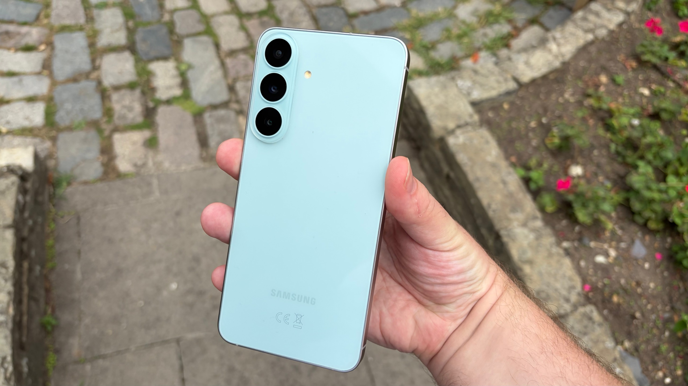
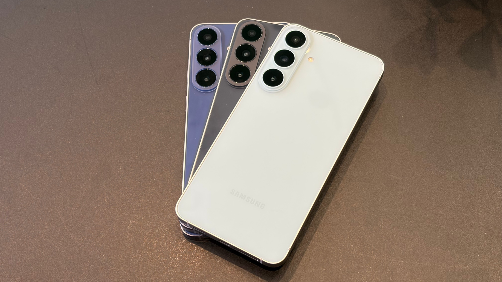
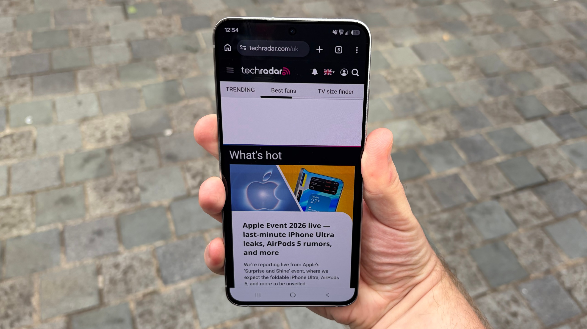
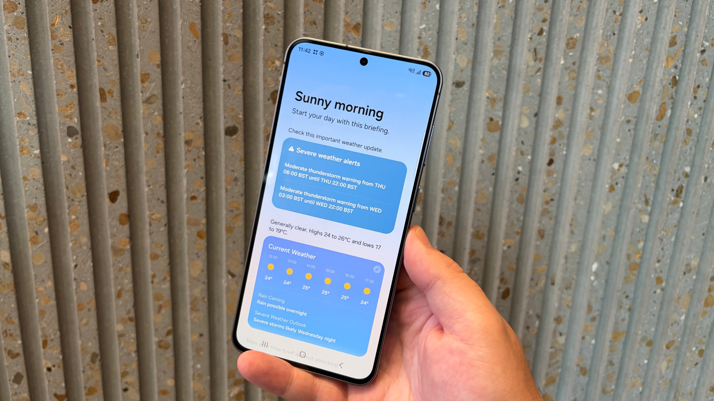
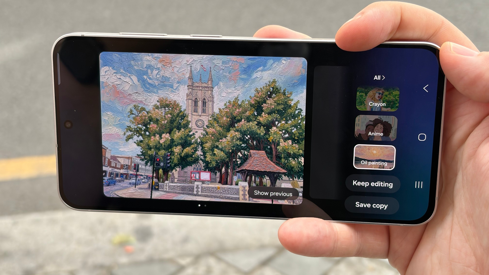
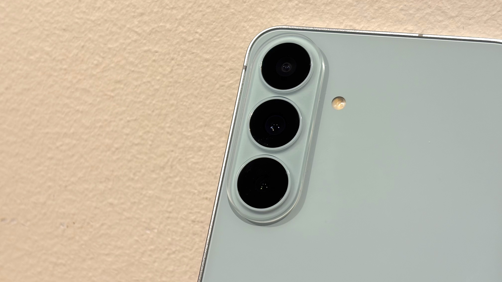
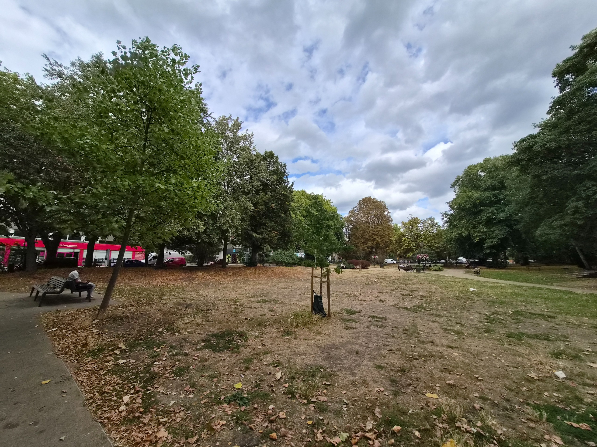
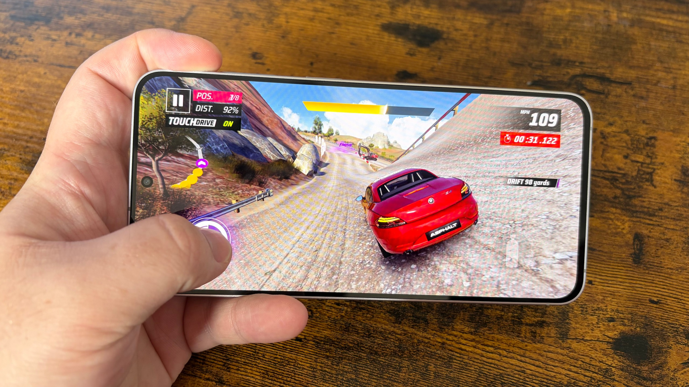
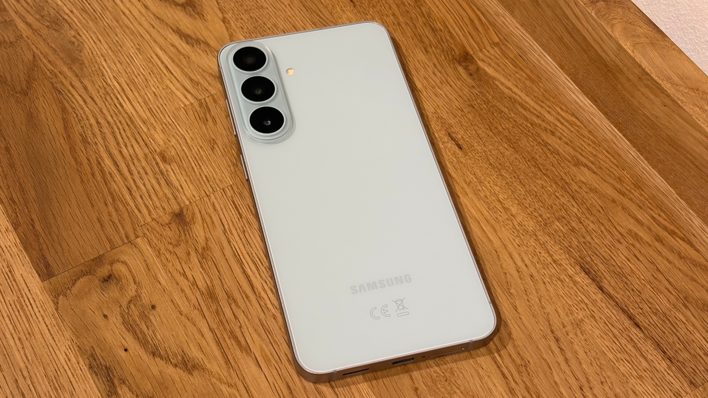

El **Samsung Galaxy S26 FE** ya está a la venta desde el 4 de septiembre de 2026 y llega como la versión más asequible de la familia Galaxy S26. La promesa de la firma surcoreana sigue siendo la misma que en generaciones anteriores: buena parte de la experiencia de un tope de gama a un precio contenido. Sin embargo, el análisis de TechRadar concluye que el resultado es un teléfono correcto al que le pesa más que nunca la etiqueta de "económico". La reseña, firmada por Richard Priday, señala que sus verdaderos atractivos son la pantalla grande, la autonomía y el rendimiento en juegos, y no tanto las cámaras o la inteligencia artificial que Samsung usa como reclamo.

## Precio y disponibilidad: más caro que su predecesor

El S26 FE arranca en **699 dólares, 699 libras o 1.149 dólares australianos** para la versión de 128 GB, lo que supone unos 50 más que lo que costaba el Galaxy S25 FE en su lanzamiento. Con esa cifra, la distancia con el Galaxy S26 base se queda en 200 dólares (180 libras o 400 dólares australianos) y sube hasta los 400 (400 libras o 700 australianos) frente al Galaxy S26 Plus, de tamaño similar.

| Almacenamiento | Precio en EE. UU. | Precio en Reino Unido | Precio en Australia |
| --- | --- | --- | --- |
| 128 GB | 699 $ | 699 £ | 1.149 AU$ |
| 256 GB | 799 $ | 799 £ | 1.299 AU$ |
| 512 GB | No disponible | 949 £ | 1.599 AU$ |

A la compra hay que sumarle un incentivo: seis meses gratis de Google AI Pro, un paquete cuyo valor estimado ronda los 120 dólares (114 libras o 200 dólares australianos) y que incluye 5 TB de almacenamiento en la nube. Para quien compare precios en euros, conviene recordar que estas tarifas corresponden a los mercados estadounidense, británico y australiano, y que el precio final en España depende de la política de cada distribuidor.

## Diseño, pantalla y software: continuidad con recortes medidos

Físicamente, el S26 FE apenas se distingue de su predecesor. Mantiene los tres objetivos integrados en la trasera, laterales planos con esquinas redondeadas y un panel frontal con la cámara para selfis centrada. Los rasgos que delatan que no es un Galaxy S26 convencional son la trasera brillante, en lugar del acabado mate, y un marco inferior algo más grueso. Llega en tres colores —Blueberry, Graphite y Pistachio—, con certificación IP68 y Gorilla Glass Victus Plus en ambas caras, un escalón por detrás del cristal que usan el S26 y el S26 Plus.

La pantalla de 6,7 pulgadas iguala en tamaño a la del Galaxy S26 Plus, pero renuncia a parte de la calidad: se queda en resolución FHD+ y 1.900 nits de brillo máximo, frente a los 2.600 nits del resto de la familia. Aun así, el análisis destaca que el color y el detalle siguen siendo buenos y que el panel se lee sin problemas bajo el sol. Los marcos más gruesos son la concesión más visible.

En el apartado de software sí llega con ventaja: trae **One UI 9 sobre Android 17** preinstalado, mientras que los demás Galaxy S26 solo pueden acceder a esa capa en fase beta. La versión incluye funciones como My FanCam para seguir sujetos en vídeo, herramientas de edición con IA como Photo Assist y Audio Eraser, tarjetas personalizadas en Now Brief y compatibilidad ampliada con Gemini. Además, Samsung mantiene la promesa de **siete generaciones de Android y siete años de parches de seguridad**, un año más que el Galaxy A57 y la misma cifra que sus hermanos mayores. El análisis advierte, eso sí, que muchas de esas novedades llegarán también a móviles más antiguos, por lo que no son un motivo de compra por sí solas.

## Cámaras, rendimiento y batería: luces y sombras

El apartado fotográfico repite los sensores del S25 FE y combina una cámara principal de 50 MP, una ultraangular de 12 MP y un teleobjetivo de 8 MP con zoom óptico 3x, además de una frontal de 12 MP. La principal y la de selfis ofrecen resultados sólidos, mientras que la ultraangular y el teleobjetivo se quedan atrás frente a lo que se espera de un tope de gama. En las pruebas, el zoom 2x por recorte del sensor principal mantiene bien el detalle gracias a la resolución de 50 MP, pero el 3x óptico entrega imágenes más oscuras y planas.

Donde más sorprende es en potencia. El chip **Exynos 2500**, propio de Samsung, en lugar del Snapdragon 8 Elite Gen 5 que usan el resto de tope de gama de 2026, firma 2.361 puntos en Geekbench 6 de un solo núcleo y 7.831 en multinúcleo. En gráficos se coloca por delante del grupo: 5.116 puntos en la mejor pasada del 3DMark Wild Life Extreme Stress Test y 10.526 en Solar Bay, una prueba centrada en el trazado de rayos.

El punto débil es la memoria: **8 GB de RAM** frente a los 12 GB de los Galaxy S26 de gama alta, una cifra que limita el uso intensivo y la multitarea, aunque no impide jugar con soltura. En autonomía, equipara los 4.900 mAh del S26 Plus, pero Samsung estima 29 horas de reproducción de vídeo, por debajo de las 31 del Plus y las 30 del S26. En el uso diario del analista, el teléfono consumió en torno al 40 % de batería en una jornada típica y podría aguantar dos días con un uso moderado.

La carga por cable se mantiene en 45 W, igual que en el S26 Plus y el Ultra, mientras que la inalámbrica baja a 15 W y se queda sin compatibilidad Qi2. Con un cargador compatible, el S26 FE pasó del 0 al 43 % en 15 minutos y alcanzó el 100 % en 58 minutos.

## Veredicto: ¿a quién le conviene el Galaxy S26 FE?

La valoración global del análisis es la de un teléfono que cumple su objetivo —ofrecer una experiencia Galaxy S grande por menos dinero— pero que ha perdido parte del encanto por la subida de precio. Las notas por apartado quedan así: valor 3,5 sobre 5; diseño 4; pantalla 3,5; software 4; cámara 3; rendimiento 4; y batería 4.

TechRadar recomienda el S26 FE a quien busque una pantalla amplia y buena autonomía de Samsung al menor coste posible y no tenga especial interés en las funciones de IA exclusivas ni en la fotografía avanzada. En cambio, desaconseja su compra a quien dé prioridad a la cámara —sobre todo a los planos ultraangulares y con zoom— o a quien pueda estirar el presupuesto, ya que por unos cientos más el Galaxy S26 o el S26 Plus ofrecen mejor equilibrio. Para quien valore la relación entre potencia y precio en juegos, el [análisis del Galaxy Z Flip8](/noticias/samsung-galaxy-z-flip8-review/) o la [comparativa entre el iPhone 18 Pro Max y el Galaxy S26 Ultra](/noticias/iphone-18-pro-max-vs-galaxy-s26-ultra/) pueden servir de referencia dentro de la propia gama.
