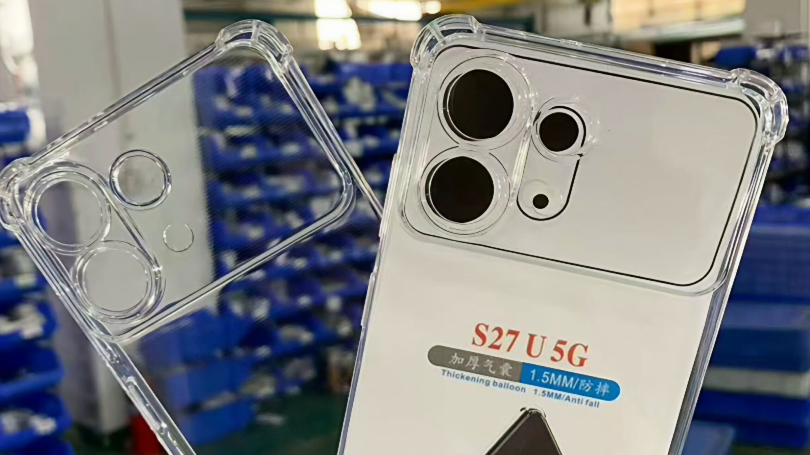

Un nuevo lote de fundas de terceros vuelve a apuntar a que el Galaxy S27 Ultra será uno de los mayores rediseños traseros de la saga Ultra en los últimos años. Según los renderizados que circulan, el teléfono abandonaría los anillos de lente individuales que han definido a los modelos recientes y pasaría a un módulo de cámara más grande, elevado y de orientación horizontal. Conviene subrayar que no existe ningún anuncio oficial de Samsung: todo lo que sigue procede de imágenes de fundas y de bocetos filtrados, no de la compañía.

## Qué muestran las fundas del Galaxy S27 Ultra

Los bocetos CAD filtrados y las sucesivas fundas que ha ido compartiendo el filtrador Ice Universe describen, según esas mismas imágenes, un área de cámara unificada en la que se integrarían dos sensores apilados en vertical y un tercero en una sección alargada u ovalada situada junto a ellos. La versión más reciente y precisa mostraría dos aperturas dentro de esa sección ovalada: la superior correspondería a la cámara teleobjetivo y una circular más pequeña, situada debajo, quedaría alineada con el flash LED.

De confirmarse, el cambio supondría un giro hacia la meseta de cámara unificada que ya emplean algunos competidores, en lugar de los aros separados que flotan sobre la trasera en las generaciones anteriores.

## La incógnita del sensor Laser AF

El detalle de las dos aperturas deja abierta una pregunta. Informaciones previas y renderizados basados en CAD sugerían que esa sección alargada albergaría la cámara teleobjetivo, el flash LED y el sensor Laser AF, el componente que los Ultra recientes usan para un enfoque automático más rápido y preciso, sobre todo con poca luz. En las imágenes más recientes solo aparecen dos recortes.

Samsung ha situado el Laser AF en la parte superior durante los últimos años, por lo que resultaría llamativo ver tanto la cámara de 5 aumentos como el sistema láser integrados en un único recorte. Según estas filtraciones, una apertura separada en otra zona del módulo sigue siendo posible, y es probable que nuevas filtraciones aclaren la situación conforme se acerque el lanzamiento.

## Qué cambia para el lector

Por ahora no hay nada confirmado. La fuente son renderizados de fundas y publicaciones de un filtrador, no material oficial de Samsung, y los fabricantes de accesorios trabajan en ocasiones con medidas preliminares o con imágenes que circulan antes del anuncio, de modo que el diseño final podría no coincidir con lo que se ve hoy.

El contexto de la saga ayuda a calibrar las expectativas. Los Galaxy S Ultra arrastran desde 2020 la misma batería de 5.000 mAh, un apartado que sí se ha comentado con más detalle en [los cambios que prepara la familia Ultra](/noticias/galaxy-s-ultra-bateria-cambio/). En el caso del módulo de cámara, habrá que esperar a las próximas filtraciones —y, sobre todo, a la presentación oficial— para saber si el rediseño se confirma tal y como apuntan estas fundas.
