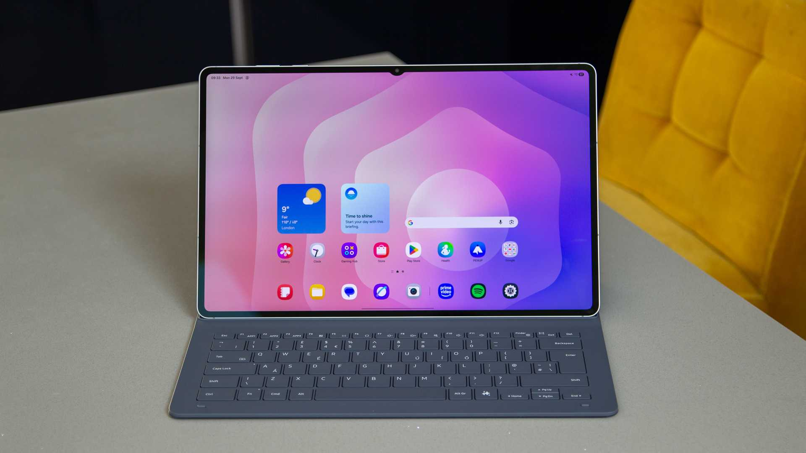

La próxima tableta insignia de Samsung vuelve a ser noticia por filtración y no por un anuncio oficial. El conocido filtrador **Evan Blass** ha publicado en X una tanda de renders de la **Galaxy Tab S12 Ultra** que muestran el dispositivo desde todos los ángulos, incluido el lápiz **S Pen** compatible. Según **Tech Advisor**, las imágenes tienen el aspecto de los renders de prensa que suelen acompañar a un lanzamiento, aunque Samsung todavía no ha confirmado ni la existencia ni el diseño del producto.

Conviene enmarcar la información como lo que es: una filtración. Los detalles que siguen proceden de filtradores y de materiales que aún no han pasado por un anuncio oficial, así que pueden cambiar antes de la presentación.

## El diseño de la Galaxy Tab S12 Ultra, al detalle

Lo más llamativo de la filtración es, precisamente, lo poco llamativo que resulta. Los renders sitúan a la **Galaxy Tab S12 Ultra** como un calco de la **Galaxy Tab S11 Ultra**, hasta el punto de conservar el característico **notch semicircular** en la pantalla. Tech Advisor describe ambos modelos como prácticamente idénticos, lo que apunta a una renovación de continuidad más que a un rediseño.

Ese inmovilismo estético tiene una lectura doble. Por un lado, da tranquilidad a quien ya conoce la generación anterior: los accesorios, el agarre y la disposición física de los elementos apenas cambian. Por otro, deja la sensación de que Samsung reserva sus novedades para el apartado interno y para el software, algo habitual en la gama alta cuando el chasis ya está muy rodado.

## Etiquetas energéticas: variantes Wi-Fi y 5G, y protección IP68

A la filtración de Blass se suma la del también filtrador **Roland Quandt**, que publicó en Bluesky unas etiquetas energéticas de la UE de la serie **Galaxy Tab S12**. Según Tech Advisor, esos documentos parecen proceder directamente del sitio web de Samsung y recogen variantes **Wi-Fi y 5G** tanto de la **Galaxy Tab S12 Plus** como de la **Galaxy Tab S12 Ultra**.

El dato más concreto que aportan esas etiquetas es la confirmación de la **protección IP68** en ambos modelos. Para una tableta de gama alta, la resistencia al agua y al polvo es un argumento relevante frente a quienes la usan en movilidad, aunque conviene recordar que la clasificación se refiere a condiciones de laboratorio y no a un uso sumergido prolongado.

## Qué se espera por dentro (y qué sigue siendo rumor)

En cuanto al hardware, lo que circula hasta ahora son afirmaciones de filtraciones previas, no especificaciones oficiales. Tech Advisor recoge que la **Galaxy Tab S12 Ultra** montaría el chip **MediaTek Dimensity 9500**, con hasta **16 GB de RAM** y hasta **1 TB de almacenamiento**. La pantalla apuntaría a un panel **AMOLED de 14,6 pulgadas a 120 Hz**, y la batería a unos **11.600 mAh**.

Son cifras plausibles para la categoría, pero todavía no verificadas. Quien esté pensando en comprar una tableta de este segmento debería tratarlas como orientativas: hasta que Samsung no publique la ficha técnica, cualquier cambio de última hora es posible. Si quieres hacerte una idea del tipo de dispositivo que prepara la marca, en TechSpain24 ya analizamos su plegable más reciente, la [Galaxy Z Flip8](/noticias/samsung-galaxy-z-flip8-review/), donde el soporte y la autonomía vuelven a ser los puntos a vigilar.

## La fecha de presentación apunta al 7 de octubre

El calendario también tiene fecha provisional. Según recuerda Tech Advisor, la semana pasada apareció nueva evidencia, procedente de la misma fuente, de que la serie **Galaxy Tab S12** se anunciaría el **7 de octubre**. Si se confirma, será en ese anuncio donde por fin se resuelvan todas las dudas y donde se pongan en contexto tanto el diseño filtrado como las especificaciones.

Para el lector hispanohablante, el mensaje práctico es que la información disponible es abundante pero unánime en lo esencial: una tableta que se parecerá mucho a la anterior por fuera y que concentrará sus cambios en el rendimiento y en el software. Hasta el 7 de octubre, conviene leer cada filtración con la cautela que merece un rumor.
