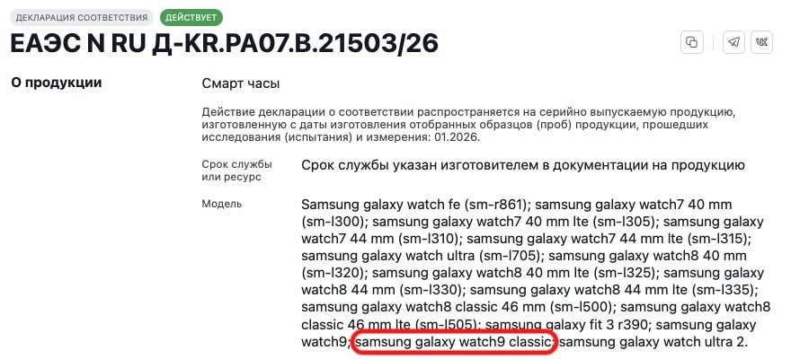

El Galaxy Watch9 Classic podría no estar muerto. Samsung lo dejó fuera de su evento Unpacked de julio, donde solo presentó el Galaxy Watch9 y el Galaxy Watch Ultra2, pero una declaración de conformidad rusa registrada el 14 de agosto —tres semanas después— vuelve a mencionar el nombre del modelo Classic junto a los dos relojes ya oficiales.

## Qué pasó: el Watch9 Classic aparece en un registro posterior al lanzamiento

El documento es una declaración de conformidad rusa que cita expresamente tres modelos como relojes inteligentes: Galaxy Watch9, Galaxy Watch9 Classic y Galaxy Watch Ultra 2. Lo llamativo no es solo el nombre, sino la fecha: el registro es posterior a la presentación oficial del 22 de julio en Londres, confirmada por la propia Samsung en su sala de prensa global.

Si el papel se hubiera sellado meses antes del Unpacked, la explicación sencilla sería que Samsung valoró el modelo y lo descartó. Pero que el nombre siga apareciendo en documentación tramitada cuando la gama 2026 ya era pública deja la puerta abierta a la otra hipótesis: que el Classic nunca estuviera previsto para julio y llegue más tarde.

Conviene poner la noticia en su contexto. Antes del Unpacked, ni los registros de la FCC estadounidense ni los de la certificación china 3C mostraban rastro alguno del Classic, y las filtraciones más completas —incluidas las de Evan Blass— tampoco lo incluían. Medios como Tech Advisor dieron por cerrado el tema el mismo 22 de julio: Samsung les confirmó en su día que el Classic seguía un ciclo de dos años, el Watch8 Classic llegó en 2025 y el siguiente tocaría en 2027. La única pista en sentido contrario fue el nombre en clave «wise9», asociado al Classic, detectado en mayo en el código de una actualización de Wear OS. Samsung, preguntada entonces, se limitó a no comentar futuros lanzamientos.

## Por qué importa: el hueco del bisel giratorio

La gama actual deja un vacío evidente. El Watch9 cubre la gama generalista y el Ultra2 corona el catálogo —un Ultra2 que comparte linaje con [un Watch Ultra anterior salpicado por una demanda de patentes de conectividad](/noticias/galaxy-s23-watch-ultra-demanda-patentes/)—, pero quien quiera el bisel giratorio físico de Samsung tiene que conformarse hoy con el Classic de la generación pasada. Ese es justo el segmento que un Watch9 Classic tardío cubriría.

El matiz importante es que un registro no equivale a un lanzamiento. Los documentos regulatorios recogen a veces productos que nunca llegan a las tiendas, así que el Classic sigue siendo un rumor, no una confirmación. La filtración aporta el nombre y una fecha intrigante, pero ni fecha de salida ni intención oficial de Samsung.

## Qué cambia para el lector: esperar o comprar ahora

Si estabas esperando un Classic con bisel giratorio de 2026, este registro es una razón para no darlo por cancelado del todo, pero no para retrasar una compra contando con él. Samsung no ha anunciado nada y el historial del ciclo bienal juega en contra de un lanzamiento inminente.

Quien necesite reloj ahora tiene tres caminos claros: el Watch9 estándar, el Ultra2 de gama alta o el Watch8 Classic de 2025 si el bisel físico es innegociable. Y si el rumor se confirma con una presentación posterior, será una buena noticia para los fieles del aro giratorio, el rasgo que siempre distinguió a la familia Classic.
