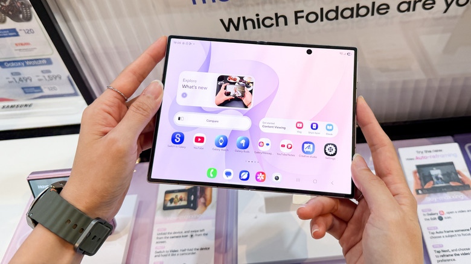

Samsung DeX es la función que convierte un teléfono Galaxy en un escritorio completo: se activa, se conecta a una pantalla externa por cable o de forma inalámbrica y el móvil pasa a comportarse como un ordenador, con soporte para ratón, teclado y dock USB. Hasta ahora ese modo estaba pensado para acompañarse de un monitor, pero en un plegable como el Galaxy Z Fold 8, con su pantalla interior de 7,6 pulgadas, tiene poco sentido depender de un display adicional.

Según Engadget, una aplicación disponible en la Play Store llamada Gadesk permite ejecutar DeX directamente sobre la pantalla interior del Z Fold 8. No se trata de un hack: no requiere root, no hay que recurrir a la instalación manual de paquetes (sideloading) ni a sitios de dudosa procedencia. Basta con instalar la app y dedicar unos minutos a configurar permisos y opciones.

## Cómo activar DeX en la pantalla interior del Z Fold 8

El procedimiento descrito por el medio pasa primero por preparar el sistema y después por vincular la aplicación con el teléfono:

1. Instalar Gadesk desde la Play Store.
2. Desactivar Auto Blocker en **Ajustes > Seguridad y privacidad**, ya que si queda activo puede bloquear alguno de los pasos necesarios para conectar la aplicación.
3. Habilitar la depuración inalámbrica desde las opciones de desarrollador. Para desbloquear ese menú hay que entrar en **Ajustes > Información del teléfono > Información del software** y pulsar siete veces sobre el número de compilación; después se introduce el código de desbloqueo y se confirma. Dentro de las opciones de desarrollador se activa la depuración inalámbrica. Es necesario estar conectado a una red Wi-Fi y el sistema pedirá autorizar siempre esa red para la depuración.
4. Abrir Gadesk, elegir «Connect driver» y seleccionar «First-time pairing». Cuando el sistema lo solicite, hay que permitir las notificaciones.
5. Si la app no lleva directamente a las opciones de desarrollador, hay que entrar en ellas, abrir la depuración inalámbrica y tocar «Pair device with pairing code». Aparecerá un código en pantalla que conviene anotar. En las notificaciones surgirá el aviso «Pairing screen detected. Enter the code.»; se pulsa «Enter pairing code» y se escribe el código mostrado. Una vez emparejado, el nombre «DeXprobe» aparecerá en el menú de depuración inalámbrica como confirmación.
6. Volver a Gadesk y pulsar «Allow Driver» y luego «Allow».
7. Tocar «Enable accessibility» y después «AGREE AND OPEN SETTINGS», lo que lleva a los ajustes de accesibilidad del Z Fold 8. Allí hay que entrar en **Aplicaciones instaladas**, localizar Gadesk y activar el interruptor, confirmando con «Allow».
8. Regresar a la app y pulsar «Start desktop».

La aplicación funciona engañando al teléfono para que crea que hay una pantalla externa conectada, usando para ello la depuración inalámbrica. Después intercepta la salida del modo escritorio y, con el permiso de accesibilidad concedido, la superpone sobre la pantalla interior del plegable.

## Ajustes que conviene revisar

Con DeX ya en marcha sobre la pantalla interna, Gadesk ofrece varias opciones que merece la pena ajustar:

- **Orientación.** Por defecto la app ejecuta DeX en horizontal, pero el modo vertical encaja mejor con la proporción del Z Fold 8, sobre todo al usar varias ventanas a la vez.
- **Trackpad virtual.** Para quien prefiera un cursor en pantalla, incorpora funciones como copiar, pegar y ampliar o reducir, además de un control para ajustar su opacidad.
- **Gesture action.** Hay gestos de dos y tres dedos, asignados por defecto a Inicio y Atrás respectivamente, y se pueden personalizar al gusto o dejar sin función.

## Las limitaciones de la versión gratuita

Gadesk no es completamente gratis. En su versión sin coste, cada sesión de DeX está limitada a 15 minutos y la app muestra anuncios. La versión de pago elimina tanto el límite de tiempo como la publicidad mediante un pago único de 20 dólares. Como alternativa, es posible extender cada sesión 10 minutos adicionales viendo promociones.

El medio señala además que la aplicación está pensada para las dimensiones del Z Fold 8, pero admite otros Galaxy compatibles con DeX siempre que ejecuten One UI 8 o una versión posterior, así como dispositivos Google Pixel a través del modo escritorio integrado en Android.
