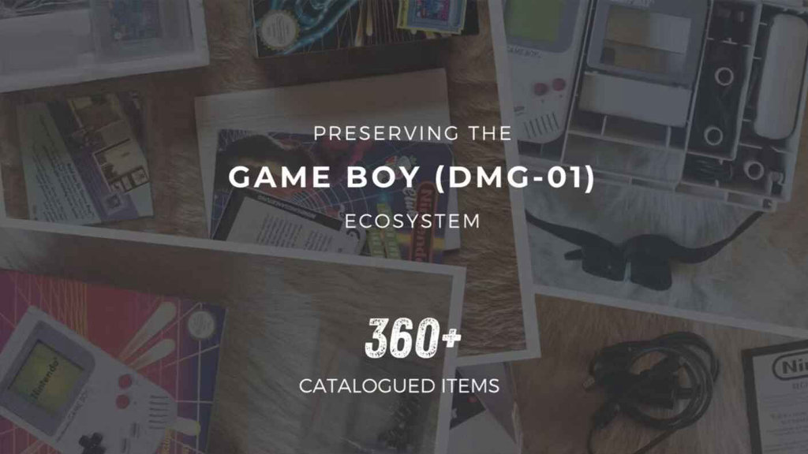

El Game Boy Museum, el archivo privado que documenta la portátil de Nintendo, se ha convertido en un cartucho de Game Boy: una ROM gratuita que contiene el catálogo completo del museo y funciona en hardware original, según explica su responsable, Marcel Pflug, en la web del museo. La noticia la ha recogido Retro Handhelds, que destaca lo autorreferencial del proyecto: un museo sobre la Game Boy que vive dentro de la propia Game Boy.

En lugar de limitarse a subir galerías de fotos o documentos, Pflug ha programado una base de datos completa y navegable dentro de las limitaciones de la máquina de 1989. Cada una de las 355 piezas catalogadas tiene su propia ficha con descripción, y la aplicación incluye un menú con Temas, Catálogo, Búsqueda y Marcadores.

## Un catálogo del Game Boy Museum navegable en hardware de 1989

Al encender el cartucho no hay sprites, ni niveles, ni música: solo la colección, organizada por categorías igual que en la web del museo. Junto al catálogo, el cartucho incluye una pequeña enciclopedia sobre el universo de la portátil, estructurada por capítulos que recorren sus orígenes, su anatomía, la serie DMG y sus accesorios, sus juegos y sus creadores.

El buscador recorre todo el contenido, y los marcadores permiten señalar las piezas que aún se están buscando: el cartucho los guarda en su pila, igual que las partidas guardadas de la época. La ROM es gratuita y funciona tanto en una Game Boy real (mediante cartuchos flash como EverDrive o en dispositivos como Analogue Pocket) como en emuladores y directamente en el navegador.

## Códigos QR: el puente entre 1989 y el móvil

El detalle más ingenioso es que cada ficha incluye su propio código QR visible en la pantalla de la consola: al apuntar con el móvil, se abre la ficha completa del objeto en la web, con fotografías y contexto. Tiene su gracia histórica, porque el código QR no existía cuando nació la Game Boy en 1989 (se inventó en 1994) y la consola nunca estuvo pensada para mostrar uno.

Para lograrlo sin superar los límites del hardware, los 355 códigos se generan por adelantado en un PC y se integran en la ROM, dimensionados para encajar en la cuadrícula de teselas de la consola. Además, cada código apunta a la identidad permanente del objeto y no a su número de catálogo, de modo que el enlace seguirá siendo válido aunque la colección se reorganice.

## Por qué importa y cómo probarlo

El proyecto entronca con una tradición curiosa: a principios de los noventa, Nintendo comercializó cartuchos que no eran juegos (guías de viaje, traductores, calculadora o agenda), de los que el museo conserva siete ejemplares. Este cartucho continúa esa idea tres décadas después, con un tema aún más específico: la Game Boy explicándose a sí misma.

Para el lector interesado, la vía más sencilla es la versión de navegador, disponible en la web del museo sin necesidad de hardware. Quien conserve una Game Boy (o un clon moderno como el [SupaBoy de Hyperkin](/noticias/hyperkin-supaboy-preorders/)) puede cargar la ROM gratuita en un cartucho flash, y también funciona en emuladores. Conviene tener clara una cosa: no contiene ningún juego jugable. Es puro trabajo de archivo, un homenaje técnico a la máquina que demuestra cuánto se puede exprimir todavía de un hardware con casi cuatro décadas a sus espaldas.
