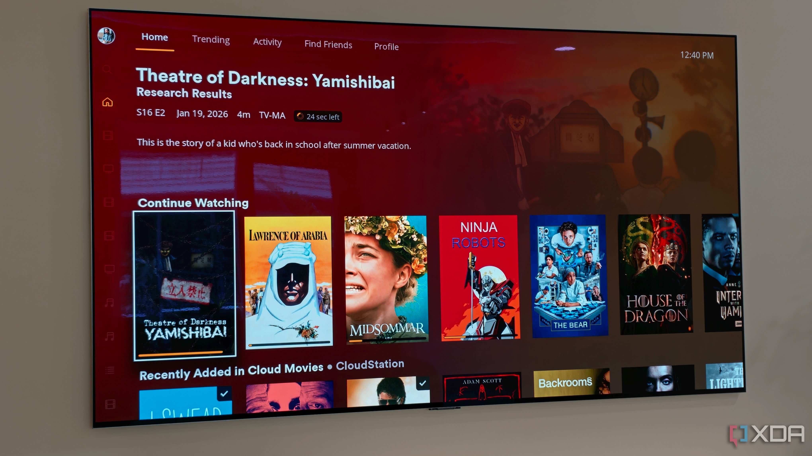
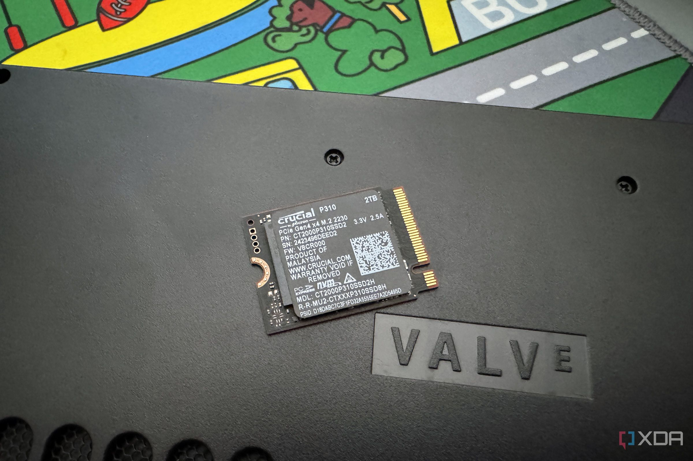
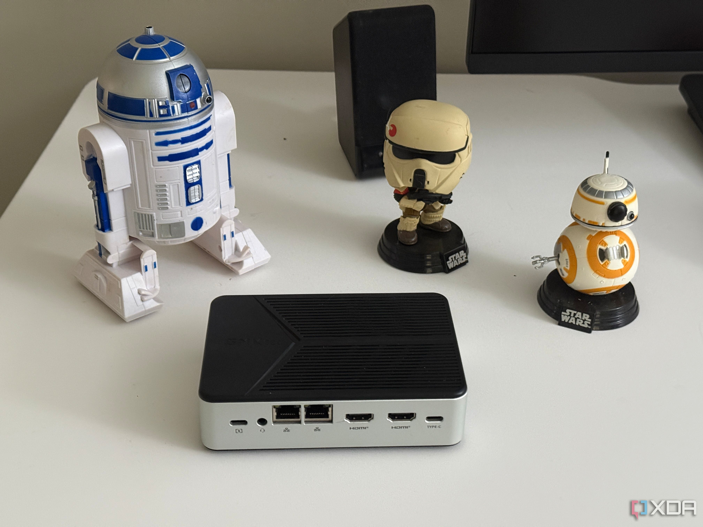
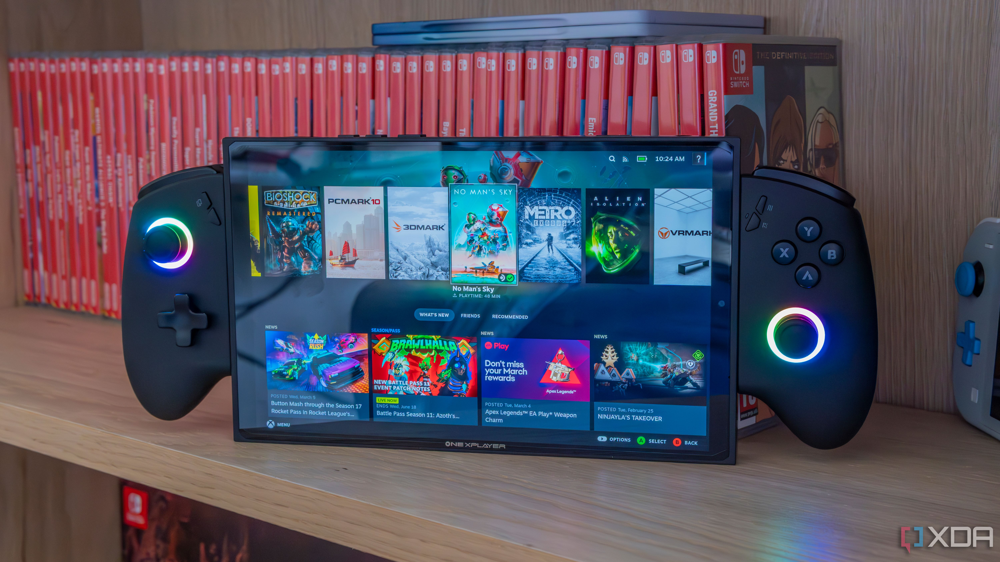

Hay una idea que suele pasar desapercibida: buena parte de las consolas portátiles actuales incorporan un procesador más potente que el de un portátil medio. Esa capacidad extra no tiene que quedarse solo en los juegos. El redactor de XDA Developers Abid Ahsan Shanto relató cómo aprovecha su equipo para servir películas y series en casa cuando no está jugando, sin que nadie note que la biblioteca no sale de un NAS.

Conviene enmarcarlo como lo que es: una experiencia personal del autor, no una recomendación general ni una comparativa medida. Aun así, el texto deja apuntes útiles sobre qué esperar y qué problemas aparecen por el camino.

## Un hardware más que suficiente para servir multimedia

El equipo del autor es un Ayaneo Air 1S con un AMD Ryzen 7 8840U. Según su experiencia, incluso una Steam Deck, con una APU comparativamente menos potente, bastaría para tareas básicas de servidor de medios. En cuanto al sistema, al ejecutar Bazzite ya dispone de un entorno de escritorio basado en Linux, y plataformas populares como Plex y Jellyfin funcionan sin contratiempos.

Entre ambas, el autor señala que tuvo buenas experiencias con las dos: organizaron la biblioteca, recuperaron metadatos y sirvieron películas y series sin fallos graves. Como criterio de elección, apunta que Jellyfin encaja mejor si se prioriza el código abierto, mientras que Plex resulta atractivo para quien prefiera una interfaz más pulida.

## El almacenamiento, el principal cuello de botella

El punto débil no es la potencia, sino el espacio. En su caso, el equipo tiene un SSD interno de 512 GB y una tarjeta microSD de 128 GB, ambos ocupados en su mayoría por juegos. Con el tamaño que alcanzan los títulos actuales, queda poco margen libre.

El autor repasa las alternativas y sus pegas. Un disco externo conectado mediante una base de acoplamiento resolvería la capacidad, pero restaría portabilidad al conjunto y sumaría un dispositivo extra. Una microSD de mayor capacidad suele ser más barata que cambiar el SSD interno y, para servir cine y televisión, sus velocidades de lectura son suficientes, sobre todo cuando los archivos no exigen transcodificación intensa.

El problema real, advierte, es la fiabilidad y la resistencia: una tarjeta de buena calidad puede con un catálogo de lectura intensiva, pero sigue siendo un soporte sin redundancia integrada. Agregar archivos de vez en cuando no debería desgastarla rápido, aunque un fallo o una corrupción pondría en riesgo toda la biblioteca.

## El reto de mantenerlo encendido

La diferencia práctica más grande frente a un NAS dedicado tiene que ver con cómo se concibe cada aparato. Una consola portátil está pensada para cogerse, desenchufarse, suspenderse y llevarse a otro sitio. Un NAS, en cambio, está diseñado para permanecer encendido y disponible cuando otro dispositivo necesita acceder a su almacenamiento.

Por eso, cuando la portátil entra en reposo o se desconecta, deja de comportarse como servidor. La gestión de energía añade otra arista: mantenerla conectada al cargador durante periodos largos puede ser un problema, sobre todo si el equipo no cuenta con carga por derivación (bypass charging).

## Un NAS no, pero tampoco lo pretende

El autor cierra su relato convencido de que la experiencia demuestra la versatilidad de estos dispositivos. Con el sistema operativo adecuado y el software correcto, una portátil puede servir películas y series por la casa sin que se note de dónde salen.

Ahora bien, el propio texto marca los límites: si lo que se busca es acceso fiable 24/7, mayor capacidad y copias de seguridad, un NAS dedicado seguirá siendo la mejor opción. La portátil no reemplaza a ese NAS, pero tampoco necesita hacerlo para resultar útil.

